# 美术素材图库

[返回首页](Home.md)

本页由 `Tools/refresh_art_gallery.py` 从 `Content/**/*.png` 自动生成，覆盖当前 mod 实际加载的美术资源。描述优先引用 Wiki 中的美术/Prompt 文本；缺少专门条目的资源使用项目美术约束生成说明。

## 总览图

## 多帧规则

- 敌怪与 Boss 主体贴图使用竖向 spritesheet；代码通过 `Main.npcFrameCount[Type]` 与 `FindFrame(int frameHeight)` 切帧。
- 敌怪/Boss 每个主体 6 帧，城镇 NPC 每个主体 4 帧；头像、Buff、物品、Tile 与弹幕保持单帧。
- 多帧由同一母版派生，统一轮廓、配色、透明边距和左上光源，避免帧间变成不同设计。

## Buff

| 素材 | 名称 | 类型 | 尺寸 | 帧 | 描述 | 路径 |
| --- | --- | --- | --- | --- | --- | --- |
|  | Alchemy Insight Buff | `buff icon` | 32x32 | - | 丹炉温养状态图标：丹炉附近的草木温养感，表现灵气恢复提升。 | `Content/Buffs/AlchemyInsightBuff.png` |
|  | Archive Lock Buff | `buff icon` | 32x32 | - | 归档锁状态图标：金色环锁与归档线，表现行动受限。 | `Content/Buffs/ArchiveLockBuff.png` |
|  | Artifact Resonance Buff | `buff icon` | 32x32 | - | 器胚共鸣状态图标：法器共振与器胚灵光，表现灵气消耗降低。 | `Content/Buffs/ArtifactResonanceBuff.png` |
| 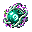 | Qi Gathering Buff | `buff icon` | 32x32 | - | 聚气状态图标：青玉灵气旋涡，表现灵气恢复与消耗优化。 | `Content/Buffs/QiGatheringBuff.png` |
|  | Spiritual Pressure Disorder Buff | `buff icon` | 32x32 | - | 灵压紊乱状态图标：青紫裂纹与气旋失衡，表现防御和移动下降。 | `Content/Buffs/SpiritualPressureDisorderBuff.png` |
|  | Spring Return Buff | `buff icon` | 32x32 | - | 回春状态图标：春意丹药与青绿生机，表现生命恢复和灵气回补。 | `Content/Buffs/SpringReturnBuff.png` |
|  | Spring Return Regen Buff | `buff icon` | 32x32 | - | 回春再生状态图标：玉丹叶纹，表现生命与灵气恢复提升。 | `Content/Buffs/SpringReturnRegenBuff.png` |
| 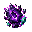 | Star Abyss Corrosion Buff | `buff icon` | 32x32 | - | 星渊侵蚀状态图标：暗蓝星眼与紫色裂纹，表现防御下降和灵压增长。 | `Content/Buffs/StarAbyssCorrosionBuff.png` |
|  | Tribulation Pressure Buff | `buff icon` | 32x32 | - | 劫压临身状态图标：雷云威压与紫蓝电纹，表现天劫锁定。 | `Content/Buffs/TribulationPressureBuff.png` |
|  | Tribulation Resistance Buff | `buff icon` | 32x32 | - | 抗劫状态图标：避雷玉符与稳定雷纹，表现伤害减免和灵压平复。 | `Content/Buffs/TribulationResistanceBuff.png` |

## Boss

| 素材 | 名称 | 类型 | 尺寸 | 帧 | 描述 | 路径 |
| --- | --- | --- | --- | --- | --- | --- |
| 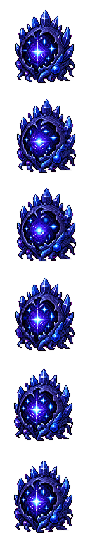 | Abyssal Star Womb | `animation sheet` | 128x768 | 6 (128px/frame) | 多帧竖向 spritesheet：由已验收单帧母版派生，保持同一轮廓、同一配色和同一光源，用于 idle/move/attack 节奏表现。 | `Content/NPCs/Bosses/AbyssalStarWomb.png` |
| 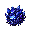 | Abyssal Star Womb Head Boss | `boss head` | 32x32 | - | Boss 资源：透明背景、强轮廓、有限色板，遵循 ART_ASSET_GENERATION_PLAN.md。 | `Content/NPCs/Bosses/AbyssalStarWomb_Head_Boss.png` |
| 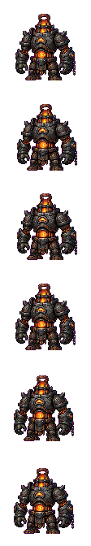 | Black Furnace Iron Golem | `animation sheet` | 112x672 | 6 (112px/frame) | 多帧竖向 spritesheet：由已验收单帧母版派生，保持同一轮廓、同一配色和同一光源，用于 idle/move/attack 节奏表现。 | `Content/NPCs/Bosses/BlackFurnaceIronGolem.png` |
| 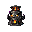 | Black Furnace Iron Golem Head Boss | `boss head` | 32x32 | - | Boss 资源：透明背景、强轮廓、有限色板，遵循 ART_ASSET_GENERATION_PLAN.md。 | `Content/NPCs/Bosses/BlackFurnaceIronGolem_Head_Boss.png` |
| 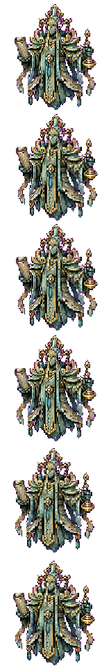 | Broken Heaven Inspector | `animation sheet` | 128x768 | 6 (128px/frame) | 多帧竖向 spritesheet：由已验收单帧母版派生，保持同一轮廓、同一配色和同一光源，用于 idle/move/attack 节奏表现。 | `Content/NPCs/Bosses/BrokenHeavenInspector.png` |
| 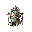 | Broken Heaven Inspector Head Boss | `boss head` | 32x32 | - | Boss 资源：透明背景、强轮廓、有限色板，遵循 ART_ASSET_GENERATION_PLAN.md。 | `Content/NPCs/Bosses/BrokenHeavenInspector_Head_Boss.png` |
|  | Formless Sword Soul | `animation sheet` | 96x576 | 6 (96px/frame) | 多帧竖向 spritesheet：由已验收单帧母版派生，保持同一轮廓、同一配色和同一光源，用于 idle/move/attack 节奏表现。 | `Content/NPCs/Bosses/FormlessSwordSoul.png` |
| 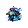 | Formless Sword Soul Head Boss | `boss head` | 32x32 | - | Boss 资源：透明背景、强轮廓、有限色板，遵循 ART_ASSET_GENERATION_PLAN.md。 | `Content/NPCs/Bosses/FormlessSwordSoul_Head_Boss.png` |
| 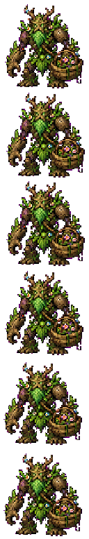 | Garden Warden | `animation sheet` | 96x576 | 6 (96px/frame) | 多帧竖向 spritesheet：由已验收单帧母版派生，保持同一轮廓、同一配色和同一光源，用于 idle/move/attack 节奏表现。 | `Content/NPCs/Bosses/GardenWarden.png` |
| 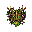 | Garden Warden Head Boss | `boss head` | 32x32 | - | Boss 资源：透明背景、强轮廓、有限色板，遵循 ART_ASSET_GENERATION_PLAN.md。 | `Content/NPCs/Bosses/GardenWarden_Head_Boss.png` |
|  | Greenwood Medicine King Echo | `animation sheet` | 112x672 | 6 (112px/frame) | 多帧竖向 spritesheet：由已验收单帧母版派生，保持同一轮廓、同一配色和同一光源，用于 idle/move/attack 节奏表现。 | `Content/NPCs/Bosses/GreenwoodMedicineKingEcho.png` |
| 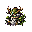 | Greenwood Medicine King Echo Head Boss | `boss head` | 32x32 | - | Boss 资源：透明背景、强轮廓、有限色板，遵循 ART_ASSET_GENERATION_PLAN.md。 | `Content/NPCs/Bosses/GreenwoodMedicineKingEcho_Head_Boss.png` |
| 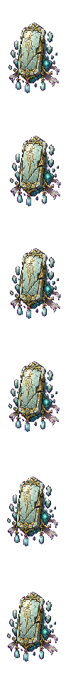 | Heaven Tablet Guardian | `animation sheet` | 96x960 | 6 (160px/frame) | 多帧竖向 spritesheet：由已验收单帧母版派生，保持同一轮廓、同一配色和同一光源，用于 idle/move/attack 节奏表现。 | `Content/NPCs/Bosses/HeavenTabletGuardian.png` |
| 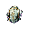 | Heaven Tablet Guardian Head Boss | `boss head` | 32x32 | - | Boss 资源：透明背景、强轮廓、有限色板，遵循 ART_ASSET_GENERATION_PLAN.md。 | `Content/NPCs/Bosses/HeavenTabletGuardian_Head_Boss.png` |
| 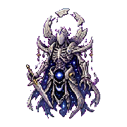 | Moonbone Immortal | `animation sheet` | 180x1080 | 6 (180px/frame) | 多帧竖向 spritesheet：由已验收单帧母版派生，保持同一轮廓、同一配色和同一光源，用于 idle/move/attack 节奏表现。 | `Content/NPCs/Bosses/MoonboneImmortal.png` |
| 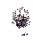 | Moonbone Immortal Head Boss | `boss head` | 48x48 | - | Boss 资源：透明背景、强轮廓、有限色板，遵循 ART_ASSET_GENERATION_PLAN.md。 | `Content/NPCs/Bosses/MoonboneImmortal_Head_Boss.png` |
|  | Old Heaven Dao Core | `animation sheet` | 192x1152 | 6 (192px/frame) | 多帧竖向 spritesheet：由已验收单帧母版派生，保持同一轮廓、同一配色和同一光源，用于 idle/move/attack 节奏表现。 | `Content/NPCs/Bosses/OldHeavenDaoCore.png` |
| 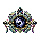 | Old Heaven Dao Core Head Boss | `boss head` | 48x48 | - | Boss 资源：透明背景、强轮廓、有限色板，遵循 ART_ASSET_GENERATION_PLAN.md。 | `Content/NPCs/Bosses/OldHeavenDaoCore_Head_Boss.png` |
| 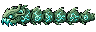 | Spirit Vein Wyrm | `animation sheet` | 96x192 | 6 (32px/frame) | 多帧竖向 spritesheet：由已验收单帧母版派生，保持同一轮廓、同一配色和同一光源，用于 idle/move/attack 节奏表现。 | `Content/NPCs/Bosses/SpiritVeinWyrm.png` |
|  | Spirit Vein Wyrm Head Boss | `boss head` | 32x32 | - | Boss 资源：透明背景、强轮廓、有限色板，遵循 ART_ASSET_GENERATION_PLAN.md。 | `Content/NPCs/Bosses/SpiritVeinWyrm_Head_Boss.png` |
|  | Thunder Marsh Jiao | `animation sheet` | 160x576 | 6 (96px/frame) | 多帧竖向 spritesheet：由已验收单帧母版派生，保持同一轮廓、同一配色和同一光源，用于 idle/move/attack 节奏表现。 | `Content/NPCs/Bosses/ThunderMarshJiao.png` |
| 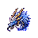 | Thunder Marsh Jiao Head Boss | `boss head` | 48x48 | - | Boss 资源：透明背景、强轮廓、有限色板，遵循 ART_ASSET_GENERATION_PLAN.md。 | `Content/NPCs/Bosses/ThunderMarshJiao_Head_Boss.png` |
| 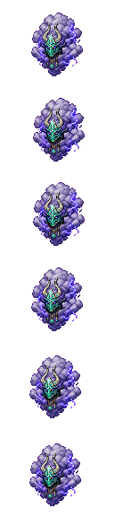 | Tribulation Cloud Avatar | `animation sheet` | 128x576 | 6 (96px/frame) | 多帧竖向 spritesheet：由已验收单帧母版派生，保持同一轮廓、同一配色和同一光源，用于 idle/move/attack 节奏表现。 | `Content/NPCs/Bosses/TribulationCloudAvatar.png` |
| 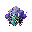 | Tribulation Cloud Avatar Head Boss | `boss head` | 32x32 | - | Boss 资源：透明背景、强轮廓、有限色板，遵循 ART_ASSET_GENERATION_PLAN.md。 | `Content/NPCs/Bosses/TribulationCloudAvatar_Head_Boss.png` |

## Enemy

| 素材 | 名称 | 类型 | 尺寸 | 帧 | 描述 | 路径 |
| --- | --- | --- | --- | --- | --- | --- |
|  | Archived Immortal Soul | `animation sheet` | 72x432 | 6 (72px/frame) | 72x72，半透明仙魂，环形归档线，中心空洞；float 6 帧，copy 4 帧 | `Content/NPCs/Enemies/ArchivedImmortalSoul.png` |
|  | Celestial Puppet | `animation sheet` | 64x480 | 6 (80px/frame) | 64x80，白玉傀儡，金线关节，无脸；walk 4 帧，attack 5 帧 | `Content/NPCs/Enemies/CelestialPuppet.png` |
|  | Furnace Ash Golem | `animation sheet` | 64x384 | 6 (64px/frame) | 64x64，灰黑小傀儡，胸口暗红煤火；walk 4 帧，punch 4 帧 | `Content/NPCs/Enemies/FurnaceAshGolem.png` |
| 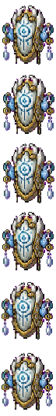 | Heaven Tablet Guard | `animation sheet` | 64x480 | 6 (80px/frame) | 64x80，碑甲卫士，盾像小天碑；guard 4 帧，blast 4 帧 | `Content/NPCs/Enemies/HeavenTabletGuard.png` |
| 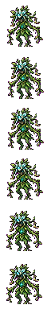 | Herb Garden Vine Spirit | `animation sheet` | 64x384 | 6 (64px/frame) | 64x64，藤蔓人形，叶冠，根须腿；idle 4 帧，whip 5 帧 | `Content/NPCs/Enemies/HerbGardenVineSpirit.png` |
| 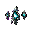 | Iron Shard Spirit | `animation sheet` | 32x192 | 6 (32px/frame) | 32x32，漂浮铁片和小火光；spin 4 帧 | `Content/NPCs/Enemies/IronShardSpirit.png` |
| 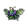 | Miasma Flower Moth | `animation sheet` | 48x288 | 6 (48px/frame) | 48x48，蝶翼带花纹，药绿和淡紫色板；fly 6 帧，miasma 3 帧 | `Content/NPCs/Enemies/MiasmaFlowerMoth.png` |
|  | Moonbone Cultivator | `animation sheet` | 72x480 | 6 (80px/frame) | 72x80，月白骨甲，残月披肩；dash 4 帧，cast 5 帧 | `Content/NPCs/Enemies/MoonboneCultivator.png` |
|  | Obsessed Sword Cultivator | `animation sheet` | 64x480 | 6 (80px/frame) | 64x80，残影剑修，破旧道袍，手持断剑；guard 3 帧，thrust 5 帧 | `Content/NPCs/Enemies/ObsessedSwordCultivator.png` |
| 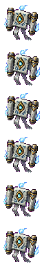 | Scripture Archive Echo | `animation sheet` | 64x384 | 6 (64px/frame) | 64x64，漂浮书卷和人形残影；cast 6 帧 | `Content/NPCs/Enemies/ScriptureArchiveEcho.png` |
| 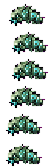 | Shattered Jade Worm | `animation sheet` | 48x144 | 6 (24px/frame) | 48x24，虫形，玉壳断裂，深绿外轮廓；crawl 6 帧 | `Content/NPCs/Enemies/ShatteredJadeWorm.png` |
|  | Star Abyss Larva | `animation sheet` | 48x192 | 6 (32px/frame) | 48x32，深蓝寄生幼体，星点眼；crawl 6 帧，leap 3 帧 | `Content/NPCs/Enemies/StarAbyssLarva.png` |
| 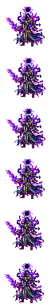 | Star Eclipsed Cultivator | `animation sheet` | 64x384 | 6 (64px/frame) | 64x64，人形修士，暗蓝斗篷，星晶侵蚀半身；cast 5 帧 | `Content/NPCs/Enemies/StarEclipsedCultivator.png` |
| 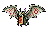 | Talisman Bat | `animation sheet` | 48x192 | 6 (32px/frame) | 48x32，蝙蝠身体像折纸符箓，朱砂眼点；fly 6 帧 | `Content/NPCs/Enemies/TalismanBat.png` |
| 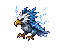 | Thunder Pattern Hawk | `animation sheet` | 64x288 | 6 (48px/frame) | 64x48，鹰形，羽毛有蓝色雷纹；fly 6 帧，dive 3 帧 | `Content/NPCs/Enemies/ThunderPatternHawk.png` |
| 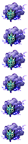 | Tribulation Cloudling | `animation sheet` | 48x288 | 6 (48px/frame) | 48x48，紫色小雷云，有玉色面具碎片；float 6 帧 | `Content/NPCs/Enemies/TribulationCloudling.png` |
|  | Wandering Spirit Slime | `animation sheet` | 48x288 | 6 (48px/frame) | 48x48，圆形青绿色史莱姆，体内漂浮小符核；idle 4 帧，hop 4 帧，hit 2 帧 | `Content/NPCs/Enemies/WanderingSpiritSlime.png` |

## Town NPC

| 素材 | 名称 | 类型 | 尺寸 | 帧 | 描述 | 路径 |
| --- | --- | --- | --- | --- | --- | --- |
| 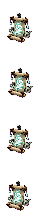 | Archive Scroll Spirit | `animation sheet` | 36x192 | 4 (48px/frame) | 多帧竖向 spritesheet：由已验收单帧母版派生，保持同一轮廓、同一配色和同一光源，用于 idle/move/attack 节奏表现。 | `Content/NPCs/Town/ArchiveScrollSpirit.png` |
|  | Archive Scroll Spirit Head | `town head` | 32x32 | - | Town NPC 资源：透明背景、强轮廓、有限色板，遵循 ART_ASSET_GENERATION_PLAN.md。 | `Content/NPCs/Town/ArchiveScrollSpirit_Head.png` |
| 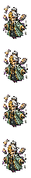 | Fallen Heaven Messenger | `animation sheet` | 42x240 | 4 (60px/frame) | 多帧竖向 spritesheet：由已验收单帧母版派生，保持同一轮廓、同一配色和同一光源，用于 idle/move/attack 节奏表现。 | `Content/NPCs/Town/FallenHeavenMessenger.png` |
| 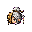 | Fallen Heaven Messenger Head | `town head` | 32x32 | - | Town NPC 资源：透明背景、强轮廓、有限色板，遵循 ART_ASSET_GENERATION_PLAN.md。 | `Content/NPCs/Town/FallenHeavenMessenger_Head.png` |
| 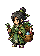 | Herb Sect Apprentice | `animation sheet` | 40x224 | 4 (56px/frame) | 多帧竖向 spritesheet：由已验收单帧母版派生，保持同一轮廓、同一配色和同一光源，用于 idle/move/attack 节奏表现。 | `Content/NPCs/Town/HerbSectApprentice.png` |
| 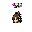 | Herb Sect Apprentice Head | `town head` | 32x32 | - | Town NPC 资源：透明背景、强轮廓、有限色板，遵循 ART_ASSET_GENERATION_PLAN.md。 | `Content/NPCs/Town/HerbSectApprentice_Head.png` |
| 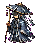 | Tribulation Observer | `animation sheet` | 40x224 | 4 (56px/frame) | 多帧竖向 spritesheet：由已验收单帧母版派生，保持同一轮廓、同一配色和同一光源，用于 idle/move/attack 节奏表现。 | `Content/NPCs/Town/TribulationObserver.png` |
| 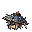 | Tribulation Observer Head | `town head` | 32x32 | - | Town NPC 资源：透明背景、强轮廓、有限色板，遵循 ART_ASSET_GENERATION_PLAN.md。 | `Content/NPCs/Town/TribulationObserver_Head.png` |
| 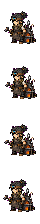 | Wandering Artificer | `animation sheet` | 42x232 | 4 (58px/frame) | 多帧竖向 spritesheet：由已验收单帧母版派生，保持同一轮廓、同一配色和同一光源，用于 idle/move/attack 节奏表现。 | `Content/NPCs/Town/WanderingArtificer.png` |
|  | Wandering Artificer Head | `town head` | 32x32 | - | Town NPC 资源：透明背景、强轮廓、有限色板，遵循 ART_ASSET_GENERATION_PLAN.md。 | `Content/NPCs/Town/WanderingArtificer_Head.png` |

## Crafting Station Tile

| 素材 | 名称 | 类型 | 尺寸 | 帧 | 描述 | 路径 |
| --- | --- | --- | --- | --- | --- | --- |
|  | Alchemy Cauldron Tile | `tile` | 32x32 | - | 64x64 青铜丹炉，青木根缠绕，药绿火焰；用于炼制丹药。 | `Content/Tiles/Stations/AlchemyCauldronTile.png` |
| 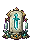 | Artifact Forge Tile | `tile` | 32x48 | - | 64x48 黑铁台、迷你炉口、悬浮铭刻线；用于铸造飞剑、阵盘和法器。 | `Content/Tiles/Stations/ArtifactForgeTile.png` |
|  | Dao Severing Altar Tile | `tile` | 80x48 | - | 80x48 黑白断环石台，中间细小裂隙；用于终局路线装备。 | `Content/Tiles/Stations/DaoSeveringAltarTile.png` |
|  | Earth Clay Furnace Tile | `tile` | 48x48 | - | 48x48 小陶炉，暗红炉口，青色药烟硬边；用于早期炼丹。 | `Content/Tiles/Stations/EarthClayFurnaceTile.png` |
|  | Heaven Fire Furnace Tile | `tile` | 64x64 | - | 64x64 白玉炉，金色天火，破损法旨环绕；用于天道系装备。 | `Content/Tiles/Stations/HeavenFireFurnaceTile.png` |
|  | Sect Trial Altar Tile | `tile` | 64x48 | - | 64x48 白石台、插剑、玉牌槽；用于宗门职业装备。 | `Content/Tiles/Stations/SectTrialAltarTile.png` |
|  | Simple Talisman Table Tile | `tile` | 48x32 | - | 48x32 矮木案、纸张、朱砂碟，无可读文字；用于绘制基础符箓。 | `Content/Tiles/Stations/SimpleTalismanTableTile.png` |
| 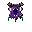 | Star Pattern Cauldron Tile | `tile` | 64x64 | - | 64x64 暗蓝丹鼎，星晶嵌边，紫黑火焰；用于星渊高阶丹药。 | `Content/Tiles/Stations/StarPatternCauldronTile.png` |
|  | Thunder Pattern Forge Tile | `tile` | 64x48 | - | 64x48 云铁锻台，紫蓝雷纹，小电弧；用于雷系装备。 | `Content/Tiles/Stations/ThunderPatternForgeTile.png` |

## Crafting Station Item

| 素材 | 名称 | 类型 | 尺寸 | 帧 | 描述 | 路径 |
| --- | --- | --- | --- | --- | --- | --- |
|  | Alchemy Cauldron | `item icon` | 32x32 | - | 64x64 青铜丹炉，青木根缠绕，药绿火焰；用于炼制丹药。 | `Content/Items/Stations/AlchemyCauldron.png` |
|  | Artifact Forge | `item icon` | 32x48 | - | 64x48 黑铁台、迷你炉口、悬浮铭刻线；用于铸造飞剑、阵盘和法器。 | `Content/Items/Stations/ArtifactForge.png` |
|  | Dao Severing Altar | `item icon` | 32x32 | - | 80x48 黑白断环石台，中间细小裂隙；用于终局路线装备。 | `Content/Items/Stations/DaoSeveringAltar.png` |
| 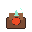 | Earth Clay Furnace | `item icon` | 32x32 | - | 48x48 小陶炉，暗红炉口，青色药烟硬边；用于早期炼丹。 | `Content/Items/Stations/EarthClayFurnace.png` |
| 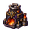 | Heaven Fire Furnace | `item icon` | 32x32 | - | 64x64 白玉炉，金色天火，破损法旨环绕；用于天道系装备。 | `Content/Items/Stations/HeavenFireFurnace.png` |
| 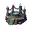 | Sect Trial Altar | `item icon` | 32x32 | - | 64x48 白石台、插剑、玉牌槽；用于宗门职业装备。 | `Content/Items/Stations/SectTrialAltar.png` |
| 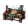 | Simple Talisman Table | `item icon` | 32x32 | - | 48x32 矮木案、纸张、朱砂碟，无可读文字；用于绘制基础符箓。 | `Content/Items/Stations/SimpleTalismanTable.png` |
| 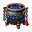 | Star Pattern Cauldron | `item icon` | 32x32 | - | 64x64 暗蓝丹鼎，星晶嵌边，紫黑火焰；用于星渊高阶丹药。 | `Content/Items/Stations/StarPatternCauldron.png` |
|  | Thunder Pattern Forge | `item icon` | 32x32 | - | 64x48 云铁锻台，紫蓝雷纹，小电弧；用于雷系装备。 | `Content/Items/Stations/ThunderPatternForge.png` |

## Tile / Object

| 素材 | 名称 | 类型 | 尺寸 | 帧 | 描述 | 路径 |
| --- | --- | --- | --- | --- | --- | --- |
|  | Archive Light Pillar Tile | `tile/object` | 32x96 | - | Tile / Object 资源：透明背景、强轮廓、有限色板，遵循 ART_ASSET_GENERATION_PLAN.md。 | `Content/Tiles/ArchiveLightPillarTile.png` |
|  | Black Furnace Wall | `tile/object` | 16x16 | - | Tile / Object 资源：透明背景、强轮廓、有限色板，遵循 ART_ASSET_GENERATION_PLAN.md。 | `Content/Tiles/BlackFurnaceWall.png` |
|  | Broken Heaven Tablet Tile | `tile/object` | 32x64 | - | Tile / Object 资源：透明背景、强轮廓、有限色板，遵循 ART_ASSET_GENERATION_PLAN.md。 | `Content/Tiles/BrokenHeavenTabletTile.png` |
|  | Fallen Heaven Jade Tile | `tile/object` | 16x16 | - | Tile / Object 资源：透明背景、强轮廓、有限色板，遵循 ART_ASSET_GENERATION_PLAN.md。 | `Content/Tiles/FallenHeavenJadeTile.png` |
| 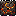 | Furnace Slag Tile | `tile/object` | 16x16 | - | Tile / Object 资源：透明背景、强轮廓、有限色板，遵循 ART_ASSET_GENERATION_PLAN.md。 | `Content/Tiles/FurnaceSlagTile.png` |
| 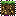 | Greenwood Soil Tile | `tile/object` | 16x16 | - | Tile / Object 资源：透明背景、强轮廓、有限色板，遵循 ART_ASSET_GENERATION_PLAN.md。 | `Content/Tiles/GreenwoodSoilTile.png` |
|  | Moonbone Tile | `tile/object` | 16x16 | - | 32x32，月白骨片，冷蓝裂纹 | `Content/Tiles/MoonboneTile.png` |
| 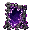 | Rift Membrane Tile | `tile/object` | 32x32 | - | Tile / Object 资源：透明背景、强轮廓、有限色板，遵循 ART_ASSET_GENERATION_PLAN.md。 | `Content/Tiles/RiftMembraneTile.png` |
|  | Sect Ruin Brick Tile | `tile/object` | 16x16 | - | Tile / Object 资源：透明背景、强轮廓、有限色板，遵循 ART_ASSET_GENERATION_PLAN.md。 | `Content/Tiles/SectRuinBrickTile.png` |
| 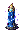 | Singing Thunder Stone Tile | `tile/object` | 24x32 | - | Tile / Object 资源：透明背景、强轮廓、有限色板，遵循 ART_ASSET_GENERATION_PLAN.md。 | `Content/Tiles/SingingThunderStoneTile.png` |
|  | Spirit Herb Tile | `tile/object` | 16x24 | - | Tile / Object 资源：透明背景、强轮廓、有限色板，遵循 ART_ASSET_GENERATION_PLAN.md。 | `Content/Tiles/SpiritHerbTile.png` |
|  | Spirit Moss Tile | `tile/object` | 16x16 | - | Tile / Object 资源：透明背景、强轮廓、有限色板，遵循 ART_ASSET_GENERATION_PLAN.md。 | `Content/Tiles/SpiritMossTile.png` |
|  | Spirit Ore Tile | `tile/object` | 16x16 | - | Tile / Object 资源：透明背景、强轮廓、有限色板，遵循 ART_ASSET_GENERATION_PLAN.md。 | `Content/Tiles/SpiritOreTile.png` |
|  | Star Abyss Crystal Tile | `tile/object` | 16x16 | - | Tile / Object 资源：透明背景、强轮廓、有限色板，遵循 ART_ASSET_GENERATION_PLAN.md。 | `Content/Tiles/StarAbyssCrystalTile.png` |
|  | Sword Tablet Tile | `tile/object` | 32x48 | - | Tile / Object 资源：透明背景、强轮廓、有限色板，遵循 ART_ASSET_GENERATION_PLAN.md。 | `Content/Tiles/SwordTabletTile.png` |
|  | Thunder Cloud Tile | `tile/object` | 16x16 | - | Tile / Object 资源：透明背景、强轮廓、有限色板，遵循 ART_ASSET_GENERATION_PLAN.md。 | `Content/Tiles/ThunderCloudTile.png` |

## Projectile

| 素材 | 名称 | 类型 | 尺寸 | 帧 | 描述 | 路径 |
| --- | --- | --- | --- | --- | --- | --- |
|  | Boss Array Field Projectile | `projectile` | 28x28 | - | Projectile 资源：透明背景、强轮廓、有限色板，遵循 ART_ASSET_GENERATION_PLAN.md。 | `Content/Projectiles/BossArrayFieldProjectile.png` |
|  | Boss Spirit Bolt Projectile | `projectile` | 18x18 | - | Projectile 资源：透明背景、强轮廓、有限色板，遵循 ART_ASSET_GENERATION_PLAN.md。 | `Content/Projectiles/BossSpiritBoltProjectile.png` |
|  | Cinnabar Talisman Flame | `projectile` | 24x24 | - | Projectile 资源：透明背景、强轮廓、有限色板，遵循 ART_ASSET_GENERATION_PLAN.md。 | `Content/Projectiles/CinnabarTalismanFlame.png` |
|  | Cloudpiercer Sword Projectile | `projectile` | 48x16 | - | Projectile 资源：透明背景、强轮廓、有限色板，遵循 ART_ASSET_GENERATION_PLAN.md。 | `Content/Projectiles/CloudpiercerSwordProjectile.png` |
|  | Cloud Wisp Projectile | `projectile` | 24x16 | - | Projectile 资源：透明背景、强轮廓、有限色板，遵循 ART_ASSET_GENERATION_PLAN.md。 | `Content/Projectiles/CloudWispProjectile.png` |
|  | Decree Judgement Beam | `projectile` | 32x128 | - | Projectile 资源：透明背景、强轮廓、有限色板，遵循 ART_ASSET_GENERATION_PLAN.md。 | `Content/Projectiles/DecreeJudgementBeam.png` |
|  | Formless Sword Wheel Projectile | `projectile` | 64x64 | - | 64x64，环形剑轮，中心空洞，青白剑影；projectile 64x64 | `Content/Projectiles/FormlessSwordWheelProjectile.png` |
|  | Greenwood Array Field | `projectile` | 96x96 | - | Projectile 资源：透明背景、强轮廓、有限色板，遵循 ART_ASSET_GENERATION_PLAN.md。 | `Content/Projectiles/GreenwoodArrayField.png` |
|  | Minor Thunderbolt Projectile | `projectile` | 16x64 | - | Projectile 资源：透明背景、强轮廓、有限色板，遵循 ART_ASSET_GENERATION_PLAN.md。 | `Content/Projectiles/MinorThunderboltProjectile.png` |
|  | Moonbone Shard Projectile | `projectile` | 24x16 | - | Projectile 资源：透明背景、强轮廓、有限色板，遵循 ART_ASSET_GENERATION_PLAN.md。 | `Content/Projectiles/MoonboneShardProjectile.png` |
|  | Spirit Bolt | `projectile` | 16x8 | - | Projectile 资源：透明背景、强轮廓、有限色板，遵循 ART_ASSET_GENERATION_PLAN.md。 | `Content/Projectiles/SpiritBolt.png` |
|  | Spirit Bolt Projectile | `projectile` | 16x8 | - | Projectile 资源：透明背景、强轮廓、有限色板，遵循 ART_ASSET_GENERATION_PLAN.md。 | `Content/Projectiles/SpiritBoltProjectile.png` |
|  | Star Eclipse Split Bolt | `projectile` | 24x24 | - | Projectile 资源：透明背景、强轮廓、有限色板，遵循 ART_ASSET_GENERATION_PLAN.md。 | `Content/Projectiles/StarEclipseSplitBolt.png` |
|  | Thunder Sword Projectile | `projectile` | 48x16 | - | Projectile 资源：透明背景、强轮廓、有限色板，遵循 ART_ASSET_GENERATION_PLAN.md。 | `Content/Projectiles/ThunderSwordProjectile.png` |
|  | Thunder Talisman Array | `projectile` | 96x96 | - | Projectile 资源：透明背景、强轮廓、有限色板，遵循 ART_ASSET_GENERATION_PLAN.md。 | `Content/Projectiles/ThunderTalismanArray.png` |
|  | Tribulation Lightning Projectile | `projectile` | 16x48 | - | Projectile 资源：透明背景、强轮廓、有限色板，遵循 ART_ASSET_GENERATION_PLAN.md。 | `Content/Projectiles/TribulationLightningProjectile.png` |
|  | Tribulation Warning Line Projectile | `projectile` | 16x4 | - | Projectile 资源：透明背景、强轮廓、有限色板，遵循 ART_ASSET_GENERATION_PLAN.md。 | `Content/Projectiles/TribulationWarningLineProjectile.png` |
|  | Woodgrain Sword Projectile | `projectile` | 32x16 | - | Projectile 资源：透明背景、强轮廓、有限色板，遵循 ART_ASSET_GENERATION_PLAN.md。 | `Content/Projectiles/WoodgrainSwordProjectile.png` |

## Equipment

| 素材 | 名称 | 类型 | 尺寸 | 帧 | 描述 | 路径 |
| --- | --- | --- | --- | --- | --- | --- |
|  | Broken Heaven Decree | `item icon` | 48x48 | - | Equipment 资源：透明背景、强轮廓、有限色板，遵循 ART_ASSET_GENERATION_PLAN.md。 | `Content/Items/Weapons/BrokenHeavenDecree.png` |
|  | Cinnabar Talisman Flame Item | `item icon` | 32x32 | - | Equipment 资源：透明背景、强轮廓、有限色板，遵循 ART_ASSET_GENERATION_PLAN.md。 | `Content/Items/Weapons/CinnabarTalismanFlameItem.png` |
|  | Cloudpiercer Flying Sword | `item icon` | 64x64 | - | 64x64 item icon，细长银剑，云形剑格，淡青尾光；projectile 48x16 | `Content/Items/Weapons/CloudpiercerFlyingSword.png` |
|  | Formless Sword Wheel | `item icon` | 64x64 | - | 64x64，环形剑轮，中心空洞，青白剑影；projectile 64x64 | `Content/Items/Weapons/FormlessSwordWheel.png` |
|  | Greenwood Array Plate | `item icon` | 48x48 | - | Equipment 资源：透明背景、强轮廓、有限色板，遵循 ART_ASSET_GENERATION_PLAN.md。 | `Content/Items/Weapons/GreenwoodArrayPlate.png` |
|  | Moonbone Dharma Sword | `item icon` | 64x64 | - | 64x64，月白骨剑，暗蓝核心，残月护手；projectile 56x20 | `Content/Items/Weapons/MoonboneDharmaSword.png` |
|  | Old Heaven Dao Scroll | `item icon` | 64x64 | - | Equipment 资源：透明背景、强轮廓、有限色板，遵循 ART_ASSET_GENERATION_PLAN.md。 | `Content/Items/Weapons/OldHeavenDaoScroll.png` |
|  | Spiritwood Crossbow | `item icon` | 48x48 | - | Equipment 资源：透明背景、强轮廓、有限色板，遵循 ART_ASSET_GENERATION_PLAN.md。 | `Content/Items/Weapons/SpiritwoodCrossbow.png` |
|  | Star Eclipse Arbalest | `item icon` | 64x64 | - | Equipment 资源：透明背景、强轮廓、有限色板，遵循 ART_ASSET_GENERATION_PLAN.md。 | `Content/Items/Weapons/StarEclipseArbalest.png` |
|  | Thunder Pattern Sword Case | `item icon` | 64x64 | - | 64x64，半开剑匣，三把小雷剑，紫蓝雷纹；projectiles 48x16 | `Content/Items/Weapons/ThunderPatternSwordCase.png` |
|  | Thunder Talisman Array Plate | `item icon` | 48x48 | - | Equipment 资源：透明背景、强轮廓、有限色板，遵循 ART_ASSET_GENERATION_PLAN.md。 | `Content/Items/Weapons/ThunderTalismanArrayPlate.png` |
|  | Woodgrain Flying Sword | `item icon` | 48x48 | - | 48x48 item icon，木质剑身，青色灵纹；projectile 32x16 | `Content/Items/Weapons/WoodgrainFlyingSword.png` |

## Accessory

| 素材 | 名称 | 类型 | 尺寸 | 帧 | 描述 | 路径 |
| --- | --- | --- | --- | --- | --- | --- |
|  | Broken Heaven Crown Seal | `item icon` | 32x32 | - | Accessory 资源：透明背景、强轮廓、有限色板，遵循 ART_ASSET_GENERATION_PLAN.md。 | `Content/Items/Accessories/BrokenHeavenCrownSeal.png` |
|  | Dao Severing Ring | `item icon` | 32x32 | - | Accessory 资源：透明背景、强轮廓、有限色板，遵循 ART_ASSET_GENERATION_PLAN.md。 | `Content/Items/Accessories/DaoSeveringRing.png` |
|  | Furnace Heart Ring | `item icon` | 32x32 | - | Accessory 资源：透明背景、强轮廓、有限色板，遵循 ART_ASSET_GENERATION_PLAN.md。 | `Content/Items/Accessories/FurnaceHeartRing.png` |
|  | Lightning Ward Jade | `item icon` | 32x32 | - | Accessory 资源：透明背景、强轮廓、有限色板，遵循 ART_ASSET_GENERATION_PLAN.md。 | `Content/Items/Accessories/LightningWardJade.png` |
|  | Nascent Soul Jade Box | `item icon` | 32x32 | - | Accessory 资源：透明背景、强轮廓、有限色板，遵循 ART_ASSET_GENERATION_PLAN.md。 | `Content/Items/Accessories/NascentSoulJadeBox.png` |
|  | Qi Gathering Pendant | `item icon` | 32x32 | - | Accessory 资源：透明背景、强轮廓、有限色板，遵循 ART_ASSET_GENERATION_PLAN.md。 | `Content/Items/Accessories/QiGatheringPendant.png` |
|  | Spiritwood Charm | `item icon` | 32x32 | - | Accessory 资源：透明背景、强轮廓、有限色板，遵循 ART_ASSET_GENERATION_PLAN.md。 | `Content/Items/Accessories/SpiritwoodCharm.png` |
|  | Star Abyss Eye | `item icon` | 32x32 | - | Accessory 资源：透明背景、强轮廓、有限色板，遵循 ART_ASSET_GENERATION_PLAN.md。 | `Content/Items/Accessories/StarAbyssEye.png` |

## Boss Summon

| 素材 | 名称 | 类型 | 尺寸 | 帧 | 描述 | 路径 |
| --- | --- | --- | --- | --- | --- | --- |
|  | Spirit Vein Incense | `item icon` | 32x32 | - | Boss Summon 资源：透明背景、强轮廓、有限色板，遵循 ART_ASSET_GENERATION_PLAN.md。 | `Content/Items/BossSummons/SpiritVeinIncense.png` |
|  | Summon Garden Broken Key | `item icon` | 32x32 | - | Boss Summon 资源：透明背景、强轮廓、有限色板，遵循 ART_ASSET_GENERATION_PLAN.md。 | `Content/Items/BossSummons/SummonGardenBrokenKey.png` |
|  | Summon Heaven Tablet Rubbing | `item icon` | 32x32 | - | Boss Summon 资源：透明背景、强轮廓、有限色板，遵循 ART_ASSET_GENERATION_PLAN.md。 | `Content/Items/BossSummons/SummonHeavenTabletRubbing.png` |
|  | Summon Heaven Tablet Rubbing Broken Heaven Inspector | `item icon` | 32x32 | - | Boss Summon 资源：透明背景、强轮廓、有限色板，遵循 ART_ASSET_GENERATION_PLAN.md。 | `Content/Items/BossSummons/SummonHeavenTabletRubbingBrokenHeavenInspector.png` |
|  | Summon Moonbone Ritual Talisman | `item icon` | 32x32 | - | Boss Summon 资源：透明背景、强轮廓、有限色板，遵循 ART_ASSET_GENERATION_PLAN.md。 | `Content/Items/BossSummons/SummonMoonboneRitualTalisman.png` |
|  | Summon Moonbone Ritual Talisman Old Heaven Dao Core | `item icon` | 32x32 | - | Boss Summon 资源：透明背景、强轮廓、有限色板，遵循 ART_ASSET_GENERATION_PLAN.md。 | `Content/Items/BossSummons/SummonMoonboneRitualTalismanOldHeavenDaoCore.png` |
|  | Summon Old Furnace Ember | `item icon` | 24x24 | - | Boss Summon 资源：透明背景、强轮廓、有限色板，遵循 ART_ASSET_GENERATION_PLAN.md。 | `Content/Items/BossSummons/SummonOldFurnaceEmber.png` |
|  | Summon Sect Trial Token | `item icon` | 32x32 | - | Boss Summon 资源：透明背景、强轮廓、有限色板，遵循 ART_ASSET_GENERATION_PLAN.md。 | `Content/Items/BossSummons/SummonSectTrialToken.png` |
|  | Summon Sect Trial Token Greenwood Medicine King Echo | `item icon` | 32x32 | - | Boss Summon 资源：透明背景、强轮廓、有限色板，遵循 ART_ASSET_GENERATION_PLAN.md。 | `Content/Items/BossSummons/SummonSectTrialTokenGreenwoodMedicineKingEcho.png` |
|  | Summon Star Abyss Membrane | `item icon` | 32x32 | - | Boss Summon 资源：透明背景、强轮廓、有限色板，遵循 ART_ASSET_GENERATION_PLAN.md。 | `Content/Items/BossSummons/SummonStarAbyssMembrane.png` |
|  | Summon Thunder Calling Jade | `item icon` | 32x32 | - | Boss Summon 资源：透明背景、强轮廓、有限色板，遵循 ART_ASSET_GENERATION_PLAN.md。 | `Content/Items/BossSummons/SummonThunderCallingJade.png` |
|  | Summon Thunder Calling Jade Thunder Marsh Jiao | `item icon` | 32x32 | - | Boss Summon 资源：透明背景、强轮廓、有限色板，遵循 ART_ASSET_GENERATION_PLAN.md。 | `Content/Items/BossSummons/SummonThunderCallingJadeThunderMarshJiao.png` |

## Consumable

| 素材 | 名称 | 类型 | 尺寸 | 帧 | 描述 | 路径 |
| --- | --- | --- | --- | --- | --- | --- |
|  | Qi Drawing Talisman | `item icon` | 32x32 | - | Consumable 资源：透明背景、强轮廓、有限色板，遵循 ART_ASSET_GENERATION_PLAN.md。 | `Content/Items/Consumables/QiDrawingTalisman.png` |

## Guide Item

| 素材 | 名称 | 类型 | 尺寸 | 帧 | 描述 | 路径 |
| --- | --- | --- | --- | --- | --- | --- |
|  | Sect Ledger | `item icon` | 32x32 | - | Guide Item 资源：透明背景、强轮廓、有限色板，遵循 ART_ASSET_GENERATION_PLAN.md。 | `Content/Items/Guides/SectLedger.png` |
|  | Tribulation Gauge | `item icon` | 32x32 | - | Guide Item 资源：透明背景、强轮廓、有限色板，遵循 ART_ASSET_GENERATION_PLAN.md。 | `Content/Items/Guides/TribulationGauge.png` |

## Material

| 素材 | 名称 | 类型 | 尺寸 | 帧 | 描述 | 路径 |
| --- | --- | --- | --- | --- | --- | --- |
|  | Artifact Blank Shard | `item icon` | 24x24 | - | 24x24，银灰碎片，边缘有未完成铭纹 | `Content/Items/Materials/ArtifactBlankShard.png` |
|  | Broken Heaven Crown Seal | `item icon` | 32x32 | - | Material 资源：透明背景、强轮廓、有限色板，遵循 ART_ASSET_GENERATION_PLAN.md。 | `Content/Items/Materials/BrokenHeavenCrownSeal.png` |
|  | Broken Heaven Decree | `item icon` | 48x48 | - | Material 资源：透明背景、强轮廓、有限色板，遵循 ART_ASSET_GENERATION_PLAN.md。 | `Content/Items/Materials/BrokenHeavenDecree.png` |
|  | Cinnabar Talisman Flame Item | `item icon` | 32x32 | - | Material 资源：透明背景、强轮廓、有限色板，遵循 ART_ASSET_GENERATION_PLAN.md。 | `Content/Items/Materials/CinnabarTalismanFlameItem.png` |
|  | Cloudpiercer Flying Sword | `item icon` | 64x64 | - | 64x64 item icon，细长银剑，云形剑格，淡青尾光；projectile 48x16 | `Content/Items/Materials/CloudpiercerFlyingSword.png` |
|  | Dao Severing Dust | `item icon` | 32x32 | - | 32x32，黑白尘粒围绕小裂隙，边缘清楚 | `Content/Items/Materials/DaoSeveringDust.png` |
|  | Dao Severing Ring | `item icon` | 32x32 | - | Material 资源：透明背景、强轮廓、有限色板，遵循 ART_ASSET_GENERATION_PLAN.md。 | `Content/Items/Materials/DaoSeveringRing.png` |
|  | Formless Sword Wheel | `item icon` | 64x64 | - | 64x64，环形剑轮，中心空洞，青白剑影；projectile 64x64 | `Content/Items/Materials/FormlessSwordWheel.png` |
|  | Foundation Pill | `item icon` | 24x24 | - | Material 资源：透明背景、强轮廓、有限色板，遵循 ART_ASSET_GENERATION_PLAN.md。 | `Content/Items/Materials/FoundationPill.png` |
|  | Furnace Heart Ring | `item icon` | 32x32 | - | Material 资源：透明背景、强轮廓、有限色板，遵循 ART_ASSET_GENERATION_PLAN.md。 | `Content/Items/Materials/FurnaceHeartRing.png` |
|  | Furnace Slag Iron | `item icon` | 24x24 | - | 24x24，暗铁矿渣，橙红裂纹 | `Content/Items/Materials/FurnaceSlagIron.png` |
|  | Garden Broken Key | `item icon` | 32x32 | - | Material 资源：透明背景、强轮廓、有限色板，遵循 ART_ASSET_GENERATION_PLAN.md。 | `Content/Items/Materials/GardenBrokenKey.png` |
|  | Greenwood Array Plate | `item icon` | 48x48 | - | Material 资源：透明背景、强轮廓、有限色板，遵循 ART_ASSET_GENERATION_PLAN.md。 | `Content/Items/Materials/GreenwoodArrayPlate.png` |
|  | Greenwood Root | `item icon` | 24x24 | - | 24x24，盘结青根，叶脉光点 | `Content/Items/Materials/GreenwoodRoot.png` |
|  | Heaven Dao Fragment | `item icon` | 32x32 | - | 32x32，白玉碎片，残金线条，冷白光 | `Content/Items/Materials/HeavenDaoFragment.png` |
|  | Heaven Tablet Rubbing | `item icon` | 32x32 | - | Material 资源：透明背景、强轮廓、有限色板，遵循 ART_ASSET_GENERATION_PLAN.md。 | `Content/Items/Materials/HeavenTabletRubbing.png` |
|  | Lightning Ward Jade | `item icon` | 32x32 | - | Material 资源：透明背景、强轮廓、有限色板，遵循 ART_ASSET_GENERATION_PLAN.md。 | `Content/Items/Materials/LightningWardJade.png` |
|  | Low Grade Spirit Stone | `item icon` | 24x24 | - | 16x16 或 24x24，青玉小晶体，中心浅青发光，深绿描边 | `Content/Items/Materials/LowGradeSpiritStone.png` |
|  | Moonbone | `item icon` | 32x32 | - | 32x32，月白骨片，冷蓝裂纹 | `Content/Items/Materials/Moonbone.png` |
|  | Moonbone Dharma Sword | `item icon` | 64x64 | - | 64x64，月白骨剑，暗蓝核心，残月护手；projectile 56x20 | `Content/Items/Materials/MoonboneDharmaSword.png` |
|  | Moonbone Ritual Talisman | `item icon` | 32x32 | - | Material 资源：透明背景、强轮廓、有限色板，遵循 ART_ASSET_GENERATION_PLAN.md。 | `Content/Items/Materials/MoonboneRitualTalisman.png` |
|  | Nascent Soul Jade Box | `item icon` | 32x32 | - | Material 资源：透明背景、强轮廓、有限色板，遵循 ART_ASSET_GENERATION_PLAN.md。 | `Content/Items/Materials/NascentSoulJadeBox.png` |
|  | Old Furnace Ember | `item icon` | 24x24 | - | Material 资源：透明背景、强轮廓、有限色板，遵循 ART_ASSET_GENERATION_PLAN.md。 | `Content/Items/Materials/OldFurnaceEmber.png` |
|  | Old Heaven Dao Scroll | `item icon` | 64x64 | - | Material 资源：透明背景、强轮廓、有限色板，遵循 ART_ASSET_GENERATION_PLAN.md。 | `Content/Items/Materials/OldHeavenDaoScroll.png` |
|  | Qi Condensing Pill | `item icon` | 24x24 | - | Material 资源：透明背景、强轮廓、有限色板，遵循 ART_ASSET_GENERATION_PLAN.md。 | `Content/Items/Materials/QiCondensingPill.png` |
|  | Qi Gathering Pendant | `item icon` | 32x32 | - | Material 资源：透明背景、强轮廓、有限色板，遵循 ART_ASSET_GENERATION_PLAN.md。 | `Content/Items/Materials/QiGatheringPendant.png` |
|  | Sect Trial Token | `item icon` | 32x32 | - | 32x32，玉牌，断裂挂绳，金色简化纹 | `Content/Items/Materials/SectTrialToken.png` |
|  | Spirit Gel | `item icon` | 16x16 | - | 16x16，半透明感用硬边高光表达，不能糊 | `Content/Items/Materials/SpiritGel.png` |
|  | Spiritwood Charm | `item icon` | 32x32 | - | Material 资源：透明背景、强轮廓、有限色板，遵循 ART_ASSET_GENERATION_PLAN.md。 | `Content/Items/Materials/SpiritwoodCharm.png` |
|  | Spring Return Pill | `item icon` | 16x16 | - | Material 资源：透明背景、强轮廓、有限色板，遵循 ART_ASSET_GENERATION_PLAN.md。 | `Content/Items/Materials/SpringReturnPill.png` |
|  | Star Abyss Eye | `item icon` | 32x32 | - | Material 资源：透明背景、强轮廓、有限色板，遵循 ART_ASSET_GENERATION_PLAN.md。 | `Content/Items/Materials/StarAbyssEye.png` |
|  | Star Abyss Forbidden Talisman | `item icon` | 32x32 | - | Material 资源：透明背景、强轮廓、有限色板，遵循 ART_ASSET_GENERATION_PLAN.md。 | `Content/Items/Materials/StarAbyssForbiddenTalisman.png` |
|  | Star Abyss Membrane | `item icon` | 32x32 | - | Material 资源：透明背景、强轮廓、有限色板，遵循 ART_ASSET_GENERATION_PLAN.md。 | `Content/Items/Materials/StarAbyssMembrane.png` |
|  | Star Eclipse Arbalest | `item icon` | 64x64 | - | Material 资源：透明背景、强轮廓、有限色板，遵循 ART_ASSET_GENERATION_PLAN.md。 | `Content/Items/Materials/StarEclipseArbalest.png` |
|  | Star Eclipse Crystal | `item icon` | 24x24 | - | 24x24，深蓝晶体，紫黑外缘，白色星点 | `Content/Items/Materials/StarEclipseCrystal.png` |
|  | Thunder Calling Jade | `item icon` | 32x32 | - | Material 资源：透明背景、强轮廓、有限色板，遵循 ART_ASSET_GENERATION_PLAN.md。 | `Content/Items/Materials/ThunderCallingJade.png` |
|  | Thunder Pattern Sword Case | `item icon` | 64x64 | - | 64x64，半开剑匣，三把小雷剑，紫蓝雷纹；projectiles 48x16 | `Content/Items/Materials/ThunderPatternSwordCase.png` |
|  | Thunder Talisman Array Plate | `item icon` | 48x48 | - | Material 资源：透明背景、强轮廓、有限色板，遵循 ART_ASSET_GENERATION_PLAN.md。 | `Content/Items/Materials/ThunderTalismanArrayPlate.png` |
|  | Tribulation Cloud Dew | `item icon` | 24x24 | - | 24x24，紫蓝水滴，内部有小闪电 | `Content/Items/Materials/TribulationCloudDew.png` |
|  | Tribulation Resisting Pill | `item icon` | 24x24 | - | Material 资源：透明背景、强轮廓、有限色板，遵循 ART_ASSET_GENERATION_PLAN.md。 | `Content/Items/Materials/TribulationResistingPill.png` |

## Hand Generated Item

| 素材 | 名称 | 类型 | 尺寸 | 帧 | 描述 | 路径 |
| --- | --- | --- | --- | --- | --- | --- |
|  | Abyssal Star Womb Lamp | `item icon` | 32x32 | - | Hand Generated Item 资源：透明背景、强轮廓、有限色板，遵循 ART_ASSET_GENERATION_PLAN.md。 | `Content/Items/HandGenerated/AbyssalStarWombLamp.png` |
|  | Abyss Dust | `item icon` | 32x32 | - | 渊尘：星渊裂隙粉尘，暗蓝紫色星点颗粒。 | `Content/Items/HandGenerated/AbyssDust.png` |
|  | Archived Immortal Soul Contract | `item icon` | 32x32 | - | Hand Generated Item 资源：透明背景、强轮廓、有限色板，遵循 ART_ASSET_GENERATION_PLAN.md。 | `Content/Items/HandGenerated/ArchivedImmortalSoulContract.png` |
|  | Archive Remnant Light | `item icon` | 32x32 | - | 归档残光：归档仙魂残留的环形光点。 | `Content/Items/HandGenerated/ArchiveRemnantLight.png` |
|  | Black Furnace Iron Golem Pet | `item icon` | 32x32 | - | Hand Generated Item 资源：透明背景、强轮廓、有限色板，遵循 ART_ASSET_GENERATION_PLAN.md。 | `Content/Items/HandGenerated/BlackFurnaceIronGolemPet.png` |
|  | Blank Sect Scroll | `item icon` | 32x32 | - | Hand Generated Item 资源：透明背景、强轮廓、有限色板，遵循 ART_ASSET_GENERATION_PLAN.md。 | `Content/Items/HandGenerated/BlankSectScroll.png` |
|  | Broken Decree Item | `item icon` | 32x32 | - | 破损法旨：残天法旨碎片，旧金边与墨灰封印。 | `Content/Items/HandGenerated/BrokenDecreeItem.png` |
|  | Broken Heaven Inscription Needle | `item icon` | 32x32 | - | Hand Generated Item 资源：透明背景、强轮廓、有限色板，遵循 ART_ASSET_GENERATION_PLAN.md。 | `Content/Items/HandGenerated/BrokenHeavenInscriptionNeedle.png` |
|  | Broken Heaven Jade | `item icon` | 32x32 | - | 残天玉：坠天宫阙玉片，白玉裂缝与残金纹。 | `Content/Items/HandGenerated/BrokenHeavenJade.png` |
|  | Broken Sword Intent | `item icon` | 32x32 | - | 断剑残意：剑气碎片，银白裂刃与冷色尾光。 | `Content/Items/HandGenerated/BrokenSwordIntent.png` |
|  | Celestial Puppet Token | `item icon` | 32x32 | - | Hand Generated Item 资源：透明背景、强轮廓、有限色板，遵循 ART_ASSET_GENERATION_PLAN.md。 | `Content/Items/HandGenerated/CelestialPuppetToken.png` |
|  | Cinnabar Powder | `item icon` | 32x32 | - | 朱砂粉：符箓与丹药材料，使用朱砂红粉末轮廓。 | `Content/Items/HandGenerated/CinnabarPowder.png` |
|  | Cold Moon Dust | `item icon` | 32x32 | - | 冷月尘：月骨天渊粉尘，月白骨粉与冷蓝微光。 | `Content/Items/HandGenerated/ColdMoonDust.png` |
|  | Dark Blue Spirit Fluid | `item icon` | 32x32 | - | 暗蓝灵液：星渊流体材料，深蓝瓶滴与冷白高光。 | `Content/Items/HandGenerated/DarkBlueSpiritFluid.png` |
|  | Endgame Route Frame | `item icon` | 32x32 | - | Hand Generated Item 资源：透明背景、强轮廓、有限色板，遵循 ART_ASSET_GENERATION_PLAN.md。 | `Content/Items/HandGenerated/EndgameRouteFrame.png` |
|  | Formless Sword Soul Costume | `item icon` | 32x32 | - | Hand Generated Item 资源：透明背景、强轮廓、有限色板，遵循 ART_ASSET_GENERATION_PLAN.md。 | `Content/Items/HandGenerated/FormlessSwordSoulCostume.png` |
|  | Furnace Ash Spirit Contract | `item icon` | 32x32 | - | Hand Generated Item 资源：透明背景、强轮廓、有限色板，遵循 ART_ASSET_GENERATION_PLAN.md。 | `Content/Items/HandGenerated/FurnaceAshSpiritContract.png` |
|  | Furnace Charcoal | `item icon` | 32x32 | - | 炉炭：沉炉矿脉余烬材料，黑灰炭块带暗红火点。 | `Content/Items/HandGenerated/FurnaceCharcoal.png` |
|  | Furnace Inscription Needle | `item icon` | 32x32 | - | Hand Generated Item 资源：透明背景、强轮廓、有限色板，遵循 ART_ASSET_GENERATION_PLAN.md。 | `Content/Items/HandGenerated/FurnaceInscriptionNeedle.png` |
|  | Garden Warden Mask | `item icon` | 32x32 | - | Hand Generated Item 资源：透明背景、强轮廓、有限色板，遵循 ART_ASSET_GENERATION_PLAN.md。 | `Content/Items/HandGenerated/GardenWardenMask.png` |
|  | Greenwood Inscription Needle | `item icon` | 32x32 | - | Hand Generated Item 资源：透明背景、强轮廓、有限色板，遵循 ART_ASSET_GENERATION_PLAN.md。 | `Content/Items/HandGenerated/GreenwoodInscriptionNeedle.png` |
|  | Heaven Dao Route Hint | `item icon` | 32x32 | - | Hand Generated Item 资源：透明背景、强轮廓、有限色板，遵循 ART_ASSET_GENERATION_PLAN.md。 | `Content/Items/HandGenerated/HeavenDaoRouteHint.png` |
|  | Herb Dew | `item icon` | 32x32 | - | 药露：药园生机凝露，青绿水滴与草木高光。 | `Content/Items/HandGenerated/HerbDew.png` |
|  | Inscription Removal Stone | `item icon` | 32x32 | - | Hand Generated Item 资源：透明背景、强轮廓、有限色板，遵循 ART_ASSET_GENERATION_PLAN.md。 | `Content/Items/HandGenerated/InscriptionRemovalStone.png` |
|  | Inspector Mask | `item icon` | 32x32 | - | Hand Generated Item 资源：透明背景、强轮廓、有限色板，遵循 ART_ASSET_GENERATION_PLAN.md。 | `Content/Items/HandGenerated/InspectorMask.png` |
|  | Lightning Avoidance Rune | `item icon` | 32x32 | - | Hand Generated Item 资源：透明背景、强轮廓、有限色板，遵循 ART_ASSET_GENERATION_PLAN.md。 | `Content/Items/HandGenerated/LightningAvoidanceRune.png` |
|  | Low Grade Spirit Core | `item icon` | 32x32 | - | 低阶灵核：灵脉早期核心，青玉内光。 | `Content/Items/HandGenerated/LowGradeSpiritCore.png` |
|  | Medicine King Cauldron Decoration | `item icon` | 32x32 | - | Hand Generated Item 资源：透明背景、强轮廓、有限色板，遵循 ART_ASSET_GENERATION_PLAN.md。 | `Content/Items/HandGenerated/MedicineKingCauldronDecoration.png` |
|  | Moonbone Immortal Wing Accessory | `item icon` | 32x32 | - | Hand Generated Item 资源：透明背景、强轮廓、有限色板，遵循 ART_ASSET_GENERATION_PLAN.md。 | `Content/Items/HandGenerated/MoonboneImmortalWingAccessory.png` |
|  | Nascent Soul Clone Talisman | `item icon` | 32x32 | - | Hand Generated Item 资源：透明背景、强轮廓、有限色板，遵循 ART_ASSET_GENERATION_PLAN.md。 | `Content/Items/HandGenerated/NascentSoulCloneTalisman.png` |
|  | Sect Trial Hint | `item icon` | 32x32 | - | Hand Generated Item 资源：透明背景、强轮廓、有限色板，遵循 ART_ASSET_GENERATION_PLAN.md。 | `Content/Items/HandGenerated/SectTrialHint.png` |
|  | Shattered Jade Shell | `item icon` | 32x32 | - | 碎玉虫掉落物：玉壳断裂、深绿外轮廓，作为浅层灵脉材料。 | `Content/Items/HandGenerated/ShatteredJadeShell.png` |
|  | Silent Tablet Decoration | `item icon` | 32x32 | - | Hand Generated Item 资源：透明背景、强轮廓、有限色板，遵循 ART_ASSET_GENERATION_PLAN.md。 | `Content/Items/HandGenerated/SilentTabletDecoration.png` |
|  | Singing Thunder Stone Item | `item icon` | 32x32 | - | 鸣雷石物品形态：小雷石与电弧，呼应雷泽云层生态物件。 | `Content/Items/HandGenerated/SingingThunderStoneItem.png` |
|  | Small Artifact Pendant | `item icon` | 32x32 | - | Hand Generated Item 资源：透明背景、强轮廓、有限色板，遵循 ART_ASSET_GENERATION_PLAN.md。 | `Content/Items/HandGenerated/SmallArtifactPendant.png` |
|  | Small Tablet Pet | `item icon` | 32x32 | - | Hand Generated Item 资源：透明背景、强轮廓、有限色板，遵循 ART_ASSET_GENERATION_PLAN.md。 | `Content/Items/HandGenerated/SmallTabletPet.png` |
|  | Spirit Herb Seeds | `item icon` | 32x32 | - | Hand Generated Item 资源：透明背景、强轮廓、有限色板，遵循 ART_ASSET_GENERATION_PLAN.md。 | `Content/Items/HandGenerated/SpiritHerbSeeds.png` |
|  | Spirit Vein Scale | `item icon` | 32x32 | - | 灵脉鳞：灵脉蠕虫鳞片，青玉鳞纹。 | `Content/Items/HandGenerated/SpiritVeinScale.png` |
|  | Spirit Vein Wyrm Trophy | `item icon` | 32x32 | - | Hand Generated Item 资源：透明背景、强轮廓、有限色板，遵循 ART_ASSET_GENERATION_PLAN.md。 | `Content/Items/HandGenerated/SpiritVeinWyrmTrophy.png` |
|  | Star Abyss Inscription Needle | `item icon` | 32x32 | - | Hand Generated Item 资源：透明背景、强轮廓、有限色板，遵循 ART_ASSET_GENERATION_PLAN.md。 | `Content/Items/HandGenerated/StarAbyssInscriptionNeedle.png` |
|  | Star Abyss Larva Contract | `item icon` | 32x32 | - | Hand Generated Item 资源：透明背景、强轮廓、有限色板，遵循 ART_ASSET_GENERATION_PLAN.md。 | `Content/Items/HandGenerated/StarAbyssLarvaContract.png` |
|  | Thunder Inscription Needle | `item icon` | 32x32 | - | Hand Generated Item 资源：透明背景、强轮廓、有限色板，遵循 ART_ASSET_GENERATION_PLAN.md。 | `Content/Items/HandGenerated/ThunderInscriptionNeedle.png` |
|  | Thunder Marsh Jiao Wing | `item icon` | 32x32 | - | Hand Generated Item 资源：透明背景、强轮廓、有限色板，遵循 ART_ASSET_GENERATION_PLAN.md。 | `Content/Items/HandGenerated/ThunderMarshJiaoWing.png` |
|  | Thunder Pattern Feather | `item icon` | 32x32 | - | 雷纹羽：雷纹鹰羽毛，蓝紫雷纹沿羽轴延伸。 | `Content/Items/HandGenerated/ThunderPatternFeather.png` |
|  | Torn Scroll Page | `item icon` | 32x32 | - | 残卷页：旧宗门书页，无可读文字，墨色边缘。 | `Content/Items/HandGenerated/TornScrollPage.png` |
|  | Torn Talisman Paper | `item icon` | 32x32 | - | 符纸蝠掉落物：旧符纸碎片与朱砂痕，无可读文字。 | `Content/Items/HandGenerated/TornTalismanPaper.png` |
|  | Tribulation Cloud Bottle | `item icon` | 32x32 | - | Hand Generated Item 资源：透明背景、强轮廓、有限色板，遵循 ART_ASSET_GENERATION_PLAN.md。 | `Content/Items/HandGenerated/TribulationCloudBottle.png` |
|  | Tribulation Training Token | `item icon` | 32x32 | - | Hand Generated Item 资源：透明背景、强轮廓、有限色板，遵循 ART_ASSET_GENERATION_PLAN.md。 | `Content/Items/HandGenerated/TribulationTrainingToken.png` |
