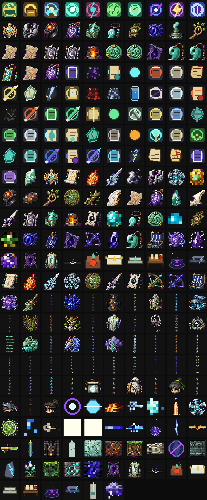
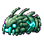
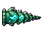
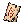
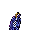

# 美术素材图库

[返回首页](Home.md)

本页集中展示 `Assets/Final` 中的第一版最终素材。所有图片均为透明 PNG，可从对应 Wiki 页面跳转查看上下文。

## 总览图

## Boss

| 素材 | 名称 | ID | 类型 | 尺寸 |
| --- | --- | --- | --- | --- |
|  | 灵脉蠕虫 | `spirit_vein_wyrm` | `boss_head` | 32x32 |
|  | 药宗守园人 | `garden_warden` | `body` | 128x128 |
|  | 药宗守园人 | `garden_warden` | `boss_head` | 32x32 |
|  | 玄炉铁傀 | `black_furnace_iron_golem` | `body` | 144x144 |
|  | 玄炉铁傀 | `black_furnace_iron_golem` | `boss_head` | 32x32 |
|  | 劫云化身 | `tribulation_cloud_avatar` | `body` | 160x120 |
|  | 劫云化身 | `tribulation_cloud_avatar` | `boss_head` | 32x32 |
|  | 雷泽蛟 | `thunder_marsh_jiao` | `boss_head` | 40x40 |
|  | 星渊胎主 | `abyssal_star_womb` | `body` | 160x160 |
|  | 星渊胎主 | `abyssal_star_womb` | `boss_head` | 32x32 |
|  | 无相剑魄 | `formless_sword_soul` | `body` | 128x128 |
|  | 无相剑魄 | `formless_sword_soul` | `boss_head` | 32x32 |
|  | 青木药王残影 | `greenwood_medicine_king_echo` | `body` | 144x144 |
|  | 青木药王残影 | `greenwood_medicine_king_echo` | `boss_head` | 32x32 |
|  | 天碑守御 | `heaven_tablet_guardian` | `body` | 128x192 |
|  | 天碑守御 | `heaven_tablet_guardian` | `boss_head` | 32x32 |
|  | 残天监察使 | `broken_heaven_inspector` | `body` | 160x160 |
|  | 残天监察使 | `broken_heaven_inspector` | `boss_head` | 32x32 |
|  | 月骸仙君 | `moonbone_immortal` | `body` | 200x200 |
|  | 月骸仙君 | `moonbone_immortal` | `boss_head` | 40x40 |
|  | 旧天道核心 | `old_heaven_dao_core` | `body` | 208x208 |
|  | 旧天道核心 | `old_heaven_dao_core` | `boss_head` | 40x40 |
|  | 灵脉蠕虫 | `spirit_vein_wyrm` | `head` | 64x64 |
|  | 灵脉蠕虫 | `spirit_vein_wyrm` | `body` | 64x64 |
|  | 灵脉蠕虫 | `spirit_vein_wyrm` | `tail` | 64x48 |
|  | shattered jade wyrm minion | `shattered_jade_wyrm_minion` | `head` | 32x32 |
|  | shattered jade wyrm minion | `shattered_jade_wyrm_minion` | `body` | 32x32 |
|  | shattered jade wyrm minion | `shattered_jade_wyrm_minion` | `tail` | 32x24 |
|  | 雷泽蛟 | `thunder_marsh_jiao` | `head` | 96x80 |
|  | 雷泽蛟 | `thunder_marsh_jiao` | `body` | 96x80 |
|  | 雷泽蛟 | `thunder_marsh_jiao` | `tail` | 96x64 |

## 敌怪

| 素材 | 名称 | ID | 类型 | 尺寸 |
| --- | --- | --- | --- | --- |
|  | 游灵史莱姆 | `wandering_spirit_slime` | `base` | 40x40 |
|  | 碎玉虫 | `shattered_jade_worm` | `base` | 54x28 |
|  | 符纸蝠 | `talisman_bat` | `base` | 50x34 |
|  | 药园藤妖 | `herb_garden_vine_spirit` | `base` | 64x64 |
|  | 花瘴蝶 | `miasma_flower_moth` | `base` | 56x56 |
|  | 炉灰傀 | `furnace_ash_golem` | `base` | 72x72 |
|  | 铁屑灵 | `iron_shard_spirit` | `base` | 36x36 |
|  | 劫云灵 | `tribulation_cloudling` | `base` | 56x48 |
|  | 雷纹鹰 | `thunder_pattern_hawk` | `base` | 68x52 |
|  | 星蚀修士 | `star_eclipsed_cultivator` | `base` | 64x64 |
|  | 星渊幼体 | `star_abyss_larva` | `base` | 52x36 |
|  | 执念剑修 | `obsessed_sword_cultivator` | `base` | 72x88 |
|  | 藏经残影 | `scripture_archive_echo` | `base` | 64x64 |
|  | 仙傀 | `celestial_puppet` | `base` | 72x80 |
|  | 天碑卫 | `heaven_tablet_guard` | `base` | 72x88 |
|  | 月骸修士 | `moonbone_cultivator` | `base` | 72x88 |
|  | 归档仙魂 | `archived_immortal_soul` | `base` | 80x80 |

## NPC

| 素材 | 名称 | ID | 类型 | 尺寸 |
| --- | --- | --- | --- | --- |
|  | 药宗遗徒 | `herb_sect_apprentice` | `body` | 40x56 |
|  | 游方器师 | `wandering_artificer` | `body` | 40x56 |
|  | 观劫道人 | `tribulation_observer` | `body` | 40x56 |
|  | 残卷书灵 | `archive_scroll_spirit` | `body` | 40x56 |
|  | 坠天信使 | `fallen_heaven_messenger` | `body` | 40x56 |
|  | 药宗遗徒 | `herb_sect_apprentice` | `head` | 32x32 |
|  | 游方器师 | `wandering_artificer` | `head` | 32x32 |
|  | 观劫道人 | `tribulation_observer` | `head` | 32x32 |
|  | 残卷书灵 | `archive_scroll_spirit` | `head` | 32x32 |
|  | 坠天信使 | `fallen_heaven_messenger` | `head` | 32x32 |

## 物品

| 素材 | 名称 | ID | 类型 | 尺寸 |
| --- | --- | --- | --- | --- |
|  | 下品灵石 | `low_grade_spirit_stone` | `item_icon` | 24x24 |
|  | 灵气凝胶 | `spirit_gel` | `item_icon` | 20x20 |
|  | 残符纸 | `torn_talisman_paper` | `item_icon` | 28x24 |
|  | 青木根 | `greenwood_root` | `item_icon` | 24x24 |
|  | 炉渣铁 | `furnace_slag_iron` | `item_icon` | 28x28 |
|  | 器胚碎片 | `artifact_blank_shard` | `item_icon` | 24x24 |
|  | 劫云露 | `tribulation_cloud_dew` | `item_icon` | 24x24 |
|  | 星蚀晶 | `star_eclipse_crystal` | `item_icon` | 28x28 |
|  | 宗门令 | `sect_trial_token` | `item_icon` | 32x32 |
|  | 天道碎片 | `heaven_dao_fragment` | `item_icon` | 32x32 |
|  | 月骸骨 | `moonbone` | `item_icon` | 36x36 |
|  | 斩道尘 | `dao_severing_dust` | `item_icon` | 28x28 |
|  | 引气符 | `qi_drawing_talisman` | `item_icon` | 32x32 |
|  | 回春丹 | `spring_return_pill` | `item_icon` | 22x22 |
|  | 凝气丹 | `qi_condensing_pill` | `item_icon` | 24x24 |
|  | 筑基丹 | `foundation_pill` | `item_icon` | 24x24 |
|  | 抗劫丹 | `tribulation_resisting_pill` | `item_icon` | 28x28 |
|  | 星渊禁符 | `star_abyss_forbidden_talisman` | `item_icon` | 36x36 |
|  | 灵脉香 | `spirit_vein_incense` | `item_icon` | 32x32 |
|  | 守园残钥 | `garden_broken_key` | `item_icon` | 32x32 |
|  | 旧炉火种 | `old_furnace_ember` | `item_icon` | 28x28 |
|  | 引雷玉 | `thunder_calling_jade` | `item_icon` | 36x36 |
|  | 星渊胎膜 | `star_abyss_membrane` | `item_icon` | 32x32 |
|  | 天碑拓片 | `heaven_tablet_rubbing` | `item_icon` | 32x32 |
|  | 月骸祭符 | `moonbone_ritual_talisman` | `item_icon` | 36x36 |

## 装备

| 素材 | 名称 | ID | 类型 | 尺寸 |
| --- | --- | --- | --- | --- |
|  | 木纹飞剑 | `woodgrain_flying_sword` | `item_icon` | 56x56 |
|  | 破云飞剑 | `cloudpiercer_flying_sword` | `item_icon` | 72x72 |
|  | 雷纹剑匣 | `thunder_pattern_sword_case` | `item_icon` | 80x80 |
|  | 无相剑轮 | `formless_sword_wheel` | `item_icon` | 96x96 |
|  | 月骸法剑 | `moonbone_dharma_sword` | `item_icon` | 104x104 |
|  | 朱砂符火 | `cinnabar_talisman_flame_item` | `item_icon` | 48x48 |
|  | 青木阵盘 | `greenwood_array_plate` | `item_icon` | 56x56 |
|  | 雷符阵盘 | `thunder_talisman_array_plate` | `item_icon` | 60x60 |
|  | 残天法旨 | `broken_heaven_decree` | `item_icon` | 56x56 |
|  | 旧天道残卷 | `old_heaven_dao_scroll` | `item_icon` | 72x72 |
|  | 灵木短弩 | `spiritwood_crossbow` | `item_icon` | 56x44 |
|  | 星蚀弩机 | `star_eclipse_arbalest` | `item_icon` | 72x52 |
|  | 聚气坠 | `qi_gathering_pendant` | `item_icon` | 36x32 |
|  | 灵木护符 | `spiritwood_charm` | `item_icon` | 32x32 |
|  | 炉心戒 | `furnace_heart_ring` | `item_icon` | 32x32 |
|  | 避雷玉佩 | `lightning_ward_jade` | `item_icon` | 32x32 |
|  | 星渊眼 | `star_abyss_eye` | `item_icon` | 36x36 |
|  | 元婴玉匣 | `nascent_soul_jade_box` | `item_icon` | 36x32 |
|  | 残天冠印 | `broken_heaven_crown_seal` | `item_icon` | 36x36 |
|  | 斩道环 | `dao_severing_ring` | `item_icon` | 32x32 |

## 投射物

| 素材 | 名称 | ID | 类型 | 尺寸 |
| --- | --- | --- | --- | --- |
|  | 木纹飞剑弹 | `woodgrain_sword_proj` | `projectile` | 40x20 |
|  | 破云飞剑弹 | `cloudpiercer_sword_proj` | `projectile` | 56x24 |
|  | 云气弹 | `cloud_wisp_proj` | `projectile` | 28x20 |
|  | 雷纹飞剑 | `thunder_sword_proj` | `projectile` | 56x24 |
|  | 小雷 | `minor_thunderbolt_proj` | `projectile` | 24x80 |
|  | 无相剑轮投射物 | `formless_sword_wheel_proj` | `projectile` | 80x80 |
|  | 月骨残刃 | `moonbone_shard_proj` | `projectile` | 28x20 |
|  | 朱砂符火投射物 | `cinnabar_talisman_flame` | `projectile` | 32x32 |
|  | 青木阵域 | `greenwood_array_field` | `projectile` | 96x96 |
|  | 雷符阵域 | `thunder_talisman_array` | `projectile` | 96x96 |
|  | 审判光束 | `decree_judgement_beam` | `projectile` | 40x160 |
|  | 灵气箭 | `spirit_bolt` | `projectile` | 20x12 |
|  | 星蚀分裂弹 | `star_eclipse_split_bolt` | `projectile` | 32x32 |

## Tile / UI

| 素材 | 名称 | ID | 类型 | 尺寸 |
| --- | --- | --- | --- | --- |
|  | 灵石矿 | `spirit_ore_tile` | `tile` | 16x16 |
|  | 灵苔 | `spirit_moss` | `tile` | 16x16 |
|  | 青木土 | `greenwood_soil_tile` | `tile` | 16x16 |
|  | 灵草 | `spirit_herb` | `tile` | 16x24 |
|  | 炉渣石 | `furnace_slag_tile` | `tile` | 16x16 |
|  | 玄炉墙 | `black_furnace_wall` | `wall` | 16x16 |
|  | 雷云块 | `thunder_cloud_tile` | `tile` | 16x16 |
|  | 鸣雷石 | `singing_thunder_stone` | `object` | 32x32 |
|  | 星渊晶岩 | `star_abyss_crystal_tile` | `tile` | 16x16 |
|  | 裂隙膜 | `rift_membrane` | `object` | 32x32 |
|  | 宗门石砖 | `sect_ruin_brick` | `tile` | 16x16 |
|  | 剑碑 | `sword_tablet` | `object` | 32x48 |
|  | 坠天玉砖 | `fallen_heaven_jade_tile` | `tile` | 16x16 |
|  | 破损天碑 | `broken_heaven_tablet` | `object` | 32x64 |
|  | 月骸骨岩 | `moonbone_tile` | `tile` | 16x16 |
|  | 归档光柱 | `archive_light_pillar` | `object` | 32x96 |
|  | 灵气条框 | `spiritual_energy_bar_frame` | `ui` | 164x16 |
|  | 灵气条填充 | `spiritual_energy_bar_fill` | `ui` | 160x12 |
|  | 灵压警告图标 | `pressure_warning_icon` | `ui` | 32x32 |
|  | 法宝槽 | `artifact_slot_frame` | `ui` | 40x40 |
|  | 天劫预警线 | `tribulation_warning_line` | `ui` | 16x4 |
