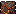
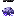
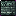

# 生态生成与 Tile 规格

[返回生态总览](Overview.md)

本页记录生态生成、判定和地图显示参数。字段借鉴 Terraria/大型 Mod wiki 对 biome 条件、tile 数量、生成位置和敌怪池的写法。

## 生态生成参数

| 生态 | ID | 阶段 | 生成位置 | 区域尺寸 | 判定 Tile | 判定阈值 | 地图颜色 | 背景优先级 |
| --- | --- | --- | --- | --- | --- | --- | --- | --- |
| 浅层灵脉 | `shallow_spirit_veins` | 开局 | 地下浅层/洞穴上部 | 20-50 宽，12-28 高 | 灵石矿、灵苔 | 40 tiles | #4EC9A2 | 低 |
| 青木药园 | `greenwood_herb_garden` | Pre-Hardmode | 地下丛林支系 | 80-140 宽，45-70 高 | 青木土、灵草 | 120 tiles | #5FAF5A | 中 |
| 沉炉矿脉 | `sunken_furnace_vein` | Pre-Hardmode | 洞穴层/熔岩上方 | 70-130 宽，40-75 高 | 炉渣石、玄炉墙 | 120 tiles | #9A4B32 | 中 |
| 雷泽云层 | `thunder_marsh_clouds` | Hardmode | 高空/空岛附近 | 90-180 宽，35-65 高 | 雷云块、鸣雷石 | 100 tiles | #6F74D8 | 中 |
| 星渊裂隙 | `star_abyss_rift` | Hardmode | 地下深层/陨石附近 | 80-160 宽，50-90 高 | 星渊晶岩、裂隙膜 | 140 tiles | #28326F | 高 |
| 万宗遗址 | `ten_thousand_sects_ruins` | Post-Plantera | 地牢深处/地下结构 | 160-260 宽，80-130 高 | 宗门石砖、藏经墙 | 180 tiles | #B9B08A | 高 |
| 坠天宫阙 | `fallen_heaven_palace` | Post-Golem | 高空特殊结构 | 160-300 宽，90-150 高 | 坠天玉砖、天碑 | 160 tiles | #D8D1A3 | 高 |
| 月骸天渊 | `moonbone_abyss` | Post-Moon Lord | 专属终局区域 | 220-360 宽，120-180 高 | 月骸骨岩、归档墙 | 200 tiles | #DDE8FF | 最高 |

## 敌怪池权重

| 生态 | 敌怪池 | 权重说明 |
| --- | --- | --- |
| 浅层灵脉 | 游灵史莱姆 45%、碎玉虫 30%、符纸蝠 25% | 低威胁教学生态 |
| 青木药园 | 药园藤妖 55%、花瘴蝶 45% | 藤妖控制地面，花瘴蝶控制空中 |
| 沉炉矿脉 | 炉灰傀 45%、铁屑灵 55% | 高防地面 + 飞行群怪 |
| 雷泽云层 | 劫云灵 50%、雷纹鹰 50% | 落雷预警 + 俯冲 |
| 星渊裂隙 | 星蚀修士 45%、星渊幼体 55% | 远程压制 + 贴身威胁 |
| 万宗遗址 | 执念剑修 50%、藏经残影 50% | 近战格挡 + 法术弹幕 |
| 坠天宫阙 | 仙傀 55%、天碑卫 45% | 模块攻击 + 盾卫 |
| 月骸天渊 | 月骸修士 55%、归档仙魂 45% | 高速终局敌怪 |

## Tile 与 Wall 资源规格

| 资源 | ID | 类型 | 画布 | Frame | 是否发光 | 是否合并 | 掉落物 |
| --- | --- | --- | --- | --- | --- | --- | --- |
| 灵石矿 | `spirit_ore_tile` | Tile/Ore | 16x16 | 3x3 变体 | 微光 | Stone | 下品灵石 |
| 灵苔 | `spirit_moss` | Decorative Tile | 16x16 | 4 变体 | 微光 | Moss | 灵苔 |
| 青木土 | `greenwood_soil_tile` | Tile | 16x16 | 3x3 变体 | 否 | Dirt/Jungle | 青木根低概率 |
| 灵草 | `spirit_herb` | Plant | 16x24 | 3 成长阶段 | 微光 | 无 | 灵草 |
| 炉渣石 | `furnace_slag_tile` | Tile | 16x16 | 3x3 变体 | 裂纹发光 | Stone | 炉渣铁 |
| 玄炉墙 | `black_furnace_wall` | Wall | 16x16 | 4 变体 | 否 | 无 | 无 |
| 雷云块 | `thunder_cloud_tile` | Platform/Tile | 16x16 | 3x3 变体 | 闪烁 | Cloud | 无 |
| 鸣雷石 | `singing_thunder_stone` | Tile/Object | 24x32 | 2 帧 | 是 | 无 | 鸣雷石 |
| 星渊晶岩 | `star_abyss_crystal_tile` | Tile/Ore | 16x16 | 3x3 变体 | 是 | Stone | 星蚀晶 |
| 裂隙膜 | `rift_membrane` | Decorative Tile | 32x32 | 4 帧 | 微光 | 无 | 渊尘低概率 |
| 宗门石砖 | `sect_ruin_brick` | Tile | 16x16 | 3x3 变体 | 否 | Dungeon/Stone | 无 |
| 剑碑 | `sword_tablet` | Object | 32x48 | 1 帧 | 微光 | 无 | 无 |
| 坠天玉砖 | `fallen_heaven_jade_tile` | Tile | 16x16 | 3x3 变体 | 微光 | 无 | 残天玉低概率 |
| 破损天碑 | `broken_heaven_tablet` | Object | 32x64 | 2 帧 | 是 | 无 | 无 |
| 月骸骨岩 | `moonbone_tile` | Tile | 16x16 | 3x3 变体 | 微光 | 无 | 月骸骨 |
| 归档光柱 | `archive_light_pillar` | Object | 32x96 | 6 帧 | 是 | 无 | 无 |

## Worldgen 约束

- 不覆盖原版地牢、神庙、出生点和海洋核心区域。
- 小型生态可重复生成，大型结构每世界 1 到 2 个。
- Hardmode 后生成的生态需要给玩家明确提示。
- 所有发光 Tile 必须控制亮度，避免破坏洞穴阅读性。

## Tile / Object / UI 美术素材

<!-- ART_SECTION:tile-ui-art:START -->

| 素材 | 名称 | ID | 类型 | 尺寸 |
| --- | --- | --- | --- | --- |
|  | 灵石矿 | `spirit_ore_tile` | `tile` | 16x16 |
|  | 灵苔 | `spirit_moss` | `tile` | 16x16 |
|  | 青木土 | `greenwood_soil_tile` | `tile` | 16x16 |
|  | 灵草 | `spirit_herb` | `tile` | 16x24 |
|  | 炉渣石 | `furnace_slag_tile` | `tile` | 16x16 |
|  | 玄炉墙 | `black_furnace_wall` | `wall` | 16x16 |
|  | 雷云块 | `thunder_cloud_tile` | `tile` | 16x16 |
|  | 鸣雷石 | `singing_thunder_stone` | `object` | 24x32 |
|  | 星渊晶岩 | `star_abyss_crystal_tile` | `tile` | 16x16 |
|  | 裂隙膜 | `rift_membrane` | `object` | 32x32 |
|  | 宗门石砖 | `sect_ruin_brick` | `tile` | 16x16 |
|  | 剑碑 | `sword_tablet` | `object` | 32x48 |
|  | 坠天玉砖 | `fallen_heaven_jade_tile` | `tile` | 16x16 |
|  | 破损天碑 | `broken_heaven_tablet` | `object` | 32x64 |
|  | 月骸骨岩 | `moonbone_tile` | `tile` | 16x16 |
|  | 归档光柱 | `archive_light_pillar` | `object` | 32x96 |
|  | 灵气条框 | `spiritual_energy_bar_frame` | `ui` | 164x16 |
|  | 灵气条填充 | `spiritual_energy_bar_fill` | `ui` | 160x12 |
|  | 灵压警告图标 | `pressure_warning_icon` | `ui` | 32x32 |
|  | 法宝槽 | `artifact_slot_frame` | `ui` | 40x40 |
|  | 天劫预警线 | `tribulation_warning_line` | `ui` | 16x4 |

<!-- ART_SECTION:tile-ui-art:END -->
