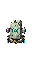

# 坠天宫阙

[返回生态总览](../Overview.md)

## 概念

坠天宫阙是 Post-Golem 后的天庭残骸生态。它将残天司、化神境和终局路线连接起来。

## 生成

- 阶段：Post-Golem。
- 位置：高空特殊结构，或通过天碑传送进入。
- 结构：破碎玉阶、悬浮宫砖、天碑终端、法旨残页。
- 危险：仙傀巡逻和审判光束陷阱。

## 内容

- 敌怪：仙傀、天碑卫。
- Boss：[天碑守御](../../Bosses/Entries/Heaven_Tablet_Guardian.md)、[残天监察使](../../Bosses/Entries/Broken_Heaven_Inspector.md)。
- 资源：天道碎片、残天玉、破损法旨。
- NPC：[坠天信使](../../NPCs/Entries/Fallen_Heaven_Messenger.md)。

## 当前美术素材

<!-- ART_SECTION:entry-art:START -->

| 素材 | 名称 | ID | 类型 | 尺寸 |
| --- | --- | --- | --- | --- |
|  | 坠天玉砖 | `fallen_heaven_jade_tile` | `tile` | 16x16 |
|  | 破损天碑 | `broken_heaven_tablet` | `object` | 32x64 |

<!-- ART_SECTION:entry-art:END -->

## 美术资源

- Tile：`fallen_heaven_jade_tile`，16x16，白玉砖、残金边线。
- 装饰：`broken_heaven_tablet`，32x64，裂碑和金色铭文。
- 背景：高空宫阙剪影，低饱和金白。
- Prompt 重点：`fallen celestial palace jade tile, broken golden decree lines, Terraria pixel art`。
