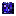

# 星渊裂隙

[返回生态总览](../Overview.md)

## 当前美术素材

<!-- ART_SECTION:entry-art:START -->

| 素材 | 名称 | ID | 类型 | 尺寸 |
| --- | --- | --- | --- | --- |
|  | 星渊晶岩 | `star_abyss_crystal_tile` | `tile` | 16x16 |
|  | 裂隙膜 | `rift_membrane` | `object` | 32x32 |

<!-- ART_SECTION:entry-art:END -->

## 美术资源

- Tile：`star_abyss_crystal_tile`，16x16，紫黑岩底、深蓝星晶。
- 装饰：`rift_membrane`，32x32，边缘必须硬，不做糊状触手。
- 背景墙：`abyssal_star_wall`，16x16，低亮星点和裂纹。
- Prompt 重点：`void star rift crystal, dark blue infection, Terraria pixel terrain tile`。

## 概念

星渊裂隙是 Hardmode 后出现的污染生态。它代表外界星灾侵入玄垣界，提供禁术和高风险装备材料。

## 生成

- 阶段：Hardmode。
- 位置：地下深层、陨石坑附近或世界边缘裂口。
- 结构：暗蓝晶簇、裂隙肉膜、漂浮星尘。
- 风险：提高灵压紊乱概率。

## 内容

- 敌怪：星蚀修士、星渊幼体。
- Boss：[星渊胎主](../../Bosses/Entries/Abyssal_Star_Womb.md)。
- 资源：星蚀晶、渊尘、暗蓝灵液。
- 装备：星渊眼、星蚀弩机。

## 代码实现

- ? 世界生成骨架（Tile铺设+物件放置）
- ? 敌怪生成池（权重与wiki对齐）
- ? 环境效果（星渊污染/雷泽落雷/月骨灵压等）
- ? 判定阈值（tile count ≥ wiki指定值）
