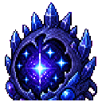
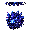

## 当前美术素材

<!-- ART_SECTION:entry-art:START -->

| 素材 | 名称 | ID | 类型 | 尺寸 |
| --- | --- | --- | --- | --- |
|  | 星渊胎主 | `abyssal_star_womb` | `body` | 160x160 |
|  | 星渊胎主 | `abyssal_star_womb` | `boss_head` | 32x32 |

<!-- ART_SECTION:entry-art:END -->

## 美术资源

- 主体：160x160，暗蓝胚胎核心、晶刺外壳、紫黑液体边缘。
- 动画：`pulse` 6 帧，`open` 5 帧，`core_fly` 6 帧。
- 头像：32x32，星形瞳孔和裂隙外壳。
- 幼体：32x32，深蓝小型寄生体。
- Prompt 重点：`void star womb boss, crystalline shell, dark blue embryo core, readable horror pixel art`。

# 星渊胎主

[返回 Boss 总览](../Overview.md)

## 定位

- 英文 ID：`abyssal_star_womb`
- 阶段：Hardmode
- 所属线：星渊余孽
- 角色：星灾禁术和污染材料 Boss。

## 召唤

在[星渊裂隙](../../Biomes/Entries/Star_Abyss_Rift.md)使用星渊胎膜，或让裂隙污染值达到阈值后自然生成一次。

## 战斗设计

- 阶段一：固定核心，释放星刺和幼体。
- 阶段二：核心脱离外壳，追踪玩家。
- 阶段三：低血量打开裂隙门，周期性吸引玩家。
- 核心考点：清理召唤物和处理吸引力。

## 掉落

- 星蚀晶。
- 渊尘。
- 星渊眼。
- 星蚀弩机材料。

## 剧情

胎主不是星渊的源头，而是裂隙在玄垣界中长出的第一枚器官。

## 当前代码与验证范围

- 三阶段阈值为65%/30%生命。环弹间隔为300/240/180帧，开始前60帧锁定两个相反的安全方向，以青色边界标示。
- 原6/8/12个方向保留两个缺口，释放4/6/10发灵弹，然后进入45帧恢复。预警和恢复无接触伤害，期间暂停其它招式；换目标取消并重新给完整间隔。
- 第二阶段起每两轮环弹释放一个预测18帧的压缩场，压缩场自身另有45帧预警。原无前摇加速已取消。
- 上述固定核心、幼体、裂隙吸引力是早期设计，尚未按该方案实现。
- 第139轮源码组合回归4687项、实际编译产物1552项和专服加载通过；NPC/弹体创建及运输使用源码边界夹具，实际图形显示、多人延迟、四职业避让和平衡仍待验收。
