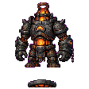

## 当前美术素材

<!-- ART_SECTION:entry-art:START -->

| 素材 | 名称 | ID | 类型 | 尺寸 |
| --- | --- | --- | --- | --- |
|  | 玄炉铁傀 | `black_furnace_iron_golem` | `body` | 144x144 |
|  | 玄炉铁傀 | `black_furnace_iron_golem` | `boss_head` | 32x32 |

<!-- ART_SECTION:entry-art:END -->

## 美术资源

- 主体：144x144，厚重铁傀，胸口橙红炉心，玄铁灰和暗红色板。
- 动画：`idle` 4 帧，`slam` 6 帧，`forge_breath` 6 帧，`hit` 2 帧。
- 头像：32x32，方形铁面和炉心光。
- 投射物：炉灰 16x16，火星 8x8。
- Prompt 重点：`heavy black iron furnace golem, glowing chest furnace, hammer fists, crisp pixel art`。

# 玄炉铁傀

[返回 Boss 总览](../Overview.md)

## 当前定位与召唤

炼器线的困难模式前Boss；使用旧炉余烬召唤物，需要引气境、已击败灵脉蠕虫，并处于沉炉矿脉，无夜晚限制。工作台配方为旧炉余烬材料×1、下品灵石×13；当前没有“修复旧炉后消耗火把”的召唤事务。

基础生命3200、伤害34、防御18；引擎难度与人数缩放沿集中规则。最终三难度/人数数值和战斗时长仍待实机记录。

## 当前战斗

- 生命低于60%/30%进入第二/第三阶段。当前主要是悬浮追位、三发灵弹与侧向灵弹组合；低血量追加加速冲刺，尚未完成独立重击前摇/恢复窗口。
- 第二阶段起每次组合轮次尝试召唤两只铁屑灵；Boss附近1600像素内存活铁屑灵达到6只时停止补充，剩1名额只补1只。天然铁屑灵同样计入附近战斗数量，其它类型和远处敌怪不占额度。
- 清除铁屑灵可降低群体冲刺压力；未来轮次可补回缺额。当前铁屑灵不会修复Boss护甲，击杀它们也不会触发额外破甲奖励。
- 召唤只由服务端执行，创建成功后指定战斗目标并标记同步；失败/槽位耗尽安全停止该批。无有效目标时主体停止接触伤害、取消计时并退出，召唤铁屑灵绑定本次Boss实例编号，来源死亡/离场/失去有效目标、距来源超过4000像素或存活满900tick（15秒）时由权威端直接清除，不触发击杀奖励。天然铁屑灵保持普通生命周期。

## 当前奖励

普通模式直接掉炉渣铁16–28、器胚碎片8–16、下品灵石8–16，另有概率灵胶/额外器胚碎片和1/20宠物。专家/大师通过宝藏袋获得材料及专家饰品炉热护符；大师额外纪念碑。掉落与多人参与资格、开袋/宠物显示仍需实机验收。

旧炼器台、炉心戒和玄炉重锤不在当前Boss直接掉落表。重锤由现有制作链获得；主线攻略应以物品提示与注册配方为准。

## 剧情与后续设计

它原本是器盟的自动锻造傀儡。坠天之夜后，炉心指令损坏，只会把一切移动物锻成材料。

独立重拳/跳砸/炉灰、读条恢复或破甲窗口仍待实现；上方动画列表是素材设计意图，不代表当前引擎动画已验收。铁屑灵来源清理的真实网络运输、15秒存活平衡、召唤位置与穿墙/刷取经济、三难度及双客户端战斗仍待验证。

## 验证状态

第102轮实际召唤partial钩子149条回归、编译产物累计834条、原生构建/打包/专服加载通过；原生创建、NPC移动及网络运输在源码回归中仍为模拟边界。第104轮补1,100条来源生命周期回归与21条实际编译方法检查，累计855条，原生构建/打包/专服加载通过。源码存在不能替代可读性、难度与美术验收。
