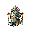

## 当前美术素材

<!-- ART_SECTION:entry-art:START -->

| 素材 | 名称 | ID | 类型 | 尺寸 |
| --- | --- | --- | --- | --- |
|  | 残天监察使 | `broken_heaven_inspector` | `body` | 160x160 |
|  | 残天监察使 | `broken_heaven_inspector` | `boss_head` | 32x32 |

<!-- ART_SECTION:entry-art:END -->

## 美术资源

- 主体：160x160，白玉甲胄人形，残金法旨，面部无五官只有印章。
- 动画：`cast` 6 帧，`summon` 5 帧，`blade` 6 帧。
- 头像：32x32，无面玉盔和金色印章。
- 召唤物：仙傀 64x64。
- Prompt 重点：`broken celestial inspector, jade armor, golden decree scroll, faceless divine judge`。

# 残天监察使

[返回 Boss 总览](../Overview.md)

## 定位

- 英文 ID：`broken_heaven_inspector`
- 阶段：Post-Golem
- 所属线：残天司
- 角色：残天司人格化 Boss，推动终局路线。

## 召唤

化神境后使用天庭法旨，或完成坠天信使任务线后挑战。

## 战斗设计（持刃动作和连招仍待扩展）

- 阶段一：持法旨施放直线审判。
- 阶段二：召唤仙傀协同攻击。
- 阶段三：失去法旨后改用近身裁决刃。
- 核心考点：多目标压力和弹幕空隙。

## 掉落

- 天庭法旨。
- 残天冠印。
- 仙傀令。
- 终局路线线索。

## 剧情

监察使曾经负责记录修士功过。如今它的数据损坏，却仍坚持审判所有“不在册”的生命。

## 当前代码实现

- 三阶段门槛为70%和35%生命，保留普通灵弹、召唤门槛、难度数值和现有掉落。
- 避中令：橙色中央64×480区域危险，离开该区域。归位令：橙色两侧区域危险，回到中央空隙。法旨交替，危险位置在60帧预警开始时锁定，玩家移动不会重瞄。
- 光柱持续30帧，施放后恢复45帧。预警与恢复停止移动/其它施法并无接触伤害，恢复末帧仍安全；目标变化取消旧预告，重新完整间隔。
- 第二阶段起，每场最多成功创建两只仙傀。容量/位置失败不消耗缺额，下条完整预告再试，击败后不补刷。出生身体在Boss侧青色区域预告，生成资格在读条开始时锁定，不因突然转阶段而追加。
- 第155轮仙傀已绑定父实例，900帧到期或来源失效由权威端无奖励撤场，目标与父同步，天然仙傀保留原行为。第三阶段已有60帧预告的160×48近身裁决刃，独立持刃动作/连招、美术、诏令链路和真实多人实战仍待完善。

第154轮源码组合22188项/弹体1427项、原生2846项及注册专服集成3133项通过。注册审计手动推进AI，不能据此认定完整玩家战斗、图形、援军生命周期或多人已验收。

### 第155轮（2026-10-09）：监察使仙傀来源生命周期

- 召唤仙傀绑定父槽位和64位战斗实例；900帧上限、4000像素来源范围，失去父来源/有效目标或状态异常时无奖励撤场。自然生成仙傀保留原行为。
- 权威端同步父攻击目标；客户端遇到来源/目标包迟到时无伤等待，不自行老化或清除。父ExtraAI共10字节（配额、预告、实例），子13字节，全包读取后更新，截断不改变状态。
- 34步源码检查通过；生命周期6148项，原生编译产物2878项；实际注册仙傀捕获实例和父消失清理审计3145项通过。官方构建0警告/0错误，打包及默认专服加载通过。原生本地化114文件、2项拒绝和包370条目/366资源/1481项通过。
- 注册审计手动推进AI，源码模拟覆盖槽位复用和900帧边界；真实多人运输、完整引擎战斗/图形/平衡仍未验收，R04/R11保持未完成。

### 第156轮（2026-10-09）：监察使第三阶段近身裁决刃

- 第三阶段诏令60帧预告同时显示Boss身边160×48横向斩击区，Boss静止，结束后裁决刃与既有法旨一同释放；30帧有效期及45帧无接触恢复。独立近身连招/持刃动画仍待扩展，并未将第三阶段设计完整标为验收。
- 裁决刃资格在预告开始锁定并写入完整11字节父ExtraAI；转阶段不临时加招，目标变化或无目标取消。子弹体沿用19字节来源/年龄协议、墙体过滤与来源失效无伤淡出。绘制与碰撞保持同一160×48身体。
- 34步/25个.NET源码检查通过；BossAdds22217项（新增29），Telegraphs1443项（新增16），原生Gameplay2912项（新增34），注册专服3151项（新增6）。注册审计验证三阶段两条连续法旨，仅第三阶段有近身刃；手动推进AI，不覆盖完整引擎tick/图形/真实客户端。
- 官方构建0警告/0错误，打包和默认专服加载run-302ffd722e47477ba8f3a950d7acc1c7通过；原生本地化114文件/2项拒绝及包370条目/366资源/1481项通过。注册审计summons-dd3feecc7de74364b3a24a3c524613de通过，原WLD/TWLD哈希不变。真实躲避、联机和数值平衡未验收，R01/R04/R11保持未完成。
