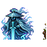

## 当前美术素材

<!-- ART_SECTION:entry-art:START -->

| 素材 | 名称 | ID | 类型 | 尺寸 |
| --- | --- | --- | --- | --- |
|  | 无相剑魄 | `formless_sword_soul` | `body` | 128x128 |
|  | 无相剑魄 | `formless_sword_soul` | `boss_head` | 32x32 |

<!-- ART_SECTION:entry-art:END -->

## 美术资源

- 主体：128x128，半透明剑修残影，中心是一把清晰飞剑。
- 动画：`idle` 6 帧，`slash` 5 帧，`split` 5 帧。
- 头像：32x32，飞剑与空白面孔。
- 投射物：剑影 48x16，剑阵线 64x8。
- Prompt 重点：`formless sword soul, ghost swordsman silhouette, central flying sword, pale cyan sword aura`。

# 无相剑魄

[返回 Boss 总览](../Overview.md)

## 定位

- 英文 ID：`formless_sword_soul`
- 阶段：Post-Plantera
- 所属线：无相散修
- 角色：飞剑中后期路线 Boss。

## 召唤

在[万宗遗址](../../Biomes/Entries/Ten_Thousand_Sects_Ruins.md)的剑碑前使用宗门令。

## 战斗设计

- 阶段一：单剑突刺、回旋、格挡反击。
- 阶段二：分出三道剑影，按不同轨迹攻击。
- 阶段三：无相剑阵，玩家需要观察安全缺口。
- 核心考点：节奏、方向判断和位移。

## 掉落

- 断剑残意。
- 无相剑轮。
- 剑修残卷。
- 飞剑铭刻材料。

## 剧情

它是一名无名散修留下的剑意。它不守宗门规矩，只承认能在剑阵中活下来的人。

## 当前代码与验证范围

第142轮剑魄使用横纵交替对穿剑阵。每次45帧预警锁定玩家当时位置，绿色边界标出中央160像素通道，青色线标出危险弹幕行；释放后45帧恢复无接触伤害。三阶段为75%/35%生命阈值，间隔300/240/180帧，释放4/8/12发。换目标取消旧阵并重新给完整间隔，原无前摇加速已取消。

第二阶段起成功召唤三只执剑修士，部分失败下轮只补缺额，被击败后不补刷。召唤修士绑定Boss实例，来源失效、离场或900帧到期无奖励撤场；天然修士不受该寿命影响。

源码组合9042项、实际编译1758项、打包及专服加载通过。正向弹幕/NPC创建及运输由源码边界夹具模拟；独立剑形弹幕美术、实际显示、世界边缘、联机延迟和四职业实战仍待验收。早期战斗设计中的其它招式不代表已经实现。
