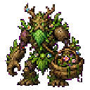

## 当前美术素材

<!-- ART_SECTION:entry-art:START -->

| 素材 | 名称 | ID | 类型 | 尺寸 |
| --- | --- | --- | --- | --- |
|  | 药宗守园人 | `garden_warden` | `body` | 128x128 |
|  | 药宗守园人 | `garden_warden` | `boss_head` | 32x32 |

<!-- ART_SECTION:entry-art:END -->

## 美术资源

- 主体：128x128，人形木傀儡，背负药篓，藤蔓手臂，深绿外轮廓。
- 动画：`idle` 4 帧，`cast` 6 帧，`hit` 2 帧。
- 头像：32x32，木面具和一片发光药叶。
- 场地物件：药种 16x16，治疗花 32x32。
- Prompt 重点：`wooden herbal sect garden guardian, vine arms, medicine basket, Terraria-style boss sprite`。

# 药宗守园人

[返回 Boss 总览](../Overview.md)

## 定位

- 英文 ID：`garden_warden`
- 阶段：Pre-Hardmode
- 所属线：青木药宗
- 角色：炼丹系统入口 Boss。

## 召唤

在[青木药园](../../Biomes/Entries/Greenwood_Herb_Garden.md)使用 `守园残钥`。召唤器以1守园残钥材料＋10下品灵石在工作台制作；须引气境并已击败灵脉蠕虫。

## 当前战斗机制

基础生命2800、伤害28、防御10，专家/大师/多人另走原生缩放。

| 阶段 | 移动/攻击间隔 | 荆棘布局 | 后续动作 |
| --- | --- | --- | --- |
| 生命≥65% | 悬停追位180帧，期间每90帧三发缓速灵弹 | 两条，距离施法锚点左右各112像素 | 60帧施法后恢复50帧 |
| 35%≤生命<65% | 悬停追位140帧 | 两条，中央通道保留 | 同上 |
| 生命<35% | 悬停追位110帧 | 四条，额外左右各224像素的外侧条带 | 恢复后进入36帧预警冲刺；冲刺24帧，再恢复50帧 |

荆棘在玩家脚下高度锁定，横向只预测当前速度最多96像素；施法后不会跟随玩家。每条80×48像素，绿色边框对应实际碰撞框；45帧预警无伤害，随后90帧有效，最后15帧淡出无伤害。命中沿原生玩家受伤流程附带2秒中毒。两条内侧荆棘之间保留144像素空隙，末阶段外侧荆棘也不填入这条通道。可留在通道、向外移动或跳出条带高度。

末阶段冲刺开始前锁定预测方向；绿色瞄准线覆盖384像素（336像素冲刺位移＋48像素主体半径），目标后续移动不会改变方向。施法、恢复和冲刺前摇期间没有接触伤害，释放冲刺后才恢复接触伤害；普通追位仍有接触伤害。墙体阻挡荆棘与主体对玩家的伤害。失去有效目标、距离超过4000像素、Boss死亡、重新选定目标或同NPC槽位换成新Boss时，旧荆棘会失效。

治疗花和可拆除药种仍是后续机制规划。当前实现的核心考点是辨认条带安全区、等待冲刺锁定后移动，以及利用恢复窗口输出。

## 当前奖励

普通模式保留两组青木根掉落（合计24–44）、8–16下品灵石及既有灵胶、器胚碎片、守园人面具稀有掉落。专家/大师通过独立宝藏袋领取同类核心材料，并含药园生息符专家饰品；大师模式另有药宗守园人大师纪念碑。击败记录与NPC/商店进度沿用已有世界系统。详细奖励概率见源码与[专家奖励](../../Items/Entries/Expert_Boss_Rewards.md)。

## 剧情

守园人是药宗留下的护园傀儡，仍把所有采药者视作入侵者。击败后，它把玩家误认为药宗新弟子。

## 实现与验收状态

战斗状态机、荆棘/冲刺预警、目标安全边界、来源编号隔离和迟加入剩余寿命同步已接入代码。229条实际战斗/弹体钩子回归、303条编译产物回归及原生打包/专服加载通过。

引擎移动、碰撞受伤、渲染、实际网络运输仍是源码测试的模拟边界；普通/专家/大师与多人实战时长、预警可读性、四职业躲避/输出和图形客户端表现须实机验收。新药种/治疗花与荆棘独立美术继续待办。
