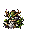

## 当前美术素材

<!-- ART_SECTION:entry-art:START -->

| 素材 | 名称 | ID | 类型 | 尺寸 |
| --- | --- | --- | --- | --- |
|  | 青木药王残影 | `greenwood_medicine_king_echo` | `body` | 144x144 |
|  | 青木药王残影 | `greenwood_medicine_king_echo` | `boss_head` | 32x32 |

<!-- ART_SECTION:entry-art:END -->

## 美术资源

- 主体：144x144，老者残影、青铜药鼎、背后药枝光轮。
- 动画：`cast` 6 帧，`cauldron` 4 帧，`absorb` 5 帧。
- 头像：32x32，药鼎和木纹面容。
- 场地物件：治疗花 24x24，毒花 24x24。
- Prompt 重点：`ancient herbal alchemist echo, bronze cauldron, green wood halo, Terraria boss sprite`。

# 青木药王残影

[返回 Boss 总览](../Overview.md)

## 定位

- 英文 ID：`greenwood_medicine_king_echo`
- 阶段：Post-Plantera
- 所属线：青木药宗
- 角色：高阶炼丹与生命系装备 Boss。

## 召唤

完成药宗残卷链后，在青木药园深处使用药王印。

## 战斗设计

- 阶段一：药鼎投掷丹火和灵草弹。
- 阶段二：场地生成治疗花和毒花，玩家需区分。
- 阶段三：药王残影吸收场地植物，强化下一轮攻击。
- 核心考点：场地管理和目标优先级。

## 掉落

- 高阶丹炉。
- 药王木心。
- 元婴灵胎材料。
- 生命系饰品升级件。

## 剧情

药王在坠天之夜尝试以众生药性修补灵脉，失败后残影仍在重复配方。

## 当前恢复机制与验收范围

第143轮第二阶段起有恢复仪式：每240帧开始90帧绿色读条，期间对Boss造成累计最大生命1%的伤害即可打断。换目标也会打断；读条成功恢复最多1%生命，每场最多三次，生命不会超过上限。成功或打断后进入60帧无接触伤害恢复，读条与恢复时暂停其它招式。原无前摇加速已取消。

普通攻击、法阵和召唤藤灵已有实现；第144轮召唤按三只成功配额，失败下轮补缺额、击败不补刷；第145轮来源绑定与限时撤场已实现，第146轮召唤已有45帧预警/30帧恢复，实际图形与联机仍待验收。早期设计中的治疗花与毒花不代表已按该方案实现。

源码组合11139项、实际编译1766项、构建/打包/专服加载通过。绿色读条实际显示、真实多人运输、治疗反制阈值和四职业战斗时长仍待实机验收。

第144轮藤灵创建继承Boss目标并同步。新增64项源码边界回归，完整创建/联机运输、地形安全与真实多人撤场尚需后续验证。

第145轮召唤藤灵绑定药王实例，来源死亡/离场、4000像素距离或900帧到期由服务器无奖励撤场。客户端来源/目标同步迟到时无伤等待；天然藤灵保留自疗与原生命周期。源码生命周期5138项、实际编译产物1787项通过，真实多人运输仍待验收。

第146轮召唤在药王附近青色区域预警45帧，然后创建配额内藤灵并恢复30帧。药王期间静止、无接触伤害且不叠加其它施法；目标变化取消，配额不消耗。出生地形和世界边缘仍待验证。新增289项源码/90项实际编译回归通过。

第147轮召唤会检查藤灵完整身体是否越界、占据实心地形或熔岩；每只最多检查12个区域内候选。没有安全位置时本轮不创建、不消耗缺额，之后重新预警再试。源码回归11514项、实际编译1882项通过；真实斜坡/平台/世界边缘和联机仍待验收。

第148轮用官方引擎的小型隔离Tilemap验证了空地/水域、实心块、熔岩和平台。平台占据出生体现在也会被拒绝；实际NPC出生、复杂斜坡/半砖及多人场景仍待验收。实际编译累计1889项通过。

第149轮在官方专服复制存档中实际创建药王和三只藤灵，确认48×48出生体位于青色预告区、父实例绑定及三只配额有效，来源失效可撤场。独立集成验收30项通过；这项工具直接调用召唤函数，完整预警释放、图形、复杂地形及多人仍待实机验收。

第150轮注册专服从实际第二阶段AI入口逐帧验证45帧召唤预警/30帧恢复：前44帧无藤灵，第45帧创建三只，期间不叠加普通灵弹/法阵或治疗，恢复末帧仍无接触伤害，下一帧恢复普通动作。集成467项通过，并修复失去目标时召唤状态取消的漏同步。验证手动推进AI钩子，完整世界tick/其它阶段、图形与真实多人尚未验收。
