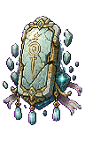

## 当前美术素材

<!-- ART_SECTION:entry-art:START -->

| 素材 | 名称 | ID | 类型 | 尺寸 |
| --- | --- | --- | --- | --- |
|  | 天碑守御 | `heaven_tablet_guardian` | `body` | 128x192 |
|  | 天碑守御 | `heaven_tablet_guardian` | `boss_head` | 32x32 |

<!-- ART_SECTION:entry-art:END -->

## 美术资源

- 主体：128x192，竖直白玉碑，裂纹、残金碑文、悬浮碎片。
- 动画：`idle` 6 帧，`shield` 4 帧，`break` 5 帧。
- 头像：32x32，玉碑上半和金色眼状符号。
- 投射物：碑文弹 16x16，审判光柱 32x128。
- Prompt 重点：`floating jade heaven tablet, golden decree runes, cracked divine archive boss`。

# 天碑守御

[返回 Boss 总览](../Overview.md)

## 定位

- 英文 ID：`heaven_tablet_guardian`
- 阶段：Post-Golem
- 所属线：残天司
- 角色：天庭残响和化神门槛 Boss。

## 召唤

在[坠天宫阙](../../Biomes/Entries/Fallen_Heaven_Palace.md)激活破损天碑。

## 后续战斗设计（四枚封印尚未实现）

- 阶段一：天碑悬浮，召唤碑文弹幕。
- 阶段二：碑文组成护盾，需要击破四枚印记。
- 阶段三：天碑裂开，释放审判光柱。
- 核心考点：按顺序处理印记和躲避直线威胁。

## 掉落

- 天道碎片。
- 天碑拓片。
- 天碑镇印。
- 化神突破材料。

## 剧情

天碑是旧天道的离线数据库。它不理解玩家，只能把玩家归类为未登记修士。

## 当前代码实现

- 三阶段普通碑文灵弹，阶段门槛为75%和35%生命；召唤门槛、难度数值和掉落沿用现有规则。
- 审判间隔300/240/180帧，60帧预警锁定位置，释放2/4/6道32×480光柱。绿色边线标出160像素中央安全通道；移动和转阶段不会重瞄或增加未预告光柱。
- 光柱持续30帧；Boss释放后恢复45帧，预警/恢复期间停移动、停其它施法并关闭接触伤害，恢复末帧仍安全。
- 目标变化取消旧读条，重新完整间隔；来源消失时光柱立即无伤并淡出。坏状态、墙体和多人权威处理已有代码。
- 四枚封印/护盾、独立美术、图形和真实多人战斗仍待完善。

第151轮完成以上审判机制。源码组合14464项/弹体1414项、原生2313项及注册专服集成1511项通过；集成审计手动推进AI钩子，不能据此认定完整引擎战斗、弹体实际年龄、通关或多人已验收。
