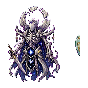

# 月骸仙君

[返回 Boss 总览](../Overview.md)

## 定位

- 英文 ID：`moonbone_immortal`
- 阶段：Post-Moon Lord
- 所属线：星灾/天庭
- 角色：揭示坠天真相的终局前 Boss。

## 召唤

在[月骸天渊](../../Biomes/Entries/Moonbone_Abyss.md)使用月骸祭符。

## 战斗设计

- 阶段一：月骨法剑和星灾弹幕交替。
- 阶段二：召唤归档仙魂，复制玩家旧攻击节奏。
- 阶段三：月骸外壳破碎，露出星渊核心。
- 核心考点：高机动、记忆攻击、弹幕阅读。

## 掉落

- 月骸骨。
- 星灾灵核。
- 月骸法剑材料。
- 旧天道核心钥匙。

## 剧情

月骸仙君曾是天庭打开高位面之门的主持者。它没有死亡，而是被星渊和月亮残骸共同保存成一具会思考的遗物。

## 当前美术素材

<!-- ART_SECTION:entry-art:START -->

| 素材 | 名称 | ID | 类型 | 尺寸 |
| --- | --- | --- | --- | --- |
|  | 月骸仙君 | `moonbone_immortal` | `body` | 180x180 |
|  | 月骸仙君 | `moonbone_immortal` | `boss_head` | 48x48 |

<!-- ART_SECTION:entry-art:END -->

## 美术资源

- 主体：180x180，月白骨甲仙人，胸口暗蓝星核，破碎光环。
- 动画：`float` 6 帧，`sword_cast` 6 帧，`core_reveal` 6 帧。
- 头像：48x48，骨面、残月角、星核光。
- 投射物：月骨剑 48x16，星灾弹 24x24。
- Prompt 重点：`moonbone immortal, skeletal celestial armor, dark star core, broken moon halo`。

## 代码实现

- ✅ 数值与wiki对齐（HP/伤害/防御）
- ✅ 独特阶段AI机制
- ✅ 6层掉落表（主/次/灵石/灵胶/法器碎片/稀有装饰）
- ✅ 专家/大师难度缩放
- ✅ Boss召唤校验（境界+前置+场地+时间）
