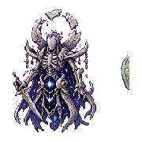

## 当前美术素材

<!-- ART_SECTION:entry-art:START -->

| 素材 | 名称 | ID | 类型 | 尺寸 |
| --- | --- | --- | --- | --- |
|  | 月骸仙君 | `moonbone_immortal` | `body` | 200x200 |
|  | 月骸仙君 | `moonbone_immortal` | `boss_head` | 40x40 |

<!-- ART_SECTION:entry-art:END -->

## 美术资源

- 主体：200x200，月白骨甲仙人，胸口暗蓝星核，破碎光环。
- 动画：`float` 6 帧，`sword_cast` 6 帧，`core_reveal` 6 帧。
- 头像：40x40，骨面、残月角、星核光。
- 投射物：月骨剑 48x16，星灾弹 24x24。
- Prompt 重点：`moonbone immortal, skeletal celestial armor, dark star core, broken moon halo`。

# 月骸仙君

[返回 Boss 总览](../Overview.md)

## 定位

- 英文 ID：`moonbone_immortal`
- 阶段：Post-Moon Lord
- 所属线：星灾/天庭
- 角色：揭示坠天真相的终局前 Boss。

## 召唤

在[月骸天渊](../../Biomes/Entries/Moonbone_Abyss.md)使用月骸祭符。

## 战斗设计

- 阶段一：月骨法剑和星灾弹幕交替。
- 阶段二：召唤归档仙魂，复制玩家旧攻击节奏。
- 阶段三：月骸外壳破碎，露出星渊核心。
- 核心考点：高机动、记忆攻击、弹幕阅读。

## 掉落

- 月骸骨。
- 星灾灵核。
- 月骸法剑材料。
- 旧天道核心钥匙。

## 剧情

月骸仙君曾是天庭打开高位面之门的主持者。它没有死亡，而是被星渊和月亮残骸共同保存成一具会思考的遗物。

## 代码实现

- ✅ 数值与wiki对齐（HP/伤害/防御）
- ✅ 独特阶段AI机制
- ✅ 6层掉落表（主/次/灵石/灵胶/法器碎片/稀有装饰）
- ✅ 专家/大师难度缩放
- ✅ Boss召唤校验（境界+前置+场地+时间）

## 当前代码战斗更新（2026-10-07）

第120轮月骸仙人环弹加入45tick锁向前摇，绿色两条边界提示安全缺口；6/8/12辐条各保留一条空向，释放5/7/11发灵弹，阶段越界不缩短已开始的前摇。随后30tick恢复，前摇和恢复期间暂停其它攻击并无接触伤害，结束重置普通射击计时。移除原终阶段瞬间加速冲刺。仅权威推进ai[1]预警、ai[2]冷却/恢复、ai[3]锁向，阶段同步netUpdate，不新增ExtraAI。原第二阶段一次召唤和预警法阵保留。BossAdds326→343项覆盖三阶段发数、锁向、前摇/恢复、阶段跨越、客户端不推进/发射及专服无图形。朝绿色边界之间移动可利用环弹缺口；第二阶段仍会在预测玩家位置留下有预警的法阵，需要继续移动。真实图形、四职业避让、难度人数与战斗时长未验收，上文完成标记不代表实机验收。

第121轮：非法环弹计时不再绕过前摇发射；权威复位、客户端等待有效同步。接触要求墙体可见，前摇和完整恢复均无接触伤害。源码510项组合回归通过，实机仍待验收。

第122轮：第二阶段援军总成功配额为2，NPC满或创建失败后在下一环弹补缺额；击杀援军不触发无限补发，成功援军继承Boss战斗目标并同步。实际来源退场/多人及掉落经济仍待完善和验收。

第123轮：月骸援军绑定当前Boss实例，最多存在900tick，Boss死亡/无目标、离场或来源实例改变后无奖励清理。天然归档仙魂不受召唤寿命限制。真实联机运输和掉落经济仍待验收。

第124轮：Boss召唤援军目标与父目标不同步时无接触伤害；权威更新援军目标，客户端停移等待同步。天然敌怪不受限制，实际原版AI追位与多人运输仍待验收。

## 环弹目标切换与缺口提示（2026-10-07）

月骸仙人环弹在预警或恢复时换目标，服务器取消当前招式，停移并重新等待完整招式间隔，再给新目标45tick锁向预警。取消帧无接触伤害；客户端等待服务器阶段同步。安全缺口绘制与实际AI共享生命阶段判定：生命低于70%进入第二阶段，低于35%进入最终阶段，绿线分别对应6/8/12辐条的安全方向；阶段跨越不缩短已开始的预警。已释放弹幕沿原来源规则处理，不因这一取消动作额外删除。真实双客户端换目标/死亡复活、图形避让与战斗平衡仍待验收。
