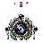

## 当前美术素材

<!-- ART_SECTION:entry-art:START -->

| 素材 | 名称 | ID | 类型 | 尺寸 |
| --- | --- | --- | --- | --- |
|  | 旧天道核心 | `old_heaven_dao_core` | `body` | 192x192 |
|  | 旧天道核心 | `old_heaven_dao_core` | `boss_head` | 48x48 |

<!-- ART_SECTION:entry-art:END -->

## 美术资源

- 主体：192x192，悬浮玉色机械核心，三层环形法阵，金色归档线，中心黑白裂隙。
- 动画：`rotate` 8 帧，`module_shift` 6 帧，`collapse` 8 帧。
- 头像：48x48，核心裂隙和环形法阵。
- UI 图标：路线图标各 32x32。
- Prompt 重点：`ancient heavenly dao core, jade divine machine, circular talisman rings, archive light, final boss`。

# 旧天道核心

[返回 Boss 总览](../Overview.md)

## 定位

- 英文 ID：`old_heaven_dao_core`
- 阶段：Endgame
- 所属线：终局
- 角色：最终 Boss 与路线选择核心。

## 召唤

击败月骸仙君后，收集三条路线信物：天道碎片、斩道尘、星灾灵核。在坠天宫阙或月骸天渊的终端处开启。

## 战斗设计

- 阶段一：核心以天碑、法旨、劫雷三种模块轮换。
- 阶段二：根据玩家路线生成不同机制。
- 阶段三：核心失控，战斗空间压缩，玩家必须打破归档锁。
- 终局选择：重铸天道、斩断天道、接纳星渊。

## 掉落

- 斩道环。
- 终局武器分支材料。
- 世界状态结局 Lore。
- 可选装饰物：沉默天碑。

## 剧情

旧天道核心不是神，而是被仙人误认为神的系统。它曾保护世界，也筛选、牺牲和归档了无数生命。

## 代码实现

- ✅ 数值与wiki对齐（HP/伤害/防御）
- ✅ 独特阶段AI机制
- ✅ 6层掉落表（主/次/灵石/灵胶/法器碎片/稀有装饰）
- ✅ 专家/大师难度缩放
- ✅ Boss召唤校验（境界+前置+场地+时间）
