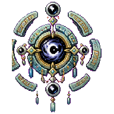
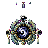

## 当前美术素材

<!-- ART_SECTION:entry-art:START -->

| 素材 | 名称 | ID | 类型 | 尺寸 |
| --- | --- | --- | --- | --- |
|  | 旧天道核心 | `old_heaven_dao_core` | `body` | 208x208 |
|  | 旧天道核心 | `old_heaven_dao_core` | `boss_head` | 40x40 |

<!-- ART_SECTION:entry-art:END -->

## 美术资源

- 主体：208x208，悬浮玉色机械核心，三层环形法阵，金色归档线，中心黑白裂隙。
- 动画：`rotate` 8 帧，`module_shift` 6 帧，`collapse` 8 帧。
- 头像：40x40，核心裂隙和环形法阵。
- UI 图标：路线图标各 32x32。
- Prompt 重点：`ancient heavenly dao core, jade divine machine, circular talisman rings, archive light, final boss`。

# 旧天道核心

[返回 Boss 总览](../Overview.md)

## 定位

- 英文 ID：`old_heaven_dao_core`
- 阶段：Endgame
- 所属线：终局
- 角色：最终 Boss 与路线选择核心。

## 召唤

击败月骸仙君后，收集三条路线信物：天道碎片、斩道尘、星灾灵核。在坠天宫阙或月骸天渊的终端处开启。

## 战斗设计

- 阶段一：核心以天碑、法旨、劫雷三种模块轮换。
- 阶段二：根据玩家路线生成不同机制。
- 阶段三：核心失控，战斗空间压缩，玩家必须打破归档锁。
- 终局选择：重铸天道、斩断天道、接纳星渊。

## 掉落

- 斩道环。
- 终局武器分支材料。
- 世界状态结局 Lore。
- 可选装饰物：沉默天碑。

## 剧情

旧天道核心不是神，而是被仙人误认为神的系统。它曾保护世界，也筛选、牺牲和归档了无数生命。

## 当前代码与验收状态

- 三阶段门槛75%/35%，普通灵弹与三模块轮换已有代码；第157轮模块接60帧锁点预告/45帧无接触恢复，阶段密度锁定，取消无预告加速。
- 光柱、缺口环弹、法阵依次轮换。绿色提示为光柱中央通道或环弹安全方向；法阵还保留自身无伤前摇。更换目标取消旧读条，客户端等待权威同步。
- 已有掉落表、专家宝藏袋、难度缩放和召唤校验代码；实际多人、完整通关、数值平衡和独立美术未验收。
- 第二/三阶段中间模块已有重铸宽缺口、斩断双横刃、星渊相对双缺口；路线未选时轮流演示，已选世界重战固定路线。第三阶段已有一次四枚归档锁/护盾：60帧预告，任意顺序破锁，完成或失效解除护盾并恢复45帧；空间压缩仍未实现，完整阶段体验仍待验收。

### 第157轮（2026-10-09）：旧天道核心三模块预告和恢复

- 核心按光柱→缺口环弹→法阵轮换；各模块60帧锁点预告、45帧无接触恢复，期间冻结移动/普通灵弹，移除终阶段无预告加速。阶段间隔270/210/150帧，密度在预告开始锁定。
- 光柱为2/4/6条32×480成对柱，中央留160像素保守通道；环弹12/16/20方向中排除朝锁点±30度，实际9/13/17发；法阵在锁点生成，仍保留自身45帧无伤预告。预告绘制与危险体、绿色安全方向一致。目标槽/Player对象更换取消，并重新完整间隔。
- 3字节ExtraAI同步当前模块、下一模块、密度，全读后修改；坏元数据客户端无伤等待，坏时钟由权威复位。接触伤害过滤墙体和坏目标。原生回归发现离场重复同步，修复为仅状态变化才请求同步，保留ai3清理。
- 34步/25个.NET源码检查通过；BossAdds28270项（新增6053），原生Gameplay4010项（新增1098）；注册专服三阶段连续三模块、60/45逐帧、真实弹体数量/几何/来源失效无伤，累计5647项（新增2496）。审计手动推进AI，不覆盖完整引擎物理/图形/真实多人。
- 官方构建0警告/0错误，打包及默认专服加载run-b63ce8d4bfab4bb48aa04f86c187bd68通过；原生本地化114文件/2项拒绝与包370条目/366资源/1481项通过。注册报告summons-d89a2edf41d94e5ca527aae0f355ef4a通过，原WLD/TWLD哈希不变。
- 路线专属模块、归档锁、压缩空间、三路线终局反馈和实际战斗仍待完善，R04/R11不勾选；基础轮换不代表完整最终Boss设计已实现。

### 第158轮（2026-10-09）：核心第二阶段三路线招式

- 世界路线在核心首次击败后才能选择；首次挑战未选路线时，第二/三阶段的中间模块依次演示重铸→斩断→星渊，仅成功到释放帧后推进演示索引。选择世界路线后重战固定对应模块；第一阶段保留基础环弹，光柱/法阵模块不改。
- 重铸：90度宽安全缺口，第二/三阶段11/15发环弹。斩断：两条480×32横刃位于锁点上下96像素，绿色保守中央128像素通道，30帧有效期；星渊：两个相对60度缺口，10/14发环弹。均沿60帧预告/45帧恢复，路线和密度在读条开始捕获，世界路线或阶段变化不临时换招。
- 当前/下一模块、密度、路线、演示索引形成5字节ExtraAI，全读后修改，坏字段客户端无伤等待；横刃沿19字节来源协议和墙体/来源失效过滤。中英文指令仅每条预告提示一次，绿色通道与实际弹体保持一致。
- 完整34步/25个.NET源码检查通过；BossAdds28391（新增121）、Telegraphs1459（新增16）；Gameplay4115（新增105）验证官方编译产物世界路线选择与恢复原状态、5字节原子读取、横刃身体/年龄。注册专服6431项（新增784），六个路线/阶段快照完整60帧预告、真实创建/布局和来源清理通过，世界结局未修改。
- 官方构建0警告/0错误、打包及默认加载run-9aa8cdfb1cde4674ae96da6824b937ff通过；原生本地化116文件/2项拒绝，包372条目/368资源/1489项通过。注册报告summons-e61d0759643d40e0af576f447b2ba280通过，原WLD/TWLD哈希不变。
- 基础路线招式已有代码；完整归档锁/空间压缩、独立动作美术、实际躲避与真实多人仍待实现/验收，R01/R04/R11不勾选。注册测试使用同步快照覆盖分支，不等于真实客户端运输或完整引擎tick。

### 第159轮（2026-10-09）：旧天道核心第三阶段归档锁

- 第三阶段空闲模块窗口触发一次60帧出生预告，四枚40×40锁位于核心上下左右160像素；四个完整身体均通过世界边距/实心/平台/熔岩检查并实际创建成功后，才同时设置dontTakeDamage与immortal护盾。创建部分失败清理已建锁并进入45帧恢复，不重复触发。
- 四枚归档锁可任意顺序击破；位掩码记录各锁，防重复解除，最后一枚立即解除护盾/清理锁/进入45帧安全恢复。核心护盾期间静止但继续路线模块，防锁随追击进入墙体；锁无接触伤害，带来源会话/目标验证，拒绝墙后或坏几何攻击。锁丢失/替换、30秒到期、无目标离场均解除护盾，不锁死战斗。
- 父25字节ExtraAI原子同步五字节模块+64位归档实例/状态/计时/破锁掩码/四槽位；子13字节绑定与年龄。坏护盾包不能开启免伤；客户端等待来源包不死亡。实际归档锁无自然生成、无战利品/击杀推进，隐藏普通图鉴；中英文显示名与击破指令已补。
- 完整34步/25个.NET源码检查通过；BossAdds32340项（新增3949）覆盖乱序破锁、完整60/45窗口、部分容量/地形失败、失效、1800帧超时、客户端/绘制与全25字节截断；原生Gameplay4612项（新增497）覆盖完整模块包、子绑定、实际第三阶段AI预告/护盾标记。
- 注册专服6751项（新增320）实际生成四锁，原生玩家伤害拒绝护盾，NPC.StrikeNPC乱序破锁、最后一锁立即安全/恢复伤害，验证无物品/击杀计数；另实际复用同类型父NPC槽位，新会话不能接管四枚旧锁，旧锁无奖励清理。报告summons-10550de925a045d7b175f7229b35c2f8通过，原WLD/TWLD哈希不变。
- 官方0警告/0错误构建、打包与默认加载run-e888764b0ff44e188c0c1c7952e4223d通过；原生本地化118文件/2项拒绝及包374条目/370资源/1497项通过。真实客户端、图形、完整引擎tick和30秒实战平衡未验收；空间压缩、独立锁美术/动画及最终Boss整体体验继续完善，R04/R11不勾选。
