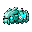

## 当前美术素材

<!-- ART_SECTION:entry-art:START -->

| 素材 | 名称 | ID | 类型 | 尺寸 |
| --- | --- | --- | --- | --- |
|  | 碎玉蠕虫仆从 | `shattered_jade_wyrm_minion` | `head` | 32x32 |
|  | 碎玉蠕虫仆从 | `shattered_jade_wyrm_minion` | `body` | 32x32 |
|  | 碎玉蠕虫仆从 | `shattered_jade_wyrm_minion` | `tail` | 32x24 |

<!-- ART_SECTION:entry-art:END -->

## 美术资源

- **分段架构：** 小型穿墙蠕虫仆从，由 head / body / tail 三个独立段拼接。是灵脉蠕虫在 HP < 50% 时分裂产出的小虫。
- **头段 (head)：** 32×32，小玉色圆头，口器简化（与灵脉蠕虫头同色系但更小），浅青眼点。`move` 6 帧（纵向排列）。
- **体段 (body)：** 32×32，重复幼体段，半透明青玉外壳，中心浅色核心。`move` 6 帧。每段间距 2px。
- **尾段 (tail)：** 32×24，锥形幼尾，青玉光渐隐到透明。`move` 6 帧。
- **Prompt 重点：** `small jade wyrm minion, segmented worm, translucent cyan shell, Terraria pixel art worm enemy, side-view`。

# 碎玉蠕虫仆从

[返回 Boss 总览](../Overview.md)

## 定位

- 英文 ID：`shattered_jade_wyrm_minion`
- 分类：Boss 召唤仆从（非独立 Boss）
- 来源：[灵脉蠕虫](Spirit_Vein_Wyrm.md) HP < 50% 时分裂产出
- 角色：增加灵脉蠕虫战斗后半段压力，迫使玩家在多条虫体间走位

## 生成条件

- 灵脉蠕虫生命低于 50% 时，服务端分裂出 2-3 条小虫
- 每条小虫由 head×1 + body×3-5 + tail×1 组成
- 生存时间 15-20 秒后自毁（避免无限堆积）

## 战斗设计

- **运动模式：** 穿墙追踪玩家，独立 AI。头部以正弦波移动（幅度小于主虫），每 5-6 秒短冲刺一次。
- **碰撞逻辑：** 头部受伤全额；体段减伤 50%；尾段减伤 70%。小虫总生命约为主虫的 20%。
- **不分裂：** 小虫不再二次分裂，避免战斗混乱。
- **掉落：** 无独立掉落。小虫击杀计入 Boss 总伤害但不产生额外 loot。
- **多人注意：** 小虫数量 = 2 + 0.5×额外玩家数（取整）。所有段由服务端生成。

## 代码实现

- ✅ 作为灵脉蠕虫 AI 的分裂产物实现
- ✅ 独立蠕虫 AI（简化版 EoW 移动逻辑）
- ✅ 限时生存 + 自动销毁
- ✅ 服务端同步，避免客户端重复生成
