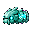

## 当前美术素材

<!-- ART_SECTION:entry-art:START -->

| 素材 | 名称 | ID | 类型 | 尺寸 |
| --- | --- | --- | --- | --- |
|  | 碎玉蠕虫仆从 | `shattered_jade_wyrm_minion` | `head` | 32x32 |
|  | 碎玉蠕虫仆从 | `shattered_jade_wyrm_minion` | `body` | 32x32 |
|  | 碎玉蠕虫仆从 | `shattered_jade_wyrm_minion` | `tail` | 32x24 |

<!-- ART_SECTION:entry-art:END -->

## 美术资源

- **分段架构：** 小型穿墙蠕虫仆从，由 head / body / tail 三个独立段拼接。是灵脉蠕虫在 HP < 50% 时分裂产出的小虫。
- **头段 (head)：** 32×32，小玉色圆头，口器简化（与灵脉蠕虫头同色系但更小），浅青眼点。`move` 6 帧（纵向排列）。
- **体段 (body)：** 32×32，重复幼体段，半透明青玉外壳，中心浅色核心。`move` 6 帧。每段间距 2px。
- **尾段 (tail)：** 32×24，锥形幼尾，青玉光渐隐到透明。`move` 6 帧。
- **Prompt 重点：** `small jade wyrm minion, segmented worm, translucent cyan shell, Terraria pixel art worm enemy, side-view`。

# 碎玉蠕虫仆从

[返回 Boss 总览](../Overview.md)

## 当前来源与组成

灵脉蠕虫首次进入生命低于50%的阶段时，在服务端尝试召唤2–3条幼虫；当前数量不按玩家数增加，NPC槽位失败会停止该批。幼虫是附加实体，主体继续战斗，不是主虫断裂替换。每条幼虫由1头、4体、1尾组成；节段由权威端整链创建，容量不足时等待，部分创建失败回滚。

头部基础生命70、伤害14、防御2。体尾通过realLife关联幼虫头部并随AI继承其生命、伤害和防御；当前没有50%/70%分段减伤，也没有约主虫20%生命或独立5–6秒短冲刺。运动是速度4.5、0.06转向插值的正弦波追踪；头体尾均穿墙，节段间距18像素。

## 来源与寿命

幼虫从实际NPC生成来源绑定本次灵脉蠕虫的槽位及64位实例编号，不能跟随同槽位新出现的Boss。父实例死亡/离场/失去有效目标、子父距离超过4000像素或出现非有限状态时停止伤害与AI；权威端直接清除幼虫，体尾也检查父来源并清理，不走死亡奖励。

寿命为900tick（15秒），只由权威端推进，并用普通NPC.ai[3]每60tick标记同步。客户端父包或目标包未到时无伤等待，不自行到期；后续有效数据可恢复预测。头体尾均过滤无效来源的接触伤害，包括体尾在头部AI之前更新的情况。NPC来源ExtraAI为34字节，父Boss为32字节（均包含24字节蠕虫关联字段），完整读取后才赋值。

幼虫没有配置独立掉落或击败进度，不进行二次分裂。正常击杀与来源清理的实机奖励、共享生命/穿透伤害仍需验证。

## 验证与后续

第105轮2,208条源码回归覆盖实际头体尾AI、来源/目标失败、时限、客户端预测、链创建/清理、截断包和同槽位新父实例；原生编译产物累计877条检查，官方EntitySource_Parent实测捕获与实例隔离通过，构建/打包/专服加载通过。

没有运行真实多人世界。第106轮头体尾按本实体/头/前节实例编号绑定，换槽位实例会阻断跟随和接触；99条共用关联与927条累计原生检查通过。真实丢包/晚加入、分裂容量失败策略、刷取经济、穿墙公平性及四职业走位还待验收。上方多帧动画为素材设计意图，当前头体尾均注册1帧；不以源码存在勾选玩法或美术验收。
