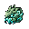
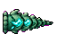

## 当前美术素材

<!-- ART_SECTION:entry-art:START -->

| 素材 | 名称 | ID | 类型 | 尺寸 |
| --- | --- | --- | --- | --- |
|  | 灵脉蠕虫 | `spirit_vein_wyrm` | `boss_head` | 32x32 |
|  | 灵脉蠕虫 | `spirit_vein_wyrm` | `head` | 64x64 |
|  | 灵脉蠕虫 | `spirit_vein_wyrm` | `body` | 64x64 |
|  | 灵脉蠕虫 | `spirit_vein_wyrm` | `tail` | 64x48 |

<!-- ART_SECTION:entry-art:END -->

## 美术资源

- **分段架构：** 穿墙蠕虫型，由 head / body / tail 三个独立段拼接，共 6-8 体节。
- **头段 (head)：** 64×64，圆形玉色头部，明显口器（深绿裂口），头顶一对短触角。深绿外轮廓 + 青玉内发光。`move` 6 帧（纵向排列）。
- **体段 (body)：** 64×64，重复段。深绿外壳、青玉发光核心（半透明感用硬边高光表达）、腹面浅色纹理。`move` 6 帧。每段之间 2px 衔接间距。
- **尾段 (tail)：** 64×48，锥形收束，青玉光从核心向尾尖渐隐，尾尖略上翘。`move` 6 帧。
- **头像：** 32×32，突出圆形头部和玉色口器，地图图标。
- **投射物：** 灵气尘 16×16，浅青粒子，不要烟雾糊边。由体段周期性释放，飘向玩家方向。
- **Prompt 重点：** 头段 `small jade spirit wyrm head, round mouth, antennae, dark green outline, inner cyan glow, side-view Terraria worm boss`。体段 `repeating wyrm body segment, jade glowing core, dark green carapace, segmented worm, Terraria pixel art`。尾段 `wyrm tail segment, tapered jade tip, fading cyan glow, side-view`。

# 灵脉蠕虫

[返回 Boss 总览](../Overview.md) | [整体进度](../../../Progression/Overview.md)

## 当前定位与召唤

浅层灵脉线的第一个模组Boss，使用灵脉香召唤，沿现有统一服务端召唤校验。灵脉香在工作台由下品灵石×8、灵气凝胶×6制作，不需要普通凝胶。

基础生命1200、伤害22、防御6；生命缩放沿集中难度/人数规则，实际三难度/人数和战斗时长仍待记录。主体由1头、7体、1尾组成，间距34像素；节段通过realLife共享头部，不是每段独立血量或40%/60%减伤。

## 当前战斗

正弦波追踪与定时加速：基础速度4.8，半血5.9，四分之一血6.8；加速倍率1.5。按阶段每240/210/180tick进入42/42/54tick加速，同时周期发射灵弹。锁定前摇、独立恢复窗口和穿墙可读性仍待深化。

半血后主体继续战斗，服务端一次尝试额外召唤2–3条[碎玉幼虫](Shattered_Jade_Wyrm_Minion.md)，不按玩家数增加。第105轮子实体绑定本次Boss实例，服务器限定900tick存活，来源失效时幼虫及其体尾无伤清理；同槽位重新召唤Boss不会继承旧幼虫。召唤成功写入战斗目标，失败停止该批；数量不足补发策略仍待完善。

## 当前掉落

普通模式掉下品灵石12–18、灵气凝胶20–35、下品灵核1、灵脉鳞片12–18，灵脉蠕虫装饰品概率1/10。专家/大师通过宝藏袋取得同类奖励及专家饰品灵脉盘环，另附对应金币；大师额外纪念碑。当前没有独立“灵脉香配方”掉落。实际开袋、多人资格和资源平衡仍需验收。

## 剧情与验证

它不是妖兽，而是一截被唤醒的灵脉。击败它后，世界承认玩家可以接触灵气。

第105轮幼虫生命周期源码回归2,208条、编译产物累计877条与原生构建/打包/专服加载通过。源码回归的创建/网络运输仍为模拟，原生检查使用官方类型但不启动世界。第106轮节段加入头/前节实例核对与24字节关联同步（主体合计32字节），同槽位新实例无法接管旧链，99条共用关联与927条累计原生回归通过。穿透共享伤害、多人战斗和动画仍待验收；上方资源表是设计意图，不表示多帧动画已实现。
