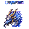
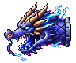
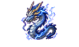
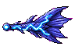

## 当前美术素材

<!-- ART_SECTION:entry-art:START -->

| 素材 | 名称 | ID | 类型 | 尺寸 |
| --- | --- | --- | --- | --- |
|  | 雷泽蛟 | `thunder_marsh_jiao` | `boss_head` | 40x40 |
|  | 雷泽蛟 | `thunder_marsh_jiao` | `head` | 96x80 |
|  | 雷泽蛟 | `thunder_marsh_jiao` | `body` | 96x80 |
|  | 雷泽蛟 | `thunder_marsh_jiao` | `tail` | 96x64 |

<!-- ART_SECTION:entry-art:END -->

## 美术资源

- **分段架构：** 空中蛇形龙，由 head / body / tail 三个独立段拼接，共 10-14 体节。不穿墙，在开阔天空飞行战斗。
- **头段 (head)：** 96×80，龙首。突出雷角（紫蓝渐变，向后弯曲）、长须（2 根，飘逸）、张口（闪蓝喉光）。雷紫和闪蓝色板。`fly` 8 帧（纵向排列），`roar` 4 帧。
- **体段 (body)：** 96×80，重复蛇身段。鳞片纹理（菱形鳞），脊背有短刺（4-6 根/段），体侧蓝色雷纹沿脊柱流动。`fly` 8 帧。段与段之间保留 2-3px 间距以避免重叠时闪烁。
- **尾段 (tail)：** 96×64，鳍状收束。尾鳍呈扇形（3-4 根鳍条），雷纹从尾部渐疏，末端有小型雷球光点。`fly` 8 帧。
- **头像：** 40×40，角和须必须清楚可辨。大型 Boss 地图图标。
- **投射物：** 电弧 32×16（横向，体段释放），雷球 24×24（尾部甩出）。
- **Prompt 重点：** 头段 `thunder jiao dragon head, lightning horns, whiskers, open maw with blue glow, purple-blue palette, side-view Terraria flying boss`。体段 `serpent dragon body segment, diamond scales, blue thunder patterns, dorsal spines, side-view Terraria pixel art`。尾段 `dragon tail with fan fin, fading thunder marks, blue-purple gradient, side-view`。

# 雷泽蛟

[返回 Boss 总览](../Overview.md)

## 定位

- 英文 ID：`thunder_marsh_jiao`
- 阶段：Hardmode
- 所属线：雷泽云层
- 角色：雷系装备和抗劫材料 Boss。

## 召唤

在[雷泽云层](../../Biomes/Entries/Thunder_Marsh_Clouds.md)使用鸣雷石。雷暴天气下召唤会进入强化版本。

## 战斗设计

- **分段结构：** head ×1 + body ×10-14 + tail ×1，共 12-16 节。每节为独立 NPC，不穿墙，头部在玩家上方 200-400px 空中游弋。
- **运动模式：** 头部以蛇形曲线盘旋（波长 ~300px，振幅 ~80px）。体段跟随头部轨迹呈 S 形。头部周期性改变高度层（通过平台上跳/下潜）。
- **阶段一：** 空中盘旋，每 5-7 秒俯冲玩家（俯冲角 30-45°，速度 ×1.8）。体段在俯冲路径上留下短电弧（持续 2 秒，碰撞造成雷伤）。
- **阶段二（HP < 70%）：** 召唤 2-4 只雷纹鹰辅助。体段开始周期性释放横向电弧（每段独立冷却，间隔 6-8 秒）。
- **阶段三（HP < 35%，断角狂暴）：** 头部加速 +30%，俯冲冷却减半（2-3 秒）。尾部甩出雷球（每 3 秒 3 枚，扇形散射）。体段雷纹亮度翻倍。
- **碰撞逻辑：** 头部全额伤害；体段减伤 30%；尾段减伤 50%。龙角（头部上方额外碰撞区域）被击破后触发阶段三。
- **核心考点：** 空战机动、多层平台控制、躲避周期性俯冲。雷暴天气下强化（伤害 ×1.2，体段数 +2）。
- **多人注意：** 段数随玩家数扩展（+2 体段/额外玩家）。所有段和投射物由服务端生成。

## 掉落

- 雷纹羽。
- 劫云露。
- 雷纹剑匣材料。
- 雷纹锻台。

## 剧情

雷泽蛟是天劫系统泄漏出的自然妖兽。它既被残天司追捕，也在吞食残余劫雷成长。

## 代码实现

- ✅ 数值与wiki对齐（HP/伤害/防御）
- ✅ 独特阶段AI机制
- ✅ 6层掉落表（主/次/灵石/灵胶/法器碎片/稀有装饰）
- ✅ 专家/大师难度缩放
- ✅ Boss召唤校验（境界+前置+场地+时间）
