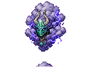

## 当前美术素材

<!-- ART_SECTION:entry-art:START -->

| 素材 | 名称 | ID | 类型 | 尺寸 |
| --- | --- | --- | --- | --- |
|  | 劫云化身 | `tribulation_cloud_avatar` | `body` | 160x120 |
|  | 劫云化身 | `tribulation_cloud_avatar` | `boss_head` | 32x32 |

<!-- ART_SECTION:entry-art:END -->

## 美术资源

- 主体：160x120，深紫雷云中露出模糊玉面，不要真实云雾糊边。
- 动画：`idle` 6 帧，`strike` 5 帧，`split` 4 帧。
- 头像：32x32，雷云和玉面轮廓。
- 投射物：雷柱 16x64，雷链 64x16。
- Prompt 重点：`storm cloud avatar with jade mask, lightning tribulation boss, sharp pixel cloud edges`。

# 劫云化身

[返回 Boss 总览](../Overview.md) | [天劫](../../../Systems/Tribulation.md)

## 定位

- 英文 ID：`tribulation_cloud_avatar`
- 阶段：Wall of Flesh 前后
- 所属线：残天司
- 角色：第一次天劫 Boss，用于筑基突破。

## 触发

玩家准备筑基并使用筑基丹后，天空聚云，给予 20 秒准备时间。玩家也可用 `引雷玉` 主动挑战。

## 战斗设计

- 阶段一：从上方落雷，地面出现短暂预警。
- 阶段二：云影横移，释放弧形雷链。
- 阶段三：生成玩家影子，影子只使用基础攻击。
- 核心考点：读预警、控制灵气爆发时机。

## 掉落

- 筑基印。
- 劫云露。
- 避雷玉佩材料。
- 天劫机制说明 Lore。

## 剧情

劫云化身不是有意识的敌人，而是残天司从旧天道规则中抽出的测试程序。

## 当前代码与验证范围

- 三阶段生命阈值为70%/40%；当前使用三向灵弹、1/3/5条落雷预警，终阶段另释放法阵并周期加速。
- 第二阶段起每场战斗成功召唤一只劫云灵。创建失败在下一轮攻击补试，击败援军不会再召唤；援军创建时继承Boss当前目标。
- 上述雷链和玩家影子是早期设计概念，当前代码尚未实现。
- 第135轮源码组合回归661项、编译产物累计1107项及专服加载通过；NPC创建/网络运输由源码夹具模拟，真实多人战斗仍待验收。
- 援军来源撤场的真实联机验证、终阶段加速前摇、躲避空间和完整素材仍需完善。数值、难度与掉落已有实现，尚未完成实机平衡验收。

第136轮召唤云灵与Boss实例绑定，离开4000像素、来源失效或900帧到期由服务器撤场，不产生击杀掉落；天然云灵保持原行为。客户端等待来源和目标同步时无伤。源码生命周期累计3118项、实际编译产物累计1128项通过，真实联机运输仍待验收。
