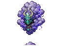
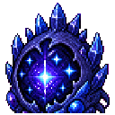
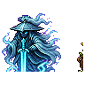
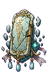
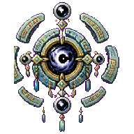

# Boss 总览

[返回首页](../../Home.md)

## Boss 列表

| Boss | 美术 | 阶段 | 所属线 | 解锁方式 | 主要奖励 |
| --- | --- | --- | --- | --- | --- |
| [灵脉蠕虫](Entries/Spirit_Vein_Wyrm.md) |  | Pre-Boss | 灵脉 | 在浅层灵脉使用引气符 | 下品灵石核心 |
| [药宗守园人](Entries/Garden_Warden.md) |  | Pre-Hardmode | 青木药宗 | 青木药园采集足够灵草后召唤 | 青木丹炉 |
| [玄炉铁傀](Entries/Black_Furnace_Iron_Golem.md) |  | Pre-Hardmode | 玄炉器盟 | 沉炉矿脉修复旧炉 | 器胚、基础炼器台 |
| [劫云化身](Entries/Tribulation_Cloud_Avatar.md) |  | Wall of Flesh 前后 | 残天司 | 筑基突破触发 | 筑基印、雷劫材料 |
| [雷泽蛟](Entries/Thunder_Marsh_Jiao.md) |  | Hardmode | 雷泽 | 雷泽云层事件 | 雷系武器、劫云露 |
| [星渊胎主](Entries/Abyssal_Star_Womb.md) |  | Hardmode | 星渊余孽 | 星渊裂隙污染值达到阈值 | 星蚀晶、禁术材料 |
| [无相剑魄](Entries/Formless_Sword_Soul.md) |  | Post-Plantera | 无相散修 | 万宗遗址剑碑试炼 | 飞剑升级材料 |
| [青木药王残影](Entries/Greenwood_Medicine_King_Echo.md) |  | Post-Plantera | 青木药宗 | 完成药宗残卷链 | 高阶丹炉 |
| [天碑守御](Entries/Heaven_Tablet_Guardian.md) |  | Post-Golem | 残天司 | 坠天宫阙激活天碑 | 天道碎片 |
| [残天监察使](Entries/Broken_Heaven_Inspector.md) |  | Post-Golem | 残天司 | 化神境后挑战 | 天庭法旨、化神材料 |
| [月骸仙君](Entries/Moonbone_Immortal.md) |  | Post-Moon Lord | 星灾/天庭 | 月骸天渊核心召唤 | 月骸材料、终局钥匙 |
| [旧天道核心](Entries/Old_Heaven_Dao_Core.md) |  | Endgame | 终局 | 完成三条路线选择前置 | 斩道奖励 |

## 相关数据

- [Boss 数值与掉落表](Boss_Stats.md)

## 设计规则

- 每个 Boss 都要有召唤物、掉落表、解锁提示和进度意义。
- 早期 Boss 不应要求玩家理解复杂系统。
- Post-Moon Lord Boss 可以引入多阶段、多机制和路线选择。
- Boss 条目必须同步维护 [Boss 数值与掉落表](Boss_Stats.md)。

## 召唤门槛

- 生成 Boss 召唤物会同时校验境界和前置试炼。
- 药宗守园人、玄炉铁傀需要先击败灵脉蠕虫。
- 雷泽线、星渊线、万宗遗址、坠天宫阙和月骨深渊会按各自路线逐步解封。
- 未满足前置试炼时，召唤物会给出失败提示，不消耗物品。
- 生成 Boss 召唤物还会校验对应试炼场所：青木药园、沉炉矿脉、雷泽云层、星渊裂隙、万宗遗址、坠天宫阙或月骸天渊。
- 星渊胎主、月骸仙君和旧天道核心要求夜晚召唤；未满足场地或时段时同样给出提示且不消耗物品。

相关页面：

- [整体进度](../../Progression/Overview.md)
- [天劫](../../Systems/Tribulation.md)
- [生态与群系](../Biomes/Overview.md)
