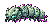
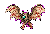
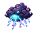
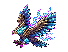
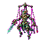
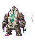

# 敌怪详细目录

[返回敌怪总览](Overview.md)

## 敌怪统计表

| 敌怪 | ID | 阶段 | 生命 | 伤害 | 防御 | 击退抗性 | AI 类型 | 生成权重 | Banner 击杀数 |
| --- | --- | --- | --- | --- | --- | --- | --- | --- | --- |
| 游灵史莱姆 | `wandering_spirit_slime` | Pre-Boss | 45 | 12 | 2 | 20% | Slime hop | 0.65 | 50 |
| 碎玉虫 | `shattered_jade_worm` | Pre-Boss | 60 | 14 | 4 | 40% | Ground crawler | 0.45 | 50 |
| 符纸蝠 | `talisman_bat` | Pre-Boss | 38 | 13 | 2 | 10% | Bat fly | 0.35 | 50 |
| 药园藤妖 | `herb_garden_vine_spirit` | Pre-Hardmode | 140 | 24 | 8 | 60% | Stationary plant | 0.55 | 50 |
| 花瘴蝶 | `miasma_flower_moth` | Pre-Hardmode | 90 | 20 | 4 | 20% | Hover caster | 0.50 | 50 |
| 炉灰傀 | `furnace_ash_golem` | Pre-Hardmode | 180 | 28 | 14 | 70% | Fighter heavy | 0.55 | 50 |
| 铁屑灵 | `iron_shard_spirit` | Pre-Hardmode | 70 | 22 | 6 | 30% | Flying swarm | 0.75 | 50 |
| 劫云灵 | `tribulation_cloudling` | Hardmode | 240 | 42 | 16 | 40% | Teleport caster | 0.45 | 50 |
| 雷纹鹰 | `thunder_pattern_hawk` | Hardmode | 300 | 48 | 18 | 35% | Dive flyer | 0.40 | 50 |
| 星蚀修士 | `star_eclipsed_cultivator` | Hardmode | 360 | 50 | 20 | 45% | Ranged humanoid | 0.45 | 50 |
| 星渊幼体 | `star_abyss_larva` | Hardmode | 260 | 46 | 18 | 50% | Leaping crawler | 0.70 | 50 |
| 执念剑修 | `obsessed_sword_cultivator` | Post-Plantera | 850 | 72 | 34 | 70% | Guard fighter | 0.45 | 50 |
| 藏经残影 | `scripture_archive_echo` | Post-Plantera | 720 | 66 | 28 | 50% | Floating caster | 0.45 | 50 |
| 仙傀 | `celestial_puppet` | Post-Golem | 1,350 | 88 | 46 | 80% | Modular fighter | 0.50 | 50 |
| 天碑卫 | `heaven_tablet_guard` | Post-Golem | 1,500 | 92 | 54 | 85% | Shield walker | 0.45 | 50 |
| 月骸修士 | `moonbone_cultivator` | Post-Moon Lord | 4,200 | 160 | 72 | 75% | Dash caster | 0.45 | 50 |
| 归档仙魂 | `archived_immortal_soul` | Post-Moon Lord | 3,600 | 150 | 64 | 60% | Copy caster | 0.35 | 50 |

## 掉落概率表

| 敌怪 | 常见掉落 | 概率 | 次要掉落 | 概率 | 稀有掉落 |
| --- | --- | --- | --- | --- | --- |
| 游灵史莱姆 | 灵气凝胶 x1-3 | 100% | 下品灵石 x1 | 25% | 史莱姆符核 2% |
| 碎玉虫 | 碎玉壳 x1-2 | 70% | 下品灵石碎片 x1-2 | 40% | 完整玉壳 3% |
| 符纸蝠 | 残符纸 x1 | 55% | 朱砂粉 x1 | 25% | 折纸蝠翼 2% |
| 药园藤妖 | 青木根 x1-3 | 70% | 灵草种子 x1 | 35% | 藤妖芯 3% |
| 花瘴蝶 | 药露 x1 | 45% | 毒粉 x1-2 | 40% | 花瘴蝶翼 2% |
| 炉灰傀 | 炉渣铁 x1-3 | 80% | 玄炉炭 x1 | 30% | 傀儡炉芯 2% |
| 铁屑灵 | 器胚碎片 x1-2 | 65% | 炉渣铁 x1 | 25% | 飞铁灵核 2% |
| 劫云灵 | 劫云露 x1-2 | 55% | 鸣雷石 x1 | 20% | 小劫云瓶 2% |
| 雷纹鹰 | 雷纹羽 x1-2 | 60% | 劫云露 x1 | 20% | 雷鹰羽冠 2% |
| 星蚀修士 | 星蚀晶 x1-2 | 60% | 残破星符 x1 | 25% | 星蚀斗篷 2% |
| 星渊幼体 | 渊尘 x2-4 | 80% | 暗蓝灵液 x1 | 20% | 星渊幼体契 1% |
| 执念剑修 | 断剑残意 x1-2 | 55% | 宗门令碎片 x1 | 35% | 旧剑穗 2% |
| 藏经残影 | 残卷页 x1-3 | 70% | 宗门令碎片 x1 | 25% | 空白藏经页 2% |
| 仙傀 | 残天玉 x1-2 | 65% | 仙傀零件 x1 | 40% | 仙傀令 1% |
| 天碑卫 | 破损法旨 x1-2 | 60% | 天道碎屑 x1-2 | 35% | 小天碑盾 2% |
| 月骸修士 | 月骸骨 x1-3 | 70% | 冷月尘 x1-2 | 35% | 月骸披肩 2% |
| 归档仙魂 | 斩道尘 x1-2 | 55% | 归档残光 x1 | 30% | 仙魂契 1% |

## Pre-Boss

### 游灵史莱姆

- ID：`wandering_spirit_slime`
- 生态：[浅层灵脉](../Biomes/Entries/Shallow_Spirit_Veins.md)
- 行为：慢速跳跃，受击时短暂释放灵气粒子。
- 掉落：灵气凝胶、少量下品灵石。
- 玩法作用：灵气系统的第一个材料来源。
- 美术：40x40，圆形青绿色史莱姆，体内漂浮小符核；idle 4 帧，hop 4 帧，hit 2 帧。
- Prompt：`jade green slime with floating talisman core, Terraria-style pixel enemy, transparent background`

### 碎玉虫

- ID：`shattered_jade_worm`
- 生态：[浅层灵脉](../Biomes/Entries/Shallow_Spirit_Veins.md)
- 行为：贴地爬行，短距离钻地冲刺。
- 掉落：碎玉壳、下品灵石碎片。
- 玩法作用：提供早期饰品材料。
- 美术：54x28，虫形，玉壳断裂，深绿外轮廓；crawl 6 帧。
- Prompt：`small jade-shelled cave worm, cracked crystal carapace, side-view Terraria pixel art`

### 符纸蝠

- ID：`talisman_bat`
- 生态：洞穴、浅层灵脉附近
- 行为：飞行接近，低概率发射弱符火。
- 掉落：残符纸、朱砂粉。
- 玩法作用：符箓制作入口。
- 美术：50x34，蝙蝠身体像折纸符箓，朱砂眼点；fly 6 帧。
- Prompt：`paper talisman bat, cinnabar markings, crisp pixel wings, no text`

## Pre-Hardmode

### 药园藤妖

- ID：`herb_garden_vine_spirit`
- 生态：[青木药园](../Biomes/Entries/Greenwood_Herb_Garden.md)
- 行为：半固定，挥藤攻击，周期性扎根回血。
- 掉落：青木根、灵草种子。
- 玩法作用：炼丹材料和药园生态威胁。
- 美术：64x64，藤蔓人形，叶冠，根须腿；idle 4 帧，whip 5 帧。
- Prompt：`vine spirit enemy, herbal garden roots, leafy head, Terraria pixel art`

### 花瘴蝶

- ID：`miasma_flower_moth`
- 生态：[青木药园](../Biomes/Entries/Greenwood_Herb_Garden.md)
- 行为：慢速飞行，释放短持续毒雾圈。
- 掉落：药露、毒粉。
- 玩法作用：教玩家不要站桩输出。
- 美术：56x56，蝶翼带花纹，药绿和淡紫色板；fly 6 帧，miasma 3 帧。
- Prompt：`flower moth with herbal miasma, green and pale purple wings, clean pixel outline`

### 炉灰傀

- ID：`furnace_ash_golem`
- 生态：[沉炉矿脉](../Biomes/Entries/Sunken_Furnace_Vein.md)
- 行为：高防御近战，受击掉落火星。
- 掉落：炉渣铁、玄炉炭。
- 玩法作用：炼器材料来源。
- 美术：72x72，灰黑小傀儡，胸口暗红煤火；walk 4 帧，punch 4 帧。
- Prompt：`small ash furnace golem, ember chest, black iron outline, Terraria enemy`

### 铁屑灵

- ID：`iron_shard_spirit`
- 生态：[沉炉矿脉](../Biomes/Entries/Sunken_Furnace_Vein.md)
- 行为：成群飞行，靠近后高速刺击。
- 掉落：器胚碎片。
- 玩法作用：胚器制作的可刷材料。
- 美术：36x36，漂浮铁片和小火光；spin 4 帧。
- Prompt：`floating iron shard spirit, tiny ember core, readable small pixel enemy`

## Hardmode

### 劫云灵

- ID：`tribulation_cloudling`
- 生态：[雷泽云层](../Biomes/Entries/Thunder_Marsh_Clouds.md)
- 行为：短距离闪现，在玩家脚下生成落雷预警。
- 掉落：劫云露。
- 玩法作用：抗劫丹和雷系装备材料。
- 美术：56x48，紫色小雷云，有玉色面具碎片；float 6 帧。
- Prompt：`small tribulation cloud spirit, jade mask shard, purple lightning, crisp pixel art`

### 雷纹鹰

- ID：`thunder_pattern_hawk`
- 生态：[雷泽云层](../Biomes/Entries/Thunder_Marsh_Clouds.md)
- 行为：高空盘旋后俯冲，留下短电弧。
- 掉落：雷纹羽。
- 玩法作用：空战威胁与翅膀/飞剑材料。
- 美术：68x52，鹰形，羽毛有蓝色雷纹；fly 6 帧，dive 3 帧。
- Prompt：`hawk with blue lightning feather patterns, side-view flying Terraria enemy`

### 星蚀修士

- ID：`star_eclipsed_cultivator`
- 生态：[星渊裂隙](../Biomes/Entries/Star_Abyss_Rift.md)
- 行为：保持距离，发射星刃，低血量短闪避。
- 掉落：星蚀晶、残破星符。
- 玩法作用：星灾禁术材料。
- 美术：64x64，人形修士，暗蓝斗篷，星晶侵蚀半身；cast 5 帧。
- Prompt：`star-infected cultivator, dark blue robe, crystal corruption, Terraria pixel enemy`

### 星渊幼体

- ID：`star_abyss_larva`
- 生态：[星渊裂隙](../Biomes/Entries/Star_Abyss_Rift.md)
- 行为：贴地爬行，靠近后跳扑并短暂附着。
- 掉落：渊尘、暗蓝灵液。
- 玩法作用：给星渊区域提供压迫感。
- 美术：52x36，深蓝寄生幼体，星点眼；crawl 6 帧，leap 3 帧。
- Prompt：`dark blue star abyss larva, parasitic shape, bright tiny star eyes`

## Post-Plantera

### 执念剑修

- ID：`obsessed_sword_cultivator`
- 生态：[万宗遗址](../Biomes/Entries/Ten_Thousand_Sects_Ruins.md)
- 行为：格挡正面攻击，格挡后反击突刺。
- 掉落：断剑残意、宗门令碎片。
- 玩法作用：教玩家绕位或等待破绽。
- 美术：72x88，残影剑修，破旧道袍，手持断剑；guard 3 帧，thrust 5 帧。
- Prompt：`ghostly sword cultivator, broken robe, broken sword, pale cyan aura`

### 藏经残影

- ID：`scripture_archive_echo`
- 生态：[万宗遗址](../Biomes/Entries/Ten_Thousand_Sects_Ruins.md)
- 行为：悬浮，释放书页弹幕和短暂护盾。
- 掉落：残卷页。
- 玩法作用：解锁 Lore 和配方。
- 美术：64x64，漂浮书卷和人形残影；cast 6 帧。
- Prompt：`floating scripture scroll echo, ancient pages, golden faded runes, no readable text`

## Post-Golem

### 仙傀

- ID：`celestial_puppet`
- 生态：[坠天宫阙](../Biomes/Entries/Fallen_Heaven_Palace.md)
- 行为：模块化攻击，手臂和主体可分别表现动画。
- 掉落：残天玉、仙傀零件。
- 玩法作用：天庭器械材料。
- 美术：72x80，白玉傀儡，金线关节，无脸；walk 4 帧，attack 5 帧。
- Prompt：`white jade celestial puppet, golden joints, faceless divine automaton, Terraria enemy`

### 天碑卫

- ID：`heaven_tablet_guard`
- 生态：[坠天宫阙](../Biomes/Entries/Fallen_Heaven_Palace.md)
- 行为：举盾推进，周期性释放碑文直线弹。
- 掉落：破损法旨、天道碎屑。
- 玩法作用：Post-Golem 防御型敌怪。
- 美术：72x88，碑甲卫士，盾像小天碑；guard 4 帧，blast 4 帧。
- Prompt：`jade tablet shield guardian, golden decree armor, crisp pixel silhouette`

## Post-Moon Lord

### 月骸修士

- ID：`moonbone_cultivator`
- 生态：[月骸天渊](../Biomes/Entries/Moonbone_Abyss.md)
- 行为：高速飞行，释放月骨剑气。
- 掉落：月骸骨。
- 玩法作用：终局武器材料来源。
- 美术：72x88，月白骨甲，残月披肩；dash 4 帧，cast 5 帧。
- Prompt：`moonbone armored cultivator, white lunar bone armor, cold blue cracks`

### 归档仙魂

- ID：`archived_immortal_soul`
- 生态：[月骸天渊](../Biomes/Entries/Moonbone_Abyss.md)
- 行为：复制玩家最近的移动方向和攻击节奏，延迟释放幻影弹。
- 掉落：斩道尘。
- 玩法作用：终局高压敌怪，呼应旧天道归档主题。
- 美术：80x80，半透明仙魂，环形归档线，中心空洞；float 6 帧，copy 4 帧。
- Prompt：`archived immortal soul, circular archive lines, hollow glowing core, Terraria pixel art`

## 统一验收

- 所有敌怪必须透明背景。
- 小敌怪在 2x 缩放下仍能辨认核心剪影。
- 每个敌怪至少保留 idle/move 或 fly 动画方案。
- 掉落物必须能回流到材料链。

## 已实现行为映射

| 敌怪 | 代码行为 |
| --- | --- |
| 药园藤妖 | 接近玩家时减速缠绕，每 90 tick 少量自愈并生成草叶粒子。 |
| 花瘴蝶 | 飞行速度略慢，每 45 tick 对 128px 内玩家施加中毒并释放毒雾粒子。 |
| 炉灰傀 | 更低击退，命中玩家施加狱炎，受击喷出火星。 |
| 铁屑灵 | 每 75 tick 朝目标高速突刺，旋转角度跟随速度。 |
| 劫云灵 | 每 150 tick 闪现到玩家上方，并生成落雷预警线投射物。 |
| 雷纹鹰 | 每 110 tick 向玩家俯冲，高速移动时留下电光粒子。 |
| 星蚀修士 | 保持距离，周期性发射敌对星灵弹。 |
| 星渊幼体 | 近距离周期性跃扑，制造贴身压力。 |
| 执念剑修 | 正面接近时提高防御并减速格挡，周期性突刺。 |
| 藏经残影 | 周期性三连书页式弹幕，低血量提高防御。 |
| 仙傀 | 周期性反向跳跃，表现模块化失控移动。 |
| 天碑卫 | 静止时提高防御，周期性释放直线碑文弹。 |
| 月骸修士 | 高频冲刺并添加冷月光照。 |
| 归档仙魂 | 周期性复制玩家速度方向的镜像弹幕。 |

## 敌怪美术素材

<!-- ART_SECTION:enemy-art:START -->

| 素材 | 名称 | ID | 类型 | 尺寸 |
| --- | --- | --- | --- | --- |
|  | 游灵史莱姆 | `wandering_spirit_slime` | `base` | 40x40 |
|  | 碎玉虫 | `shattered_jade_worm` | `base` | 54x28 |
|  | 符纸蝠 | `talisman_bat` | `base` | 50x34 |
|  | 药园藤妖 | `herb_garden_vine_spirit` | `base` | 64x64 |
|  | 花瘴蝶 | `miasma_flower_moth` | `base` | 56x56 |
|  | 炉灰傀 | `furnace_ash_golem` | `base` | 72x72 |
|  | 铁屑灵 | `iron_shard_spirit` | `base` | 36x36 |
|  | 劫云灵 | `tribulation_cloudling` | `base` | 56x48 |
|  | 雷纹鹰 | `thunder_pattern_hawk` | `base` | 68x52 |
|  | 星蚀修士 | `star_eclipsed_cultivator` | `base` | 64x64 |
|  | 星渊幼体 | `star_abyss_larva` | `base` | 52x36 |
|  | 执念剑修 | `obsessed_sword_cultivator` | `base` | 72x88 |
|  | 藏经残影 | `scripture_archive_echo` | `base` | 64x64 |
|  | 仙傀 | `celestial_puppet` | `base` | 72x80 |
|  | 天碑卫 | `heaven_tablet_guard` | `base` | 72x88 |
|  | 月骸修士 | `moonbone_cultivator` | `base` | 72x88 |
|  | 归档仙魂 | `archived_immortal_soul` | `base` | 80x80 |

<!-- ART_SECTION:enemy-art:END -->
