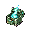

# 武器与饰品详细目录

[返回武器与饰品总览](Overview.md)

## 飞剑线

## 武器统计表

| 武器 | ID | 类型 | 阶段 | 伤害 | 使用时间 | 击退 | 暴击 | 消耗 | 射速 | 稀有度 | 售价 | 研究 |
| --- | --- | --- | --- | --- | --- | --- | --- | --- | --- | --- | --- | --- |
| 木纹飞剑 | `woodgrain_flying_sword` | 近战/灵气 | Pre-Boss | 14 | 28 | 3.0 | 4% | 4 灵气 | 9 | Blue | 20 银 | 1 |
| 破云飞剑 | `cloudpiercer_flying_sword` | 近战/灵气 | Pre-Hardmode | 28 | 25 | 3.5 | 4% | 6 灵气 | 11 | Green | 80 银 | 1 |
| 雷纹剑匣 | `thunder_pattern_sword_case` | 近战/灵气 | Hardmode | 54 | 22 | 3.0 | 6% | 9 灵气 | 13 | Light Red | 4 金 | 1 |
| 无相剑轮 | `formless_sword_wheel` | 近战/灵气 | Post-Plantera | 92 | 20 | 4.0 | 8% | 14 灵气 | 8 | Lime | 9 金 | 1 |
| 月骸法剑 | `moonbone_dharma_sword` | 近战/灵气 | Post-Moon Lord | 220 | 18 | 4.5 | 10% | 22 灵气 | 14 | Red | 28 金 | 1 |
| 朱砂符火 | `cinnabar_talisman_flame_item` | 魔法/灵气 | Pre-Hardmode | 24 | 24 | 2.0 | 4% | 5 灵气 | 7 | Green | 70 银 | 1 |
| 青木阵盘 | `greenwood_array_plate` | 魔法/阵法 | Pre-Hardmode | 18/秒 | 36 | 0 | 4% | 16 灵气 | 0 | Orange | 1 金 20 银 | 1 |
| 雷符阵盘 | `thunder_talisman_array_plate` | 魔法/阵法 | Hardmode | 46/秒 | 34 | 0 | 6% | 24 灵气 | 0 | Light Red | 5 金 | 1 |
| 残天法旨 | `broken_heaven_decree` | 魔法/天道 | Post-Golem | 165 | 42 | 5.0 | 8% | 32 灵气 | 0 | Yellow | 16 金 | 1 |
| 旧天道残卷 | `old_heaven_dao_scroll` | 魔法/终局 | Post-Moon Lord | 310 | 38 | 5.0 | 10% | 45 灵气 | 0 | Purple | 35 金 | 1 |
| 灵木短弩 | `spiritwood_crossbow` | 远程 | Pre-Boss | 12 | 30 | 2.0 | 4% | 灵气箭 | 10 | Blue | 18 银 | 1 |
| 星蚀弩机 | `star_eclipse_arbalest` | 远程/星渊 | Hardmode | 68 | 24 | 2.5 | 6% | 星蚀弹 | 12 | Light Red | 5 金 | 1 |

## 投射物索引

- 详细投射物参数见：[投射物详细目录](Projectile_Catalog.md)。

### 木纹飞剑

- ID：`woodgrain_flying_sword`
- 阶段：Pre-Boss
- 职业：近战/魔法混合
- 效果：发射短距离飞剑，命中后返回玩家。
- 材料：木材、下品灵石、灵气凝胶。
- 美术：56x56 item icon，木质剑身，青色灵纹；projectile 40x20。
- Prompt：`wooden flying sword with jade spirit grain, angled item icon, Terraria pixel art`

### 破云飞剑

- ID：`cloudpiercer_flying_sword`
- 阶段：Pre-Hardmode
- 效果：飞剑穿透 1 个敌人，返回时产生短云气弹。
- 材料：木纹飞剑、器胚碎片、炉渣铁。
- 美术：72x72 item icon，细长银剑，云形剑格，淡青尾光；projectile 56x24。
- Prompt：`slender silver flying sword, cloud-shaped guard, pale cyan aura, readable inventory icon`

### 雷纹剑匣

- ID：`thunder_pattern_sword_case`
- 阶段：Hardmode
- 效果：储存 3 把雷剑，连续释放，最后一剑召小雷。
- 材料：破云飞剑、雷纹羽、劫云露。
- 美术：80x80，半开剑匣，三把小雷剑，紫蓝雷纹；projectiles 56x24。
- Prompt：`sword case holding three lightning flying swords, purple blue thunder patterns`

### 无相剑轮

- ID：`formless_sword_wheel`
- 阶段：Post-Plantera
- 效果：根据玩家移动方向改变攻击轨迹。
- 材料：雷纹剑匣、断剑残意、宗门令。
- 美术：96x96，环形剑轮，中心空洞，青白剑影；projectile 80x80。
- Prompt：`circular wheel of flying swords, formless cyan sword aura, crisp pixel icon`

### 月骸法剑

- ID：`moonbone_dharma_sword`
- 阶段：Post-Moon Lord
- 效果：命中后生成月骨残刃，终局路线可改变元素。
- 材料：无相剑轮、月骸骨、斩道尘。
- 美术：104x104，月白骨剑，暗蓝核心，残月护手；projectile 28x20。
- Prompt：`moonbone magic sword, white lunar bone blade, dark star core, endgame item icon`

## 符箓与法器

| 装备 | 阶段 | 效果 | 美术规格 |
| --- | --- | --- | --- |
| 朱砂符火 | Pre-Hardmode | 消耗灵气发射燃烧符火 | 48x48 黄符，红火边，projectile 32x32 |
| 青木阵盘 | Pre-Hardmode | 放置小型恢复/伤害阵 | 56x56 圆盘，绿木纹，阵图不写字 |
| 雷符阵盘 | Hardmode | 区域落雷 | 60x60 紫蓝阵盘，雷纹 |
| 残天法旨 | Post-Golem | 高消耗直线审判 | 56x56 白玉卷轴，金线 |
| 旧天道残卷 | Post-Moon Lord | 终局术法，按路线变形 | 72x72 破卷与黑白裂隙 |

## 远程与机关

| 装备 | 阶段 | 效果 | 美术规格 |
| --- | --- | --- | --- |
| 灵木短弩 | Pre-Boss | 发射灵气箭 | 56x44 木弩青纹 |
| 符弩 | Pre-Hardmode | 符箭有状态效果 | 48x48 黄纸绑弩臂 |
| 星蚀弩机 | Hardmode | 分裂星蚀弹，增加灵压 | 72x52 暗蓝机关弩 |
| 宗门机关弩 | Post-Plantera | 轮换三种机关弹 | 64x64 木金机关结构 |
| 星灾机关匣 | Post-Moon Lord | 终局远程，多段追踪 | 64x64 深蓝匣体和星晶 |

## 召唤与器灵

| 装备 | 阶段 | 效果 | 美术规格 |
| --- | --- | --- | --- |
| 小器灵坠 | Pre-Boss | 召唤小器灵辅助攻击 | 32x32 小玉坠 |
| 炉灰器灵 | Pre-Hardmode | 召唤炉灰傀小型版 | minion 32x32 |
| 星渊幼体契 | Hardmode | 召唤星渊幼体，附带灵压副作用 | 32x32 暗蓝契印 |
| 元婴分身符 | Post-Plantera | 召唤短时分身 | 32x32 青白人形符 |
| 仙傀令 | Post-Golem | 召唤仙傀 | 32x32 白玉令牌 |
| 归档仙魂契 | Post-Moon Lord | 召唤归档仙魂 | 32x32 环形光契 |

## 饰品

## 饰品统计表

| 饰品 | ID | 阶段 | 稀有度 | 售价 | 可见 | 效果数值 | 副作用 |
| --- | --- | --- | --- | --- | --- | --- | --- |
| 聚气坠 | `qi_gathering_pendant` | Pre-Boss | Blue | 20 银 | 是 | 灵气恢复 +1/秒 | 无 |
| 灵木护符 | `spiritwood_charm` | Pre-Hardmode | Green | 1 金 | 是 | 生命恢复 +0.5 HP/秒，丹药持续 +8% | 无 |
| 炉心戒 | `furnace_heart_ring` | Pre-Hardmode | Orange | 1 金 50 银 | 是 | 炼器武器伤害 +6% | 近战命中火星有 0.5 秒冷却 |
| 避雷玉佩 | `lightning_ward_jade` | Hardmode | Light Red | 4 金 | 是 | 雷伤 -12%，天劫伤害 -8% | 无 |
| 星渊眼 | `star_abyss_eye` | Hardmode | Pink | 6 金 | 是 | 星渊伤害 +12%，投射物速度 +8% | 灵压积累 +20% |
| 元婴玉匣 | `nascent_soul_jade_box` | Post-Plantera | Lime | 10 金 | 是 | 召唤伤害 +8%，分身持续 +2 秒 | 无 |
| 残天冠印 | `broken_heaven_crown_seal` | Post-Golem | Yellow | 18 金 | 是 | 天道法宝消耗 -12%，控制时间 +10% | 灵气低于 20% 时效果减半 |
| 斩道环 | `dao_severing_ring` | Endgame | Purple | 40 金 | 是 | 按终局路线提供 +10% 到 +14% 核心收益 | 锁定路线后不可中途切换 |

### 聚气坠

- 阶段：Pre-Boss
- 效果：小幅提高灵气恢复。
- 美术：36x32，青玉水滴坠。

### 灵木护符

- 阶段：Pre-Hardmode
- 效果：小幅生命恢复，提高炼丹药效。
- 美术：32x32，木牌和青叶。

### 炉心戒

- 阶段：Pre-Hardmode
- 效果：炼器系武器伤害小幅提高，近战击中产生火星。
- 美术：32x32，黑铁戒指和橙红炉心。

### 避雷玉佩

- 阶段：Hardmode
- 效果：降低天劫和雷系伤害。
- 美术：32x32，紫玉佩和蓝色雷纹。

### 星渊眼

- 阶段：Hardmode
- 效果：提高星渊装备伤害，但增加灵压紊乱速度。
- 美术：36x36，暗蓝眼形晶体。

### 元婴玉匣

- 阶段：Post-Plantera
- 效果：强化召唤和分身持续时间。
- 美术：36x32，小玉匣，内有青白人形光。

### 残天冠印

- 阶段：Post-Golem
- 效果：强化天道系法宝，降低法旨消耗。
- 美术：36x36，残金冠印和白玉底。

### 斩道环

- 阶段：Endgame
- 效果：根据终局路线提供不同被动。
- 美术：32x32，黑白双环，中间断裂。

## 平衡规则

- 飞剑线提供稳定远程近战，但单体爆发低于同阶段专精武器。
- 星渊线高伤但增加灵压或副作用。
- 天道线强控制高消耗，依赖灵气管理。
- 召唤线重视持续输出，不让分身复制全部玩家伤害。

## 法器觉醒规则

- 生成法器拥有第一版觉醒门槛：需要指定境界与宗门声望。
- 觉醒后 tooltip 会显示“法器已觉醒”，并给出觉醒后的灵气消耗与伤害加成。
- 第一批接入对象：破云飞剑、雷纹剑匣、无相剑轮、月骨法剑、朱砂符火、青木阵盘、雷符阵盘、残天法门、星蚀弩机。
- 觉醒收益按品阶递增：中期法器约 +10% 到 +12% 伤害，高阶法器约 +14% 到 +18% 伤害，同时降低灵气消耗。

## 装备美术素材

<!-- ART_SECTION:equipment-art:START -->

| 素材 | 名称 | ID | 类型 | 尺寸 |
| --- | --- | --- | --- | --- |
|  | 木纹飞剑 | `woodgrain_flying_sword` | `item_icon` | 56x56 |
|  | 破云飞剑 | `cloudpiercer_flying_sword` | `item_icon` | 72x72 |
|  | 雷纹剑匣 | `thunder_pattern_sword_case` | `item_icon` | 80x80 |
|  | 无相剑轮 | `formless_sword_wheel` | `item_icon` | 96x96 |
|  | 月骸法剑 | `moonbone_dharma_sword` | `item_icon` | 104x104 |
|  | 朱砂符火 | `cinnabar_talisman_flame_item` | `item_icon` | 48x48 |
|  | 青木阵盘 | `greenwood_array_plate` | `item_icon` | 56x56 |
|  | 雷符阵盘 | `thunder_talisman_array_plate` | `item_icon` | 60x60 |
|  | 残天法旨 | `broken_heaven_decree` | `item_icon` | 56x56 |
|  | 旧天道残卷 | `old_heaven_dao_scroll` | `item_icon` | 72x72 |
|  | 灵木短弩 | `spiritwood_crossbow` | `item_icon` | 56x44 |
|  | 星蚀弩机 | `star_eclipse_arbalest` | `item_icon` | 72x52 |
|  | 聚气坠 | `qi_gathering_pendant` | `item_icon` | 36x32 |
|  | 灵木护符 | `spiritwood_charm` | `item_icon` | 32x32 |
|  | 炉心戒 | `furnace_heart_ring` | `item_icon` | 32x32 |
|  | 避雷玉佩 | `lightning_ward_jade` | `item_icon` | 32x32 |
|  | 星渊眼 | `star_abyss_eye` | `item_icon` | 36x36 |
|  | 元婴玉匣 | `nascent_soul_jade_box` | `item_icon` | 36x32 |
|  | 残天冠印 | `broken_heaven_crown_seal` | `item_icon` | 36x36 |
|  | 斩道环 | `dao_severing_ring` | `item_icon` | 32x32 |

<!-- ART_SECTION:equipment-art:END -->
