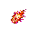

# 投射物详细目录

[返回武器与饰品总览](Overview.md) | [武器与饰品详细目录](Equipment_Catalog.md)

本页记录武器、Boss、敌怪使用的主要投射物规格。字段参考大型 Terraria Mod wiki 常见的 velocity、pierce、knockback、lifetime、immunity frame 等条目写法。

## 玩家武器投射物

| 投射物 | ID | 来源 | 画布 | 碰撞箱 | 速度 | 穿透 | 生存时间 | 伤害倍率 | 击退 | 特殊规则 |
| --- | --- | --- | --- | --- | --- | --- | --- | --- | --- | --- |
| 木纹飞剑弹 | `woodgrain_sword_proj` | 木纹飞剑 | 40x20 | 30x12 | 9 | 1 | 90 ticks | 1.00 | 3.0 | 命中或到达最大距离后返回 |
| 破云飞剑弹 | `cloudpiercer_sword_proj` | 破云飞剑 | 56x24 | 44x12 | 11 | 2 | 105 ticks | 1.00 | 3.5 | 返回时生成 1 枚云气弹 |
| 云气弹 | `cloud_wisp_proj` | 破云飞剑 | 28x20 | 20x12 | 6 | 1 | 45 ticks | 0.35 | 1.0 | 不触发额外特效 |
| 雷纹飞剑 | `thunder_sword_proj` | 雷纹剑匣 | 56x24 | 44x12 | 13 | 3 | 110 ticks | 0.85 | 3.0 | 第三把剑命中召唤小雷 |
| 小雷 | `minor_thunderbolt_proj` | 雷纹剑匣 | 24x80 | 12x56 | 0 | 1 | 18 ticks | 0.45 | 0.5 | 垂直落雷，落点有 30 ticks 预警 |
| 无相剑轮 | `formless_sword_wheel_proj` | 无相剑轮 | 80x80 | 54x54 | 8 | 5 | 150 ticks | 1.00 | 4.0 | 轨迹受玩家移动方向影响 |
| 月骨残刃 | `moonbone_shard_proj` | 月骸法剑 | 28x20 | 20x12 | 10 | 2 | 80 ticks | 0.40 | 2.0 | 命中后短暂停留再碎裂 |
| 朱砂符火 | `cinnabar_talisman_flame` | 朱砂符火 | 32x32 | 18x18 | 7 | 1 | 90 ticks | 1.00 | 2.0 | 施加燃烧类 Debuff |
| 青木阵域 | `greenwood_array_field` | 青木阵盘 | 96x96 | 区域 | 0 | 无限 | 300 ticks | 0.30/秒 | 0 | 对敌伤害，对玩家微量恢复 |
| 雷符阵域 | `thunder_talisman_array` | 雷符阵盘 | 96x96 | 区域 | 0 | 无限 | 240 ticks | 0.45/秒 | 0 | 周期性落雷 |
| 审判光束 | `decree_judgement_beam` | 残天法旨 | 40x160 | 28x120 | 0 | 8 | 24 ticks | 1.20 | 5.0 | 需要 20 ticks 起手 |
| 灵气箭 | `spirit_bolt` | 灵木短弩 | 20x12 | 14x6 | 10 | 1 | 180 ticks | 1.00 | 2.0 | 使用灵气弹药 |
| 星蚀分裂弹 | `star_eclipse_split_bolt` | 星蚀弩机 | 32x32 | 18x18 | 12 | 2 | 160 ticks | 0.85 | 2.5 | 命中后分裂两枚小星刺 |

## Boss 与敌怪投射物

| 投射物 | 使用者 | 画布 | 碰撞箱 | 速度 | 穿透 | 预警 | 生存时间 | 备注 |
| --- | --- | --- | --- | --- | --- | --- | --- | --- |
| 灵气尘 | 灵脉蠕虫 | 16x16 | 10x10 | 2 | 1 | 无 | 90 ticks | 低伤害，教学用 |
| 藤蔓墙 | 药宗守园人 | 16x64 | 12x60 | 0 | 无限 | 45 ticks | 180 ticks | 场地限制 |
| 炉灰团 | 玄炉铁傀 | 16x16 | 12x12 | 5 | 1 | 无 | 120 ticks | 抛物线 |
| 雷柱 | 劫云化身 | 16x64 | 12x60 | 0 | 1 | 48 ticks | 16 ticks | 地面预警后落下 |
| 雷链 | 劫云化身/雷泽蛟 | 64x16 | 58x10 | 0 | 2 | 20 ticks | 24 ticks | 横向或弧形 |
| 星刺 | 星渊胎主 | 32x8 | 28x6 | 8 | 1 | 无 | 140 ticks | 从核心放射 |
| 剑影 | 无相剑魄 | 48x16 | 44x10 | 12 | 1 | 12 ticks | 90 ticks | 可从多个方向出现 |
| 碑文弹 | 天碑守御 | 16x16 | 12x12 | 7 | 1 | 无 | 180 ticks | 不出现真实文字 |
| 归档幻影弹 | 归档仙魂/月骸仙君 | 24x24 | 18x18 | 6 | 1 | 20 ticks | 120 ticks | 延迟复制玩家方向 |

## 免疫与同步规则

- 快速多段投射物优先使用本地 NPC 免疫，建议 `localNPCHitCooldown` 8 到 14 ticks。
- 区域型阵法每 30 ticks 结算一次伤害，避免服务器压力过高。
- Boss 投射物由服务端生成，客户端只播放预警和粒子。
- 预警贴图必须比伤害判定提前出现，不少于 12 ticks。

## 已实现行为

- 破云飞剑命中或撞墙后会生成短程云气弹。
- 雷纹飞剑命中时有概率召小雷，形成雷系武器的节奏差异。
- 无相剑轮拥有本地 NPC 免疫和更长穿透，轨迹会受玩家移动方向轻微影响。
- 青木阵域停留控场，并为站在阵内的玩家缓慢恢复生命和灵气。
- 雷符阵域停留控场，并周期性召落雷。
- 审判光束拥有短起手窗口，起手后才造成伤害。
- 星蚀分裂弹命中后分裂为两枚小灵气弹。

## 投射物美术素材

<!-- ART_SECTION:projectile-art:START -->

| 素材 | 名称 | ID | 类型 | 尺寸 |
| --- | --- | --- | --- | --- |
|  | 木纹飞剑弹 | `woodgrain_sword_proj` | `projectile` | 40x20 |
|  | 破云飞剑弹 | `cloudpiercer_sword_proj` | `projectile` | 56x24 |
|  | 云气弹 | `cloud_wisp_proj` | `projectile` | 28x20 |
|  | 雷纹飞剑 | `thunder_sword_proj` | `projectile` | 56x24 |
|  | 小雷 | `minor_thunderbolt_proj` | `projectile` | 24x80 |
|  | 无相剑轮投射物 | `formless_sword_wheel_proj` | `projectile` | 80x80 |
|  | 月骨残刃 | `moonbone_shard_proj` | `projectile` | 28x20 |
|  | 朱砂符火投射物 | `cinnabar_talisman_flame` | `projectile` | 32x32 |
|  | 青木阵域 | `greenwood_array_field` | `projectile` | 96x96 |
|  | 雷符阵域 | `thunder_talisman_array` | `projectile` | 96x96 |
|  | 审判光束 | `decree_judgement_beam` | `projectile` | 40x160 |
|  | 灵气箭 | `spirit_bolt` | `projectile` | 20x12 |
|  | 星蚀分裂弹 | `star_eclipse_split_bolt` | `projectile` | 32x32 |

<!-- ART_SECTION:projectile-art:END -->
