# 物品总览

[返回首页](../../Home.md)

## 材料

| 物品 | 美术 | 阶段 | 来源 | 用途 |
| --- | --- | --- | --- | --- |
| [下品灵石](Entries/Materials.md) |  | Pre-Boss | 浅层灵脉、游灵史莱姆 | 引气、基础符箓 |
| [灵气凝胶](Entries/Materials.md) |  | Pre-Boss | 游灵史莱姆 | 灵气药剂、低阶弹药 |
| [青木根](Entries/Materials.md) | 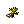 | Pre-Hardmode | 药园藤妖 | 丹药、生命饰品 |
| [炉渣铁](Entries/Materials.md) |  | Pre-Hardmode | 沉炉矿脉 | 炼器基础材料 |
| [器胚碎片](Entries/Materials.md) |  | Pre-Hardmode | 铁屑灵、玄炉铁傀 | 武器胚器 |
| [劫云露](Entries/Materials.md) | 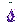 | Hardmode | 雷泽云层 | 抗劫丹、雷系装备 |
| [星蚀晶](Entries/Materials.md) |  | Hardmode | 星渊裂隙 | 禁术、星灾武器 |
| [宗门试炼令](Entries/Materials.md) | 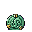 | Post-Plantera | 万宗遗址 | 试炼入口 |
| [天道碎片](Entries/Materials.md) | 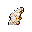 | Post-Golem | 天碑守御 | 化神装备 |
| [月骨](Entries/Materials.md) | 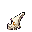 | Post-Moon Lord | 月骸天渊 | 终局武器 |
| [斩道尘](Entries/Materials.md) | 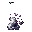 | Endgame | 旧天道核心 | 终局路线奖励 |

## 消耗品

| 物品 | 美术 | 阶段 | 效果 |
| --- | --- | --- | --- |
| [引气符](Entries/Consumables.md) | 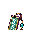 | Pre-Boss | 解锁灵气系统 |
| [回春丹](Entries/Consumables.md) |  | Pre-Hardmode | 持续恢复生命+灵气 |
| [凝气丹](Entries/Consumables.md) | 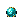 | Pre-Hardmode | 凝气境突破 |
| [筑基丹](Entries/Consumables.md) | 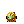 | Pre-Hardmode | 筑基境突破 |
| [抗劫丹](Entries/Consumables.md) | 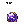 | Hardmode | 降低天劫压力 |
| [星渊禁符](Entries/Consumables.md) | — | Hardmode | 高风险高回报灵气恢复 |

## Boss 召唤物

| 物品 | 美术 | 目标 | 阶段 |
| --- | --- | --- | --- |
| [灵脉香](Entries/Boss_Summons.md) |  | 灵脉蠕虫 | Pre-Boss |
| [守园残钥](Entries/Boss_Summons.md) |  | 药宗守园人 | Pre-Hardmode |
| [旧炉火种](Entries/Boss_Summons.md) | 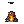 | 玄炉铁傀 | Pre-Hardmode |
| [引雷玉](Entries/Boss_Summons.md) |  | 劫云化身 | Hardmode |
| [星渊胎膜](Entries/Boss_Summons.md) | 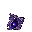 | 星渊胎主 | Hardmode |
| [天碑拓片](Entries/Boss_Summons.md) | 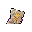 | 天碑守御 | Post-Golem |
| [月骨祭符](Entries/Boss_Summons.md) | 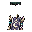 | 月骸仙君 | Post-Moon Lord |

## 铭刻与契约

- [铭刻与契约物品](Entries/Inscriptions_and_Contracts.md) — 5种铭刻针、铭刻清除石、6种召唤契约、商店专属物品

## 相关数据

- [物品详细目录](Item_Catalog.md)
- [制作与材料链](../Crafting/Overview.md)

相关页面：

- [武器与饰品](../Equipment/Overview.md)
- [敌怪总览](../Enemies/Overview.md)
