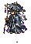

# NPC 总览

[返回首页](../../Home.md)

## 友好 NPC

| NPC | 美术 | 解锁条件 | 功能 | 剧情定位 |
| --- | --- | --- | --- | --- |
| [药宗遗徒](Entries/Herb_Sect_Apprentice.md) |  | 持有青木根或启灵境 | 出售丹方、灵草种子、回春丹 | 青木药宗幸存者 |
| [游方器师](Entries/Wandering_Artificer.md) |  | 持有炉渣铁或击败灵脉蠕虫 | 出售法器、铭刻针、器胚 | 玄炉器盟传人 |
| [观劫道人](Entries/Tribulation_Observer.md) |  | 筑基境或持有劫云露 | 出售抗劫物品、天劫提示 | 研究残天司的散修 |
| [经阁卷灵](Entries/Archive_Scroll_Spirit.md) |  | 金丹境或持有试炼令 | 出售宗门物品、试炼提示 | 宗门记忆集合 |
| [坠天信使](Entries/Fallen_Heaven_Messenger.md) |  | 元婴境或击败天碑守御 | 出售天道物品、路线提示 | 残天司半叛离个体 |

## NPC 设计规则

- NPC 的功能必须随进度逐步解锁。
- 不让 NPC 直接出售跳过进度的关键装备。
- NPC 对话负责提示世界观，但不能阻塞玩家探索。

## 相关数据

- [NPC 统计与商店](NPC_Stats_and_Shops.md)

相关页面：

- [阵营与势力](../../Lore/Factions.md)
- [炼丹](../../Systems/Alchemy.md)
- [炼器](../../Systems/Refining.md)
