# XianXia Mod Wiki

> 世界并非缺少神明，而是神明曾经太多。玩家从一名被残缺天道遗漏的凡人开始，在灵脉复苏、仙门崩塌、劫雷失控的 Terraria 世界中修行，最终决定这个世界是重归天道秩序，还是彻底断开旧天庭的锁链。

---

## 入门速览

| | | | | |
|---|---|---|---|---|
| [ **引气入门**](Progression/Overview.md) | [ **飞剑与武器**](Content/Equipment/Overview.md) | [ **符箓与法器**](Content/Equipment/Overview.md#符箓与法器) | [ **炼丹**](Systems/Alchemy.md) | [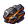 **炼器**](Systems/Refining.md) |
| [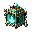 **饰品**](Content/Equipment/Overview.md#饰品) | [ **境界突破**](Systems/Cultivation.md) | [ **天劫系统**](Systems/Tribulation.md) | [ **灵气系统**](Systems/Spiritual_Energy.md) | [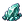 **材料与掉落**](Content/Items/Overview.md) |

---

## 进度指南

| 阶段 | Boss | 生态 | 关键解锁 | 详细数据 |
|---|---|---|---|---|
| **Pre-Boss** | [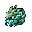 灵脉蠕虫](Content/Bosses/Entries/Spirit_Vein_Wyrm.md) | [浅层灵脉](Content/Biomes/Entries/Shallow_Spirit_Veins.md) | 灵气系统、引气符、木纹飞剑 | — |
| **Pre-Hardmode** | [ 药宗守园人](Content/Bosses/Entries/Garden_Warden.md) [ 玄炉铁傀](Content/Bosses/Entries/Black_Furnace_Iron_Golem.md) | [青木药园](Content/Biomes/Entries/Greenwood_Herb_Garden.md) [沉炉矿脉](Content/Biomes/Entries/Sunken_Furnace_Vein.md) | 炼丹、炼器、筑基突破 | — |
| **WoF 前后** | [ 劫云化身](Content/Bosses/Entries/Tribulation_Cloud_Avatar.md) | [雷泽云层](Content/Biomes/Entries/Thunder_Marsh_Clouds.md) | 天劫系统、筑基印 | — |
| **Hardmode** | [ 雷泽蛟](Content/Bosses/Entries/Thunder_Marsh_Jiao.md) [ 星渊胎主](Content/Bosses/Entries/Abyssal_Star_Womb.md) | [星渊裂隙](Content/Biomes/Entries/Star_Abyss_Rift.md) | 雷系武器、禁术材料 | — |
| **Post-Plantera** | [ 无相剑魄](Content/Bosses/Entries/Formless_Sword_Soul.md) [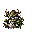 药王残影](Content/Bosses/Entries/Greenwood_Medicine_King_Echo.md) | [万宗遗址](Content/Biomes/Entries/Ten_Thousand_Sects_Ruins.md) | 飞剑升级、高阶丹炉 | — |
| **Post-Golem** | [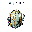 天碑守御](Content/Bosses/Entries/Heaven_Tablet_Guardian.md) [ 残天监察使](Content/Bosses/Entries/Broken_Heaven_Inspector.md) | [坠天宫阙](Content/Biomes/Entries/Fallen_Heaven_Palace.md) | 天道装备、天庭法旨 | — |
| **Post-Moon Lord** | [ 月骸仙君](Content/Bosses/Entries/Moonbone_Immortal.md) | [月骸天渊](Content/Biomes/Entries/Moonbone_Abyss.md) | 月骸材料、终局装备 | — |
| **Endgame** | [ 旧天道核心](Content/Bosses/Entries/Old_Heaven_Dao_Core.md) | 终局路线 | 斩道奖励、路线抉择 | — |

📊 [Boss 数值与掉落表](Content/Bosses/Boss_Stats.md) · 📋 [Boss 总览](Content/Bosses/Overview.md)

---

## Boss

| 阶段 | Boss | 类型 | 分段 | 召唤方式 | 主要掉落 | 详细 |
|---|---|---|---|---|---|---|
| Pre-Boss | [ **灵脉蠕虫**](Content/Bosses/Entries/Spirit_Vein_Wyrm.md) | 穿墙蠕虫 | head+body+tail (8-10节) | 浅层灵脉使用灵脉香 | 下品灵核、灵脉鳞片 | [Boss页](Content/Bosses/Entries/Spirit_Vein_Wyrm.md) |
| Pre-Hardmode | [ **药宗守园人**](Content/Bosses/Entries/Garden_Warden.md) | 植物型 | 单体 | 青木药园采集足够灵草 | 青木丹炉、青木根 | [Boss页](Content/Bosses/Entries/Garden_Warden.md) |
| Pre-Hardmode | [ **玄炉铁傀**](Content/Bosses/Entries/Black_Furnace_Iron_Golem.md) | 铁傀儡型 | 单体 | 沉炉矿脉修复旧炉 | 器胚碎片、旧炼器台 | [Boss页](Content/Bosses/Entries/Black_Furnace_Iron_Golem.md) |
| WoF 前后 | [ **劫云化身**](Content/Bosses/Entries/Tribulation_Cloud_Avatar.md) | 云/风暴型 | 单体 | 筑基突破触发 | 筑基印、劫云露 | [Boss页](Content/Bosses/Entries/Tribulation_Cloud_Avatar.md) |
| Hardmode | [ **雷泽蛟**](Content/Bosses/Entries/Thunder_Marsh_Jiao.md) | 空中蛇形龙 | head+body+tail (12-16节) | 雷泽云层事件 | 雷纹羽、雷纹锻台 | [Boss页](Content/Bosses/Entries/Thunder_Marsh_Jiao.md) |
| Hardmode | [ **星渊胎主**](Content/Bosses/Entries/Abyssal_Star_Womb.md) | 深渊/星体型 | 单体 | 星渊裂隙污染值达标 | 星蚀晶、禁术材料 | [Boss页](Content/Bosses/Entries/Abyssal_Star_Womb.md) |
| Post-Plantera | [ **无相剑魄**](Content/Bosses/Entries/Formless_Sword_Soul.md) | 剑魂型 | 单体 | 万宗遗址剑碑试炼 | 飞剑升级材料 | [Boss页](Content/Bosses/Entries/Formless_Sword_Soul.md) |
| Post-Plantera | [ **药王残影**](Content/Bosses/Entries/Greenwood_Medicine_King_Echo.md) | 药王虚影型 | 单体 | 完成药宗残卷链 | 高阶丹炉、药王木心 | [Boss页](Content/Bosses/Entries/Greenwood_Medicine_King_Echo.md) |
| Post-Golem | [ **天碑守御**](Content/Bosses/Entries/Heaven_Tablet_Guardian.md) | 石碑守护型 | 单体 | 坠天宫阙激活天碑 | 天道碎片、天碑拓片 | [Boss页](Content/Bosses/Entries/Heaven_Tablet_Guardian.md) |
| Post-Golem | [ **残天监察使**](Content/Bosses/Entries/Broken_Heaven_Inspector.md) | 天神审视者型 | 单体 | 化神境后挑战 | 天庭法旨、化神材料 | [Boss页](Content/Bosses/Entries/Broken_Heaven_Inspector.md) |
| Post-Moon Lord | [ **月骸仙君**](Content/Bosses/Entries/Moonbone_Immortal.md) | 终局人形 | 单体 | 月骸天渊核心召唤 | 月骸骨、星灾灵核 | [Boss页](Content/Bosses/Entries/Moonbone_Immortal.md) |
| Endgame | [ **旧天道核心**](Content/Bosses/Entries/Old_Heaven_Dao_Core.md) | 终局核心 | 单体 | 完成三条路线选择 | 斩道环、斩道尘 | [Boss页](Content/Bosses/Entries/Old_Heaven_Dao_Core.md) |

### Boss 召唤仆从

| 仆从 | 来源 | 分段 | 运动 | 数量 | 生存时间 |
|---|---|---|---|---|---|
| [碎玉蠕虫仆从](Content/Bosses/Entries/Shattered_Jade_Wyrm_Minion.md) | 灵脉蠕虫 HP<50% 分裂 | head+body+tail (5-7节) | 穿墙追踪 | 2-3 条 | 15-20 秒 |

---

## 敌怪

| 阶段 | 敌怪 | 生态 | HP | 伤害 | 行为 | 主要掉落 | 详细 |
|---|---|---|---|---|---|---|---|
| Pre-Boss | [ **游灵史莱姆**](Content/Enemies/Entries/Wandering_Spirit_Slime.md) | 浅层灵脉 | 45 | 12 | 慢速跳跃，受击释放灵粒 | 灵气凝胶、下品灵石 | [页](Content/Enemies/Entries/Wandering_Spirit_Slime.md) |
| Pre-Boss | [ **碎玉虫**](Content/Enemies/Entries/Shattered_Jade_Worm.md) | 浅层灵脉 | 60 | 14 | 贴地爬行，钻地冲刺 | 下品灵石、灵气凝胶 | [页](Content/Enemies/Entries/Shattered_Jade_Worm.md) |
| Pre-Boss | [ **符纸蝠**](Content/Enemies/Entries/Talisman_Bat.md) | 浅层灵脉 | 38 | 13 | 飞行，低概率符火 | 灵气凝胶 | [页](Content/Enemies/Entries/Talisman_Bat.md) |
| Pre-Hardmode | [ **药园藤妖**](Content/Enemies/Entries/Herb_Garden_Vine_Spirit.md) | 青木药园 | 140 | 24 | 半固定炮台，自愈+藤鞭 | 青木根、药露 | [页](Content/Enemies/Entries/Herb_Garden_Vine_Spirit.md) |
| Pre-Hardmode | [ **花瘴蝶**](Content/Enemies/Entries/Miasma_Flower_Moth.md) | 青木药园 | 90 | 20 | 慢速飞行，释放瘴毒环 | 药露、朱砂粉 | [页](Content/Enemies/Entries/Miasma_Flower_Moth.md) |
| Pre-Hardmode | [ **炉灰傀**](Content/Enemies/Entries/Furnace_Ash_Golem.md) | 沉炉矿脉 | 180 | 28 | 高防近战，静止加防 | 炉渣铁、玄炉炭 | [页](Content/Enemies/Entries/Furnace_Ash_Golem.md) |
| Pre-Hardmode | [ **铁屑灵**](Content/Enemies/Entries/Iron_Shard_Spirit.md) | 沉炉矿脉 | 70 | 22 | 成群飞行，蜂群冲刺 | 器胚碎片、炉渣铁 | [页](Content/Enemies/Entries/Iron_Shard_Spirit.md) |
| Hardmode | [ **劫云灵**](Content/Enemies/Entries/Tribulation_Cloudling.md) | 雷泽云层 | 240 | 42 | 闪现召雷 | 劫云露、鸣雷石 | [页](Content/Enemies/Entries/Tribulation_Cloudling.md) |
| Hardmode | [ **雷纹鹰**](Content/Enemies/Entries/Thunder_Pattern_Hawk.md) | 雷泽云层 | 300 | 48 | 盘旋俯冲，电弧 | 雷纹羽、劫云露 | [页](Content/Enemies/Entries/Thunder_Pattern_Hawk.md) |
| Hardmode | [ **星蚀修士**](Content/Enemies/Entries/Star_Eclipsed_Cultivator.md) | 星渊裂隙 | 360 | 50 | 保持距离，低血闪避 | 星蚀晶、残天玉 | [页](Content/Enemies/Entries/Star_Eclipsed_Cultivator.md) |
| Hardmode | [ **星渊幼体**](Content/Enemies/Entries/Star_Abyss_Larva.md) | 星渊裂隙 | 260 | 46 | 跃扑附着减速 | 渊尘、暗蓝灵液 | [页](Content/Enemies/Entries/Star_Abyss_Larva.md) |
| Post-Plantera | [ **执念剑修**](Content/Enemies/Entries/Obsessed_Sword_Cultivator.md) | 万宗遗址 | 850 | 72 | 格挡后反击突刺 | 断剑残意、宗门令 | [页](Content/Enemies/Entries/Obsessed_Sword_Cultivator.md) |
| Post-Plantera | [ **藏经残影**](Content/Enemies/Entries/Scripture_Archive_Echo.md) | 万宗遗址 | 720 | 66 | 三连弹幕+护盾 | 残卷页、宗门令 | [页](Content/Enemies/Entries/Scripture_Archive_Echo.md) |
| Post-Golem | [ **仙傀**](Content/Enemies/Entries/Celestial_Puppet.md) | 坠天宫阙 | 1,350 | 88 | 模块化三阶段攻击 | 残天玉、天道碎片 | [页](Content/Enemies/Entries/Celestial_Puppet.md) |
| Post-Golem | [ **天碑卫**](Content/Enemies/Entries/Heaven_Tablet_Guard.md) | 坠天宫阙 | 1,500 | 92 | 举盾推进+碑文弹 | 破损法旨、残天玉 | [页](Content/Enemies/Entries/Heaven_Tablet_Guard.md) |
| Post-Moon Lord | [ **月骸修士**](Content/Enemies/Entries/Moonbone_Cultivator.md) | 月骸天渊 | 4,200 | 160 | 高速冲刺+剑气 | 月骨、冷月尘 | [页](Content/Enemies/Entries/Moonbone_Cultivator.md) |
| Post-Moon Lord | [ **归档仙魂**](Content/Enemies/Entries/Archived_Immortal_Soul.md) | 月骸天渊 | 3,600 | 150 | 复制位置+幻影弹 | 斩道尘、归档残光 | [页](Content/Enemies/Entries/Archived_Immortal_Soul.md) |

📋 [敌怪总览](Content/Enemies/Overview.md) · 📊 [敌怪详细目录](Content/Enemies/Enemy_Catalog.md)

---

## 友好 NPC

| NPC | 解锁条件 | 功能 | 剧情定位 | 详细 |
|---|---|---|---|---|
| [ **药宗遗徒**](Content/NPCs/Entries/Herb_Sect_Apprentice.md) | 持有青木根或启灵境 | 出售丹方、灵草种子、回春丹 | 青木药宗幸存者 | [NPC页](Content/NPCs/Entries/Herb_Sect_Apprentice.md) |
| [ **游方器师**](Content/NPCs/Entries/Wandering_Artificer.md) | 持有炉渣铁或击败灵脉蠕虫 | 出售法器、铭刻针、器胚 | 玄炉器盟传人 | [NPC页](Content/NPCs/Entries/Wandering_Artificer.md) |
| [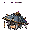 **观劫道人**](Content/NPCs/Entries/Tribulation_Observer.md) | 筑基境或持有劫云露 | 出售抗劫物品、天劫提示 | 研究残天司的散修 | [NPC页](Content/NPCs/Entries/Tribulation_Observer.md) |
| [ **经阁卷灵**](Content/NPCs/Entries/Archive_Scroll_Spirit.md) | 金丹境或持有宗门令 | 出售宗门物品、试炼提示 | 宗门记忆集合 | [NPC页](Content/NPCs/Entries/Archive_Scroll_Spirit.md) |
| [ **坠天信使**](Content/NPCs/Entries/Fallen_Heaven_Messenger.md) | 元婴境或击败天碑守御 | 出售天道物品、路线提示 | 残天司半叛离个体 | [NPC页](Content/NPCs/Entries/Fallen_Heaven_Messenger.md) |

📊 [NPC 统计与商店](Content/NPCs/NPC_Stats_and_Shops.md)

---

## 武器

| 类别 | Pre-Boss | Pre-Hardmode | Hardmode | Post-Plantera | Post-Moon Lord |
|---|---|---|---|---|---|
| **飞剑** | [ 木纹飞剑](Content/Equipment/Entries/Woodgrain_Flying_Sword.md) | [ 破云飞剑](Content/Equipment/Entries/Cloudpiercer_Flying_Sword.md) | [ 雷纹剑匣](Content/Equipment/Entries/Thunder_Pattern_Sword_Case.md) | [ 无相剑轮](Content/Equipment/Entries/Formless_Sword_Wheel.md) | [ 月骸法剑](Content/Equipment/Entries/Moonbone_Dharma_Sword.md) |
| **符箓法器** | — | [ 朱砂符火](Content/Equipment/Entries/Cinnabar_Talisman_Flame.md) [ 青木阵盘](Content/Equipment/Entries/Greenwood_Array_Plate.md) | [ 雷符阵盘](Content/Equipment/Entries/Thunder_Talisman_Array_Plate.md) | [ 残天法旨](Content/Equipment/Entries/Broken_Heaven_Decree.md) | [ 旧天道残卷](Content/Equipment/Entries/Old_Heaven_Dao_Scroll.md) |
| **远程** | [ 灵木短弩](Content/Equipment/Entries/Spiritwood_Crossbow.md) | — | [ 星蚀弩机](Content/Equipment/Entries/Star_Eclipse_Arbalest.md) | — | — |

---

## 饰品

| 饰品 | 阶段 | 效果 | 详细 |
|---|---|---|---|
| [**聚气坠**](Content/Equipment/Entries/Accessories_Stats.md) | Pre-Boss | 灵气恢复 +1/秒 | [属性](Content/Equipment/Entries/Accessories_Stats.md) |
| [**灵木护符**](Content/Equipment/Entries/Accessories_Stats.md) | Pre-Hardmode | 生命恢复 +0.5 HP/秒，丹药持续 +8% | [属性](Content/Equipment/Entries/Accessories_Stats.md) |
| [**炉心戒**](Content/Equipment/Entries/Accessories_Stats.md) | Pre-Hardmode | 炼器武器伤害 +6% | [属性](Content/Equipment/Entries/Accessories_Stats.md) |
| [**避雷玉佩**](Content/Equipment/Entries/Accessories_Stats.md) | Hardmode | 雷伤 -12%，天劫伤害 -8% | [属性](Content/Equipment/Entries/Accessories_Stats.md) |
| [**星渊眼**](Content/Equipment/Entries/Accessories_Stats.md) | Hardmode | 星渊伤害 +12%，投射物速度 +8%（灵压 +20%） | [属性](Content/Equipment/Entries/Accessories_Stats.md) |
| [**元婴玉匣**](Content/Equipment/Entries/Accessories_Stats.md) | Post-Plantera | 召唤伤害 +8%，分身持续 +2 秒 | [属性](Content/Equipment/Entries/Accessories_Stats.md) |
| [**残天冠印**](Content/Equipment/Entries/Accessories_Stats.md) | Post-Golem | 天道法宝消耗 -12%，控制时间 +10% | [属性](Content/Equipment/Entries/Accessories_Stats.md) |
| [**斩道环**](Content/Equipment/Entries/Accessories_Stats.md) | Endgame | 按路线 +10%~14% 核心收益 | [属性](Content/Equipment/Entries/Accessories_Stats.md) |

📋 [武器与饰品总览](Content/Equipment/Overview.md) · 📊 [装备详细目录](Content/Equipment/Equipment_Catalog.md) · 🎯 [投射物目录](Content/Equipment/Projectile_Catalog.md)

---

## 材料与消耗品

| 阶段 | 材料 | 消耗品 / 丹药 | Boss 召唤物 |
|---|---|---|---|
| **Pre-Boss** | [下品灵石](Content/Items/Entries/Low_Grade_Spirit_Stone.md) [灵气凝胶](Content/Items/Entries/Spirit_Gel.md) [残符纸](Content/Items/Entries/Torn_Talisman_Paper.md) | [引气符](Content/Items/Entries/Qi_Drawing_Talisman.md) | [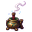灵脉香](Content/Items/Entries/Spirit_Vein_Incense.md) |
| **Pre-Hardmode** | [青木根](Content/Items/Entries/Greenwood_Root.md) [炉渣铁](Content/Items/Entries/Furnace_Slag_Iron.md) [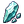器胚碎片](Content/Items/Entries/Artifact_Blank_Shard.md) | [回春丹](Content/Items/Entries/Spring_Return_Pill.md) [凝气丹](Content/Items/Entries/Qi_Condensing_Pill.md) [筑基丹](Content/Items/Entries/Foundation_Pill.md) | [守园残钥](Content/Items/Entries/Garden_Broken_Key.md) [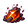旧炉火种](Content/Items/Entries/Old_Furnace_Ember.md) |
| **Hardmode** | [劫云露](Content/Items/Entries/Tribulation_Cloud_Dew.md) [星蚀晶](Content/Items/Entries/Star_Eclipse_Crystal.md) | [抗劫丹](Content/Items/Entries/Tribulation_Resisting_Pill.md) [星渊禁符](Content/Items/Entries/Star_Abyss_Forbidden_Talisman.md) | [引雷玉](Content/Items/Entries/Thunder_Calling_Jade.md) [星渊胎膜](Content/Items/Entries/Star_Abyss_Membrane.md) |
| **Post-Plantera** | [宗门令](Content/Items/Entries/Sect_Trial_Token.md) | — | — |
| **Post-Golem** | [天道碎片](Content/Items/Entries/Heaven_Dao_Fragment.md) | — | [天碑拓片](Content/Items/Entries/Heaven_Tablet_Rubbing.md) |
| **Post-Moon Lord** | [月骨](Content/Items/Entries/Moonbone.md) [斩道尘](Content/Items/Entries/Dao_Severing_Dust.md) | — | [月骨祭符](Content/Items/Entries/Moonbone_Ritual_Talisman.md) |

📋 [物品总览](Content/Items/Overview.md) · 📊 [物品详细目录](Content/Items/Item_Catalog.md)

---

## 制作站

| 制作站 | 阶段 | 来源 | 用途 | 详细 |
|---|---|---|---|---|
| [ **土炉**](Content/Crafting/Entries/Earth_Clay_Furnace.md) | Pre-Boss | 基础材料制作 | 低阶丹药 | [页](Content/Crafting/Entries/Earth_Clay_Furnace.md) |
| [ **简易符案**](Content/Crafting/Entries/Simple_Talisman_Table.md) | Pre-Boss | 木材、残符纸 | 符箓制作 | [页](Content/Crafting/Entries/Simple_Talisman_Table.md) |
| [ **青木丹炉**](Content/Crafting/Entries/Alchemy_Cauldron.md) | Pre-Hardmode | 药宗守园人掉落 | 中阶炼丹 | [页](Content/Crafting/Entries/Alchemy_Cauldron.md) |
| [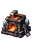 **旧炼器台**](Content/Crafting/Entries/Artifact_Forge.md) | Pre-Hardmode | 玄炉铁傀掉落 | 胚器和法宝 | [页](Content/Crafting/Entries/Artifact_Forge.md) |
| [ **星纹丹鼎**](Content/Crafting/Entries/Star_Pattern_Cauldron.md) | Hardmode | 星渊胎主材料 | 星灾丹药 | [页](Content/Crafting/Entries/Star_Pattern_Cauldron.md) |
| [ **雷纹锻台**](Content/Crafting/Entries/Thunder_Pattern_Forge.md) | Hardmode | 雷泽蛟材料 | 雷系装备 | [页](Content/Crafting/Entries/Thunder_Pattern_Forge.md) |
| [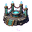 **宗门试炼台**](Content/Crafting/Entries/Sect_Trial_Altar.md) | Post-Plantera | 万宗遗址 | 职业分化装备 | [页](Content/Crafting/Entries/Sect_Trial_Altar.md) |
| [ **天火炉**](Content/Crafting/Entries/Heaven_Fire_Furnace.md) | Post-Golem | 天碑守御掉落 | 天道系装备 | [页](Content/Crafting/Entries/Heaven_Fire_Furnace.md) |
| [ **斩道台**](Content/Crafting/Entries/Dao_Severing_Altar.md) | Endgame | 旧天道核心掉落 | 终局装备 | [页](Content/Crafting/Entries/Dao_Severing_Altar.md) |

📋 [制作总览](Content/Crafting/Overview.md) · 📊 [配方目录](Content/Crafting/Recipe_Catalog.md)

---

## 生态

| 生态 | 阶段 | 主要敌怪 | Boss | 特色方块 | 详细 |
|---|---|---|---|---|---|
| [ **浅层灵脉**](Content/Biomes/Entries/Shallow_Spirit_Veins.md) | Pre-Boss | 游灵史莱姆、碎玉虫、符纸蝠 | 灵脉蠕虫 | 灵脉矿石、灵气苔藓 | [页](Content/Biomes/Entries/Shallow_Spirit_Veins.md) |
| [ **青木药园**](Content/Biomes/Entries/Greenwood_Herb_Garden.md) | Pre-Hardmode | 药园藤妖、花瘴蝶 | 药宗守园人 | 青木土壤、灵草 | [页](Content/Biomes/Entries/Greenwood_Herb_Garden.md) |
| [ **沉炉矿脉**](Content/Biomes/Entries/Sunken_Furnace_Vein.md) | Pre-Hardmode | 炉灰傀、铁屑灵 | 玄炉铁傀 | 炉渣方块、黑炉墙 | [页](Content/Biomes/Entries/Sunken_Furnace_Vein.md) |
| [ **雷泽云层**](Content/Biomes/Entries/Thunder_Marsh_Clouds.md) | Hardmode | 劫云灵、雷纹鹰 | 劫云化身、雷泽蛟 | 雷云方块 | [页](Content/Biomes/Entries/Thunder_Marsh_Clouds.md) |
| [ **星渊裂隙**](Content/Biomes/Entries/Star_Abyss_Rift.md) | Hardmode | 星蚀修士、星渊幼体 | 星渊胎主 | 星渊水晶 | [页](Content/Biomes/Entries/Star_Abyss_Rift.md) |
| [ **万宗遗址**](Content/Biomes/Entries/Ten_Thousand_Sects_Ruins.md) | Post-Plantera | 执念剑修、藏经残影 | 无相剑魄、药王残影 | 宗门遗迹砖 | [页](Content/Biomes/Entries/Ten_Thousand_Sects_Ruins.md) |
| [ **坠天宫阙**](Content/Biomes/Entries/Fallen_Heaven_Palace.md) | Post-Golem | 仙傀、天碑卫 | 天碑守御、残天监察使 | 坠天玉砖 | [页](Content/Biomes/Entries/Fallen_Heaven_Palace.md) |
| [ **月骸天渊**](Content/Biomes/Entries/Moonbone_Abyss.md) | Post-Moon Lord | 月骸修士、归档仙魂 | 月骸仙君 | 月骸方块 | [页](Content/Biomes/Entries/Moonbone_Abyss.md) |

📋 [生态总览](Content/Biomes/Overview.md) · 📊 [生成与 Tile 规格](Content/Biomes/Biome_Generation_Stats.md)

---

## 系统机制

| 系统 | 说明 | 详细 |
|---|---|---|
| **灵气系统** | 替代魔力的修炼资源，灵气恢复、灵压紊乱、灵气节点 | [详细设计](Systems/Spiritual_Energy.md) |
| **修行境界** | 引气→凝气→筑基→金丹→元婴→化神→斩道，每境界解锁新能力 | [详细设计](Systems/Cultivation.md) |
| **天劫系统** | 突破境界时触发天劫，雷劫预警、抗劫物品、劫雷压力 | [详细设计](Systems/Tribulation.md) |
| **炼丹** | 丹炉 + 灵草 → 丹药，回血/突破/抗劫/ Buff 类 | [详细设计](Systems/Alchemy.md) |
| **炼器** | 锻台 + 材料 → 法宝/武器，铭刻与觉醒 | [详细设计](Systems/Refining.md) |
| **机制详解** | 所有机制的完整数值与交互规则 | [机制详细设计](Systems/Mechanics_Detail.md) |

---

## 世界观

| 文档 | 内容 | 详细 |
|---|---|---|
| **世界观总览** | 天道崩碎后的修仙世界全貌 | [阅读](Lore/Worldview.md) |
| **历史年表** | 上古天庭→天道崩碎→灵脉复苏的时间线 | [阅读](Lore/History.md) |
| **阵营与势力** | 青木药宗、玄炉器盟、残天司、无相散修等势力 | [阅读](Lore/Factions.md) |
| **角色层次** | 凡人→修士→仙人的力量阶梯 | [阅读](Lore/Character_Tiers.md) |

---

## 开发参考

| 文档 | 说明 |
|---|---|
| [美术资源规格](Asset_Specs.md) | 通用画布尺寸、命名规则、Prompt 模板、色板 |
| [Sprite 尺寸规格](../Docs/sprite-sizing-reference.md) | 全部素材的 PNG 2x 尺寸标准与参考来源 |
| [美术素材图库](Art_Gallery.md) | 自动生成的全素材联系表 |
| [美术素材审计](Art_Audit.md) | 素材状态追踪 |
| [条目参数模板](Content/Parameter_Templates.md) | 新条目的标准参数与格式 |
| [设计状态追踪](Design_Status.md) | 设计与代码实现进度对照 |
| [职业配装指南](Guides/Class_Setups.md) | 各阶段推荐配装路线 |
| [项目约束](../Docs/PROJECT_CONSTRAINTS.md) | 技术、设计、美术、本地化约束 |
| [美术资源生成方案](../Docs/ART_ASSET_GENERATION_PLAN.md) | 素材生成流水线设计 |

---

## Wiki 编写规则

| 规则 | 说明 |
|---|---|
| 设计意图优先 | 所有条目先写设计意图，再写玩法用途 |
| 标注进度阶段 | 所有内容必须标注所属阶段（Pre-Boss / Pre-Hardmode / Hardmode / Post-Plantera / Post-Golem / Post-Moon Lord / Endgame） |
| 说明解锁条件 | Boss、生态和大型机制必须说明解锁条件 |
| 相对链接跳转 | 条目之间必须用相对链接互相跳转 |
| 美术资源标注 | 必须标注 PNG 2x 尺寸、帧数、动画格式和 Prompt 重点 |
| 不压探索循环 | 设定可以浓，但不能压过 Terraria 的探索、采集、制作和战斗循环 |

---

*本文档库结构参考 Terraria Wiki (terraria.wiki.gg)、Calamity Mod Wiki 和 Thorium Mod Wiki 的组织方式。*
